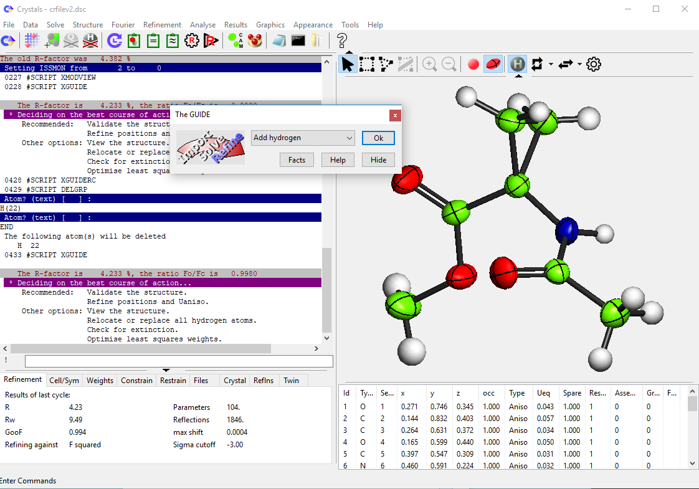

.. toctree::
   :maxdepth: 1
   :caption: Contents:

.. include:: ../macros.bit

##############
About CRYSTALS
##############
.. index:: About CRYSTALS
   
The CRYSTALS installation kit comprises CRYSTALS and CAMERON and, with the permission 
of their authors,  SIR92, SHELXS, MCE and Superflip. CRYSTALS 
can read and/or write files for WinGX Mapviewer, SHELXL and SHELXT, Mercury, and Platon.
If the Cambridge Crystallographic Data Base is installed on the users computer, 
structures can be automatically validated using MOGUL.

The diffraction data (laboratory or synchrotron X-rays, or neutrons) must be corrected for 
experimental conditions (sample or beam decay, absorption, Lorentz and polarisation effects 
etc.) and can be from single or twinned samples.

The normal user interface is a standard windowed application, with a view of the structural model and
menus and dialogues for carrying out analysis and refinement. 
Command line instructions can be used in the windowed application when advanced options are required.
A purely command line (batch mode ASCII file in - ASCII file out) version is available.
 

.. _Video Demo:

*******************
Video Demonstration
*******************
.. index:: Demonstration Video

This short video demonstrates the use of CRYSTALS for a routine structure analysis.  A 
detailed description can be found :ref:`here. <Cyclo>`

.. raw:: html

    

    <iframe width="560" height="315" src="https://www.youtube.com/embed/KDUIFE_epXE?rel=0" frameborder="0" allow="autoplay; encrypted-media" allowfullscreen></iframe>
    

See the :ref:`discussion` for more details.

.. _Features:

********
Features
********
.. index Features of CRYSTALS::

Features include:

- A context-sensitive Guide
- Menus for most common operations
- HELP files to assist with the use of the program 
- Information files explaining the crystallographic background
- Continually updated graphical model of the structure
- hydrogen atom placement
- powerful atomic and structural parameter editor
- sophisticated refinement with constraints and restraints
- various weighting schemes for refinement
- extensive data and structure validation tools
- advanced analysis of absolute structure
- Fourier maps and contour plots
- Analysis of positional and thermal parameters
- publication tables and cifs
- Built-in plotting module

Several conversion utilities are also provided:

- Shelx2cry, a conversion tool for SHELX .INS and .RES files, which handles weighting schemes, 
  part numbers, partial occupancies, restraints, constraints and special positions.
- Diffin prepares data for CRYSTALS from a variety of diffractometer sources.
- CSD2CRY converts CSD files to CRYSTALS format input files.
- CIF2CRY converts CIFs to CRYSTALS format input files.
- hklf52cry converts a SHELX hklf5 format twinned reflection data to CRYSTALS format.

The programs are currently available for Windows 7 and 10. An executable for Linux, or compilation 
instructions, can be provided on request.
   

Whenever possible, the user is recommended to output SHEXL format (.ins or .res  and 
hklf4 or hklf5) files from their diffractometer. If these are not available, the example 
:ref:`**NKET** <nket>` will take you through creating *native* CRYSTALS format files. |br|\

	

