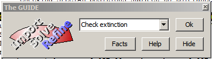

.. toctree::
   :maxdepth: 1
   :caption: Contents:

.. include:: ../macros.bit

.. _examples:

   
###############
Worked examples
###############

.. index:: Worked Examples

:ref:`Cylo - A Routine Analysis <Cyclo>`
|br|\
:ref:`Tetraphenylene - A weak data set <tetraphenylene>`
|br|\
:ref:`NKET - Introduction to the COMMAND LINE <nket>`

These (and other) examples can be found in the *Wincrys/demo* folder.
Each demo subfolder contains data and instructions exploring a differenct crystallographic 
problem. In this section of the manual we look at three simple cases.

.. _Cyclo:
.. index:: Cyclo
.. index:: Example - Routine Structure

************************************
Cyclo - a routine structure analysis
************************************
This natty material was supplied as very poor colourless crystals found congealed 
in the bottom of a half-abandoned flask.
|br|\
A fragment of crystal (0.3 x 0.4 x 0.4 mm) was mounted in oil 
on a KCCD diffractometer at 190K and  a data set collected in two hours. 
|br|\
The space group is P 21 21 21

.. image:: ../images/cyclo.jpg

..index:: Video Demonstration

^^^^^^^^^^^^^^^^^^^
Video demonstration
^^^^^^^^^^^^^^^^^^^
The video is explained step by step after it finishes.

.. raw:: html

    

    <iframe width="560" height="315" src="https://www.youtube.com/embed/KDUIFE_epXE?rel=0" frameborder="0" allow="autoplay; encrypted-media" allowfullscreen></iframe>
    

.. _discussion:	
	
^^^^^^^^^^
Discussion
^^^^^^^^^^

^^^^^^^^^^^^^^^^^^^^^^^^^^
Step one: SHELX-style data
^^^^^^^^^^^^^^^^^^^^^^^^^^

Click the GUIDE button (crystal icon) at the top left of the toolbar.

The GUIDE provides a list of options. To carry out the current 
recommended action you would just click OK. You can change the 
action by clicking the little down arrow to the right of where it 
suggests a useful option.
|br|\ |br|\
Choose *Import Data* |br|\
In the folder listing which pops up, choose **cyclo.ins** and then
*Open*.  
|br|\
If there is a corresponding hkl file (cyclo.hkl in this case) it will also
be read in, other wise you will be prompted for the reflection data.
|br|\
You will be invited to merge the Friedel Pairs. Read the explanatory text
so that you can make a suitable decision. CRYSTALS assumes that you will
want to refine your structure using |F2|.  You can change this to F later
if you prefer to.  CRYSTALS stores all of your reflections, but you can
selectively filter out those you don't want to use. The default filter rejects 
very negative reflections. (:math:`I/\sigma(I) < -3`)
|br|\
The *Experimental Conditions* box will pop up. It's a good idea to fill this in
now because these items will be needed later when you output a cif file.

.. image:: ../images/experimental.png

^^^^^^^^^^^^^^^^^^^^^^^^^^^^^^^^^^^^^^^^
Step two: Initial assessment of the data
^^^^^^^^^^^^^^^^^^^^^^^^^^^^^^^^^^^^^^^^

.. image:: ../images/initguide.png

It is useful to get an idea of the
quality of your data before proceeding - click OK.

.. image:: ../images/initial.png

Click on each tab, and convince yourself that the data looks reasonable. 
Some of the graphs allow you to choose cut-off limits for the
data (based on :math:`I/\sigma(I)` or :math:`(\sin\theta/\lambda)^2`) if you click with the
right mouse button. However, don't do this for now.
|br|\
Click |blue| **Help** |xblue| for an explanation of what each tab tells you
|br|\
The last tab is particularly useful as it checks that the cell
contents are reasonable given the cell volume, and that the number
of observations is reasonable given the expected number of final
parameters.
|br|\
Note that the resolution is in terms of :math:`(\sin\theta/\lambda)^3`.  The cube
exponent means that the shells are of equal volumes and so should contain roughly
the same number of reflections. The *Resolution Table* button converts to
:math:`(\sin\theta/\lambda)^2`, and this value can also be seen directly by hovering the
cursor over a point on the graph. 

^^^^^^^^^^^^^^^^^^^^^^^^^^^^^^
Step three: Structure solution
^^^^^^^^^^^^^^^^^^^^^^^^^^^^^^

**If your *.ins* file contained some atoms, CRYSTALS will have imported them and you will
not be invited to solve the structure, but will skip on to refinement.**
|br|\
Otherwise, the guide should now be recommending *Run Superflip*.  This has been made the 
default choice because it tries to confirm your space group assingment and is generally 
robust. You will be offered a small menu of alternatives - just click OK to the default 
values.  Note that your database (.dsc) will be backed up just in case something goes 
seriously wrong.

If the structure solves, Superflip will try to assign atom types based on the peak 
heights and connectivity in electron density maps.  The solution is rendered in a new 
window where you have the opportunity to change the atom assignments made by Superflip.
|br|\
To rotate the structure:
|br|\
Point into some empty space, hold down the left-mouse button and drag the mouse around.
|br|\
To change an atom type, select the type you want from the box on the left and then 
left-click on the atoms to change. In this example all but one nitrogen should be changed 
to oxygen.
|br|\
Make sure the model matches the expected structure before continuing.

If the structure is a molecular material but has not already been assembled into discrete
molecules, click *Collect Atoms*.  Once the atom labelling is complete, CRYSTALS 
automatically re-numbers the atoms so that the serial numbers progress logically through 
the structure.

^^^^^^^^^^^^^^^^^^^^^^^^^^^^^^
Step four: Commence refinement
^^^^^^^^^^^^^^^^^^^^^^^^^^^^^^

You may wish to change the model style from Ball to
Ellipse so that you can see how the anisotropic temperature
factors are behaving as the structure refines.
|br|\
To do this click the Ellipse button on the toolbar above the model:

The guide is recommending refinement. (Refine scale, position and Uiso)
|br|\
Click OK to start.

Click OK to set up the least squares directives as specified.
|br|\
Refinement will start automatically (unless you check the Advanced
box, in which case you can edit the directives and choose the number
of cycles).
|br|\
The Guide now recommends anisotropic refinement. Click OK
|br|\
CRYSTALS will carry out some rounds of refinement, the R-factor
should drop to somewhere around 9%
*(see bottom-left Info-Tab)*.  Note that because Superflip uses a random start 
procedure, successive runs will give slightly different initial atomic coordinates
but they will finally converge.

^^^^^^^^^^^^^^^^^^^^^^^^^^^^^^^^
Step five: Adding Hydrogen Atoms
^^^^^^^^^^^^^^^^^^^^^^^^^^^^^^^^

The GUIDE has decided that it is time to add hydrogen atoms.

.. image:: ../images/addhguid.jpg

Click OK to do this.
|br|\
White atoms are a sites computed from the geometry of the existing atoms. 
Because the geometry  at nitrogen is very flexible, CRYSTALS 
does not normally try to compute the positions of hydrogen connected to nitrogen.
|br|\
Pink atoms are sites found in a difference density map that does **not** include contributions 
from the theoretical H atoms.

You can see that in general while most of the hydrogen atoms have been
computed correctly (almost co-incident white and pink atoms), the computed positions for the CH3 
at the botton of the image are about 60 degrees out of phase.  This is because CRYSTALS 
has to start by putting one H atom *trans* to either the adjacent O or N, and it made the 
wrong choice. Don't worry - the |blue| Regularise H Using Restraints |xblue| will fix 
that. Watch the CH3 rotate as it refines.
|br|\
Note also that there is still a hydrogen missing from the nitrogen atom.
|br|\
Click Continue.
|br|\
Follow the GUIDE, it will recommend more refinement, then
Add Hydrogen again but make sure NOT to delete the existing hydrogen atoms.
|br|\

.. image:: ../images/nodelete.png

This time the missing hydrogen atom will be found in the
Fourier map. It is currently labelled QH(1). Using the right-click
method from step five, change the element type to Hydrogen.
|br|\
Check the box that says "All H atoms have been found".
|br|\
Click Continue.

^^^^^^^^^^^^^^^^^^^^^^^^^^^^^^^^^^^^^^
Step six: More refinement & Extinction
^^^^^^^^^^^^^^^^^^^^^^^^^^^^^^^^^^^^^^

Carry out some more refinement by clicking OK on the GUIDE.
|br|\
This time, the refinement setup offers a choice of how to
treat the H atoms:

You will now have a selection of possible treatments for the hydrogen atoms.
|br|\
The default treatment is to refine H attached to O or N with slack restaints,
and to *RIDE* all other hydrogen atoms.  

::

  Riding Hydrogen atoms are refined synchronously 
  with their parent atom (i.e. they have the same 
  shifts applied) and do not introduce new parameters.

  Hydrogen bound to O or N are best refined with 
  restraints because their exact position is less
  predictable.

  With modern data it is usually possible to
  refine all hydrogen atoms with weak restraints,
  and with good modern data it is possible to 
  refine most hydrogen without restraints.

  

Set up and carry out the refinement by clicking OK.
|br|\
Next the GUIDE recommends an extinction check:

Click OK
|br|\
The extinction check graph is displayed:

.. image:: ../images/extinction_proc.jpg
.. image:: ../images/fovsfc_proc.jpg

This plots Fo against Fc. If extinction is a problem for the
crystal, the graph will flatten out (drop under the green Fo=Fc
line above left) at high values of Fc.
|br|\
Extinction isn't a problem with this data. However, three of the reflections
are clearly outliers. (Lie far from the Fo/Fc line, above right).
|br|\
Exclude the outliers from the refinement 
by right-clicking on the offending points and
choosing "Omit". However, you should investigate why they are outliers.
|br|\
The most common cause is that the beam trap was
partially obscuring the image on the diffractometer due to a misplaced
beam trap, or an incorreclty defined exclusion zone.
|br|\
Click the "Do not" button to close the window and continue without
an extinction correction.

^^^^^^^^^^^^^^^^^^^^^^^^^^^^^^^^^^^^^^^^^^^^^^
Step seven: Choose a suitable weighting scheme
^^^^^^^^^^^^^^^^^^^^^^^^^^^^^^^^^^^^^^^^^^^^^^

Carry out one more cycle of refinement to account for the reflections
just omitted.
|br|\
We now have an opportunity to pick an optimal weighting scheme.
The GUIDE recommends "Optimise Weights"
|br|\
Click OK
|br|\
This dialog offers several alternatives:

If you are refining against |F2|, choose the Modified SHELX scheme.

.. image:: ../images/agreement.png

The red bars in the plots are the residuals with unit weights, the green bars
are the weighted residuals. The green bars should all be very small, centred about
the unity line. The dark blue line shows the number of reflections in each
bin. Bins contailing small numbers of reflections may have un-typical 
average residuals. The pale blue line in 1000 times the average Fo over the average Fc,
and should be close to 1000.
|br|\
The Help button brings up a short description of the functions of the 
different schemes.

^^^^^^^^^^^^^^^^^^^^^^^^^^^^^^^^^^^^^^^
Step eight: Validation and CIF archival
^^^^^^^^^^^^^^^^^^^^^^^^^^^^^^^^^^^^^^^

Click OK on the GUIDE to carry out a few last cycles of refinement.
|br|\
The GUIDE now recommends "Validate" (this means that it's happy that
the structure is complete).
|br|\
Click OK to validate the structure.
|br|\
A list of tests and any failures will
appear in the text window on the left:

.. image:: ../images/valid.jpg

If the shift/esd is causing a warning this usually means that the refinement has
not quite converged. Try a few more cycles. 
Change the GUIDE default option to Refine posn and aniso and click OK.
Then carry out the validation again.
|br|\
This time, there should be no problems with the structure.

::

  If a refinement fails to converge (shift/esd keeps changing 
  up and down or moves very slowly in one direction) look at 
  the blue line in the text pane and see if a single parameter
  is responsible. 
  Possible remedies are:
   1) Re-optimise thr weights
   2) Look for outliers in the Fo/Fc plot
   3) Apply shift limiting restraints
   4) Apply a few cycles of refinement with 'Partial Shifts' 

If all checks passed, the GUIDE will recommend Publish.
|br|\
A variety of data formats are available for publication/archiving.
|br|\
Choose CIF, which contains just about everything that you need.
|br|\
Click OK to write a CIF.

.. image:: ../images/publish.png

If the Six final cycles box is ticked, it means that CRYSTALS doesnt think 
the refinement has converged. 
|br|\
Choose 'Edit CIF Goodies' from the top of the menu and verify that
you have input all the small details like crystal colour, size, shape etc.
|br|\
Click OK.

From the menus choose "Results"->"Checkcif on the web" for further
checks.
|br|\
The cif is c:\\wincrys\\demo\\cyclo\\publish.cif.
|br|\

To close CRYSTALS choose Exit Crystals from the File menu.

.. _tetraphenylene:

.. index:: Tetraphenylene
.. index:: Example - Poor Quality Data

....

**********************************
Poor Quality Data - Tetraphenylene
**********************************

^^^^^^^^^^
Background
^^^^^^^^^^

This is a hard, well crystalline organic material, melting point 232-235 C.
The crystals are in the form of prisms terminated with brilliant pyramidal
faces. It was selected as a potential test crystal for analysing data
collection and processing strategies because its internal symmetry
permits non-crystallographic statistical tests to be applied.  A
crystal 0.04 x 0.05 x 0.17 mm was Araldited to a fine glass capilliary.
A hemisphere of data was collected using the parameter settings selected
by the Nonius COLLECT software.  Further equivalent data sets were collected
with exposure times doubled, halved and quartered.

The data we have here is for the very fast data collection.
The full hemisphere of data took 48 minutes to collect (15519
reflections).  The average redundancy is 3, with 4000 reflections having
a redundancy of 5 or more.

Chemical formula C24 H16 |br|\
The instrument which collected this data only output
the point group, C2. The actual Space group monoclinic C2/c.

^^^^^^^^^^^^^^^^^^^^^
Analysis and solution
^^^^^^^^^^^^^^^^^^^^^

Get started as in Exercise 1, with the following differences:
::

   This time:
          Choose the workshop structure "Quick"
          the SHELX format input file is called veryfast.ins 
          the reflection file is called veryfast.hkl
          when the filter dialogue opens, change the minimum
               I/sigma(I) from 3.0 to -10.0 (i.e. only reject
               very negative data).

Foolishly ignore the "Initial analysis" selection, and try to solve
the structure with SIR92, using the default settings.
It will not be very successful.

Quit SIR, and when asked do not use the solution from Sir92.
Close the advice dialog that follows.

Now re-select the "Initial Analysis" option in the GUIDE. (OK)

There may be a few moments delay while the systematic absences
are loaded.

Note that the high resolution completeness is awful.

Select the "Absences" tab - you should see that they are
fairly symmetrically distributed about 0,0.

Select "Sigma freq." - you will see that there are only about 500
reflections with I>3sigma(I).

Select "Wilson Plot" - the high-angle data don't make any sense. In the textpane CRYSTALS 
will suggest a resolution cut-off of about 0.28.  Be a bit more
conservative than this and
right-click a blue cross on the Wilson plot somewhere near
:math:`\rho`, (:math:`=(\sin\theta/\lambda)^2`) = 0.32. Then click the "Reject data"
menu item that pops up.

.. image:: ../images/bad-wilson.png

In the filter dialogue (under Refinement), 
round the :math:`(\sin\theta/\lambda)^2` upper limit
to exactly 0.35.

Close this dialogue, close the Initial Analyses window and then
re-run SIR92, but this time click the radio-button that says *Filter
Reflections using List28 conditions*.

The structure should now solve, but with two molecules in the asymmetric unit. This is 
because the space group has not been set correctly. Go to the Info Tab |blue|
Cell/Symmetry |xblue| and input the correct space group, C 2/c. Now select *Solve* 
from the Menu bar.

Note that setting a minimum I/sigma(I) threshold instead of a
resolution threshold will not help solve the structure.  This
is because while high-angle weak reflections are just noise,
low angle weak reflections have high information content and
are needed for the negative quartets.

If you try to solve the structure with Superflip it will also find the wrong space group
unless you choose the *Superflip parameters for difficult structures*

^^^^^^^^^^
Refinement
^^^^^^^^^^

The Guide will now invite you to perform Isotropic refinement.

Try it.  

Because of the high R factor, the Guide will not advance past
isotropic refinement.

Force anisotropic refinement.  

There is little improvement in R, but if you enable ellipses
in the model window they look fair.

Now choose "Filter Reflections" from the "Refinement" menu.

Change the I/sigma(I) threshold from -3.0 to 3.0, and then try
some aniso refinement.

The R factor will be quite small, but in the Refinement summary
tab, you will see that there are less than 3 reflections per parameter!

Accept the GUIDE's invitation to Add Hydrogen atoms.  

You should see that many of the ones found in the difference map are reasonably
near to the predicted positions.

Select more anisotropic refinement, but in the dialog box, also
enable hydrogen position refinement
by selecting Restrain H x's, Uiso for all H bonds.

Go back to *Refine Position and Aniso* in the Guide and turn off
hydrogen restaints and enable hydrogen positional refinement. 
You have a stable refinement with no restraints yet an
observation:parameter ratio of little over two.

^^^^^^^^^^^^^^^^^^^^^^^^
But what of the e.s.d's?
^^^^^^^^^^^^^^^^^^^^^^^^

Type the following into the CRYSTALS command line box (below
the information tabs):

::

   \DIST
   E.S.D. YES
   END

Each of the bond lengths will be listed, with its associated e.s.d.

There will be an optimum I/sigma(I) cutoff and weighting scheme
to minimize the e.s.d's:
::

   Cutoff too high      => not enough data.
   Cutoff too low	=> too much noise.

You can use the reflection filter dialogue box to experiment with
different filters, and use the optimise weights dialogue to experiment
with weighting.

....

.. index:: COMMAND mode example
.. index:: Example - Introduction to COMMAND mode 
.. index:: NKET Example
.. _nket:

***********************************
NKET - Introduction to Command mode
***********************************

The native mode for using CRYSTALS consists of inputting commands either
from the keyboard, or from pre-prepared files.  CRYSTALS has an extensive 
vocabulary of commands and sub-commands. An ability to use the command mode 
interface gives the user access to advanced facilities which have not been
packaged up into *SCRIPTS*. |br|\
Now that most instruments produce basic data in SHELX format, the SCRIPT
that processes *.INS* and *.RES* files is the most convenient way to start
an analysis. However, is the data is in some way exotic, it can be input 
via the COMMAND line.

^^^^^^^^^^
Background
^^^^^^^^^^

The demonstration data set *NKET* is a quick introduction to the command line.
You could print out the files listed below and input each piece of information
line by line, but in practice it is more convenient to instruct CRYSTALS to 
read the information from each file - to |blue| *USE* |xblue| the named file
|br|\
The files to be used in Command mode are:

::

 NKET.QCK    Initial data, including a set of trial coordinates
 NKET.LSQ    Isotropic refinement and molecule assembly
 NKET.ANI    Anisotropic refienement
 NKET.FOU    Difference Fourier
 NKET.REF    Reflections in SHELX format - you would almost never type this in!

Start CRYSTALS as described else where. The `COMMAND`_  LINE 
is near the bottom of
the left hand side of the screen. To *USE* a file (i.e. input the contents of a file)
type **#USE fole-name**.  If you wish to see the contents of a file before you execute it, type
**#TYPE file-name** .

.. _command: ../_../images/layout.png 
 

|blue| #USE NKET.QCK |xblue|

This file inputs the basic information needed for an analysis, including an
atomic model obtained from elsewhere. It also refines the scael factor and 
carries out an analysis of variance.  It does NOT contain all the information
needed to create a fully valid cif file.
  

::

      #QUICKSTART
      CELL 7.5330  7.5336 15.7802
      SPACEGROUP P 41
      CONTENT C 32 H 32 N 4 O 16
      DATA 1.5418 FSQ
      FILE NKET.REF
      FORMAT (3F4.0, 2F8.2 )
      END
      #LIST 6
      READ TYPE=COPY
      END
      #LIST      5
      READ NATOM =     13
      ATOM C       1 X=0.819200   0.697300   0.118000
      ATOM C       2 X=0.502300   0.661800   0.030100
      ATOM C       3 X=0.809300   0.322200   0.053100
      ATOM C       4 X=0.739400   0.046200   0.091800
      ATOM C       5 X=0.936400   0.463600   0.025800
      ATOM C       6 X=1.059800   0.461400   0.171800
      ATOM C       7 X=0.836400   0.629600   0.033900
      ATOM C       8 X=0.634800   0.560100   0.004300
      ATOM C       9 X=1.106300   0.435500   0.091400
      ATOM C      10 X=1.180100   0.263500   0.070100
      ATOM C      11 X=1.048600   0.109000   0.096000
      ATOM C      12 X=0.857800   0.160100   0.077100
      ATOM C      13 X=0.630000   0.381500   0.040500
      END
      #SFLS
      SCALE
      END
      #ANALYSE
      END
                

|blue| #USE NKET.LSQ |xblue|

  This file specifies that the x,yz and isotropic adp coordinates of
  all the atoms should be refined by two cycles of least squares, that
  the atoms should be collected to form a single molecule, and that
  the atom list should be sorted on the magnitude of Uiso. The DISPLAY
  HIGH instruction lists the atomic parameters in the text window.
  The MOLAX
  instruction is now essentially obsolete. It computes a simple plot
  in the text window of all the atoms between and including the first
  and last (i.e. all) atoms in the list.

::

 #LIST 12
 FULL X'S U[ISO]
 END
 #SFLS
 REFINE
 REFINE
 CALC
 END
 #COLLECT
 END
 #EDIT
 SORT U[ISO]
 END
 #DISPLAY HIGH
 END
 #MOLAX
 ATOM FIRST UNTIL LAST
 PLOT
 END
 

|blue| #USE NKET.ANI  |xblue|

 The structure outline looks OK - now use the structure editor to rename 
 some of the atoms. Note that keywords can be shortened to a unique string
 in the current context (RENAME becomes REN).

 The overall scale factor is refined followed by 
 the atomic positions (X's = x,y,z) and adps (U's = U[11], U[22] etc) 
 

::

 #EDIT
 RENAME C(1) O(1), C(2) O(2), C(4) O(4), C(6) O(6)
 REN C(3) N(3)
 EXEC
 END
 #LIST 12
 FULL X'S U'S
 END
 #SFLS
 SCALE
 REFINE
 REFINE
 END

|blue| #USE NKET.FOU |xblue|

 Compute a difference Fourier map, scans it for peaks and bring these peaks
 into close contact with the existing atoms. The positive peaks are named
 Q( ), the deepest hole QN(1). You should rename the peaks that look like
 hydrogen to H( ) and delete spurious peaks, including QN(1). |br|\
 PERHYDRO tries to fill in any missing hydrogen atoms based on standard
 geometries. |br|\
 The refinement directive specifies the list of atoms to be refined i.e. 
 the hydrogen atoms are omitted. The implicit specification used above
 would also work here since it automatically omits hydrogen atoms.
 #FINISH (or #END) closes CRYSTALS down.

::

 #FOURIER
 MAP TYP=DIFF
 PEAK HEIGHT=2
 END
 #PEAK
 END
 #COLLECT
 SEL TYPE=PEAK
 END
 #PERHYDRO
 END
 #LIST 12
 BLOCK SCALE O(1,X'S,U'S) UNTIL C(9)
 END
 #SFLS
 REFINE
 REFINE
 END
 #FINISH

The interested user might wish to delete the .dsc file which was created for this
example and start again by just importing NKET.QCK and then using the GUIDE to
complete the analysis.
 

..index:: Spacegroup Quiz
.. _Spacegroup quiz

***************
Spacegroup Quiz
***************
From the Tools menu, choose Space group quiz - a simple test of your understanding of 
space groups. 
|br|\
The files for this toy are SPACETEST*.SCP in \SCRIPT.  Feel free to add your own 
additional tests 

