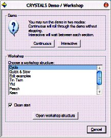

.. toctree::
   :maxdepth: 1
   :caption: Contents:

.. include::  ../macros.bit

###############
Getting Started
###############
.. index:: Getting Started
   
********************
Organisation of data
********************
CRYSTALS stores information in a single document (default name crfilev2.dsc) within a folder. 
It is important that you do not try to edit this file.
|br|\
Many other output and intermediate files are written to this folder.
|br|\
For more details see the section :ref:`Files and Folders`.

.. _startup:

********************
Starting the program
********************
.. index:: Starting CRYSTALS

*Method 1* Double click on the CRYSTALS icon on the desktop, the "Browse for Folder" dialog 
will be displayed. Find the folder where you have stored your primary data.

.. image:: ../images/browseforfolder.jpg

*Method 2* If you have already started a project, browse to the structure folder
and double click on the CRYSTALS database file (*.dsc* file) to launch
CRYSTALS and open that file.

*Method 3* Browse to the folder containing your primary data and choose 'Open CRYSTALS here' 
from the right-click popup menu.
|br|\
If a CRYSTALS database file (*.dsc* file) alresady exists it will be opened by CRYSTALS 
and you can continue working on the structure, otherwise a new (empty) database will be created.
You can put the basic data into the database by choosing *Data* from the top menu. 
|br|\
See :ref:`Files and Folders`.

.. _customise:

*********************************************
Customising CRYSTALS to suit your screen size
*********************************************
.. index:: Customisisg CRYSTALS

It is important to be able to read the text output in the left hand pane of the CRYSTALS window.
|br|\
From the menus choose :ref:`Appearance->Set Text Font <set font>`
Choose the smallest font size that you can read.
|br|\
I would recommend *Lucida Console* in size 7 or *Courier New* size 9.

.. image:: ../images/drag.jpg

Now make sure that you can see the full width of a line of text in the output pane.
You can drag the bar situated between the text area on the left and the CRYSTALS logo 
screen on the right, to adjust the relative sizes of these two areas.
|br|\
The area on the right will eventually display a representation of the atomic co-ordinates, 
so leave at least a little bit of space.

