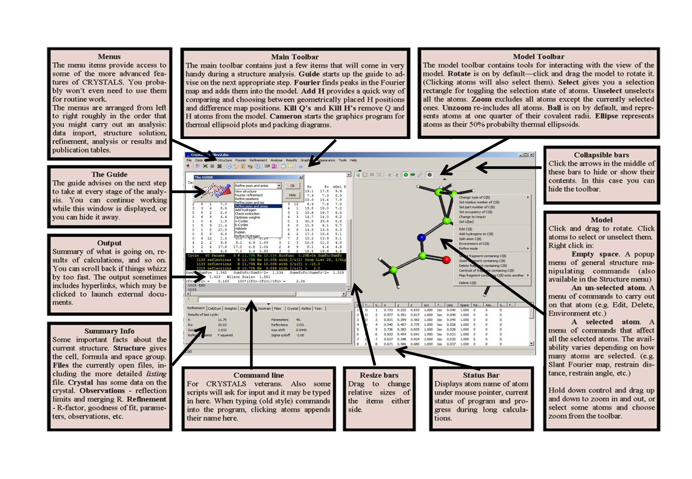

.. toctree::
   :maxdepth: 3
   :caption: Contents:

.. include:: ../macros.bit 

#######################
Understanding  CRYSTALS
#######################

*****************
You Need to Know:
*****************

.. index:: Need to Know

::

 There are a few things you need to keep in the back of your mind when using CRYSTALS.

       Structure database
       Lists
       Atoms
       Reflections
       Commands
       Scripts

.. _database:

.. _structure database:

^^^^^^^^^^^^^^^^^^^
Structure database:
^^^^^^^^^^^^^^^^^^^
.. index:: Database, Structure

The program accumulates information as it works, which means that if you stop working on a structure,
you can restart the task from where you left off - a bit like creating a big WORD document. The accumulated data
is stored in a binary database *something.dsc*.  By default, the something is  *crfilev2.dsc*.
See the section :ref:`Structure Database <crysdatabase>` for full details. 

.. _files:

.. _output:

^^^^^^^^^^^^^^^^
Output and Files
^^^^^^^^^^^^^^^^
.. index:: Files, I/O

===================
Plain text Listings
===================
The output displayed on the screen is normally sufficient for you to see how an analysis 
is progressing.  More detailed information of the computations is simultaneously copied to a  
*listing* file, /log/bfile#nn.lis.  Each time CRYSTALS is re-started the generation 
number, #nn, is automatically incremented so that the *log* folder holds a complete record 
of an analysis.
These are plain text (ASCII) files and so can be examined using any text editor, such as 
Notepad or Wordpad.
If you don't think you are interested in the contents of these files, they 
can safely be deleted. The |blue| Tools |xblue| menu contains a utility to do this for 
you.  
|br|\
If you need to see the contents of the current listing file while CRYSTALS is still 
running, this can be done via the InfoTab *Files*.  The default viewer is a built-in 
module, but the menu |blue| Tools/Preferences |xblue| lets you nominate an alternative 
editor.  **The nominated editor must be able to access files that are currently associated 
with another process (in this case, CRYSTALS).**

=============
Monitor files
=============
This text file only contains special output from a few utilities. 
It is not auto-incremented - each time CRYSTALS is restarted the old monitor file 
is overwritten. 

=========
Log files
=========
In general, all input typed on the Command Line is mirrored to a file /log/bfile#nn.log. 
This file is auto-incremented, and as well as containing a transcript of the users input, 
it also logs much of the activity of SCRIPTS. |br|\
If you wish to repeat a series of calculations in a slightly modified form, this file can 
be edited to remove unwanted operations and include new modifications before being saved 
with a unique name, *e.g.* Test-1.dat. This new file can be executed by typing |blue|
#USE TEST-1.DAT |xblue| on the Command Line.

===========
Punch Files
===========
CRYSTALS can produce carefully formatted data files for re-input to CRYSTALS, or for 
communication with other programs.  If the file has a special purpose, it will generally 
by given a name to reflect its use, *e.g.* publish.cif.  Otherwise it simply has the name 
bfile.pch.  There are no generation numbers for this file - new versions overwrite the old 
one.  We are slowly moving to a convention that files formatted as native CRYSTALS input 
will have the extension .cry.
|br|\
The folder /data/ holds punch files created by CRYSTALS for possible future use.  If you 
delete these, some of the graph plotting utilities will generate an error message.

^^^^^^
Lists:
^^^^^^
.. index:: LISTs, Data

Sets of related crystallographic data are collected together into *LISTs*.  Some of the 
LISTS have names, but they are generally referred to by a number
|br|\
You will most frequently see references to *LIST 5*, the refinable parameters 
(mostly atoms) and *LIST 6*, the reflections.
|br|\ See, for example, LIST 1, :ref:`LIST01` and :ref:`Lists` for a list of all LISTs.
|br|\
The section :ref:`Managing the Database <manage-db>` describes some commonly used operations.

.. _`Atom ID`:

^^^^^^
Atoms:
^^^^^^
.. index:: Atom Name Syntax
.. index:: Atom Identifiers
.. index:: Atom ID

Atoms are held in LIST 5, and are identified by a two-part symbol, the **atom ID:**

   * The Name. A four character identifier also used to identify the atomic scattering 
     factor.  This is **not** case sensitive.

   * A four digit *serial number* enclosed in parentheses.  

The combination e.g. C(12), should be unique for every atom.  While symbols like C(12) 
and O(12) refer to different atoms and are permitted, they are not recommended and it 
is advised that all serial numbers are unique because automatic hydrogen naming computes the 
serial number of each hydrogen from that of its parent atom, e.g. H(11), H(12) and 
H(13) attached to C(1). 
|br|\ 
If two atoms have the same ID, references to the atom will only find the first 
occurrence. See :ref:`Fixing clashes <fix clashes>`
|br|\
It is a good idea to assign a final atom numbering scheme as soon as
possible in the analysis. This will save a lot of hastle later.
|br|\
Atom names can also include symmetry information.
See the section :ref:`atomparams`.

.. see crystals/initial.rst
.. see crystals/parameters.rst

^^^^^^^^^^^^
Reflections:
^^^^^^^^^^^^
.. index:: Reflections

Reflections are held in LIST 6. Usually unmerged data including  the systematic absences
are input to CRYSTALS. The systematic absences are excluded and the 
indices transformed to the unique part of the reciprocal lattice and equivalent 
reflections merged during data input.  The systematic absences and the equivalent
reflections are examined and information about them exported to tables and graphs to help
resolve problems should they occur.
|br|
Friedel pairs are generally conserved for non-centrosymmetric space groups.  If 
necessary, a merged copy will be created for special purposes, e.g. computing a 
Fourier Synthesis.

^^^^^^^^^^^^^^^^^^^^
Commands and Scripts
^^^^^^^^^^^^^^^^^^^^
.. index:: Commands

CRYSTALS works by performing operations given in the form of *COMMANDS*.  For 
convenience in day-to-day use, COMMANDS and suitable parameters have been packaged up
into *SCRIPTS*.  These SCRIPTs are usually accessed via the *GUI* Menus, Tool Bar or 
Model window.  The experienced user can access many SCRIPTS directly via the *Command 
Line*.
|br|\ See the section :ref:`Syntax of Commands`
|br|\ and the example :ref:`nket`

^^^^^^^^^^
Help Files
^^^^^^^^^^
.. index:: Help

There are a variety of help files, which are slowly being rationalised. Many menus have
a brief help text as the bottom item on the menu.
|br|\
Some menus also have hyperlinks to illustrated texts.
|br|\
Some menu items having a basic choice between *Continue* or *Cancel* also have an 
optional *Help* button.  This button only shows if you have |blue| Tools-Help |xblue|
enabled. 
:ref:`See the section Tools Help <Tools Help>`. These little help files explain what will
happen if you choose to continue.
|br|\

----

.. _command file:

^^^^^^^^^^^^^^^^^^^^
Command file summary
^^^^^^^^^^^^^^^^^^^^
.. index:: Command File

CRYSTALS uses a master system database containing the definitions of all
COMMANDS  and LISTS. This is usually hidden from the users
but advanced users typing COMMANDS directly into CRYSTALS
can interogate it to get terse aide-memoires of COMMANDS and LISTS.

==========
\\COMMANDS
==========
This COMMAND should only be issued after any preceeding COMMANDS have
executed to completion. Its format is:
 
::

     \COMMANDS      commandname
 or
     \COMMANDS      LIST      listnumber

==============
Query facility
==============
Once a COMMAND is  initiated, information about its directives and
parameters can be obtained by starting a line with '?'. This facility will
not work if an error has occured during the input of the current COMMAND.
 
::

      \FOURIER
      ?
      ?MAP
      ?MAP            TYPE
      MAP             TYPE=DIFF
      END

In this example, the first ? produces a list of available directives, the
second a list of parameters for MAP, and the third a list of permitted map
types, and the default choice.  The amount of output available depends upon
the structure in the master database. 

*********************
Organising your data:
*********************
.. index:: Organising Your Data

Keep track of what you are doing by creating a new folder for each new structure and 
placing you basic data, such as diffractometer output, into it.  CRYSTALS will create a 
binary data base of information about your structure and add to it as he analysis 
proceeds.
|br|\
**DO NOT** try to edit this file in any way. You will corrupt it and make its contents 
inacessible.
|br|\ For details see the section :ref:`Files and Folders`.
|br|\

********************* 
Layout of the Screen:
*********************
.. index:: Screen Layout
.. index:: GUI Overview

Please see `layout`_ for a high resolution image

.. _layout: ../_../images/layout.png

::

       Main Toolbar
       Top Menu
       The Guide
       Text Window
       Summary Tabs
       Command Line
       Model Window

^^^^^^^^^^^^^
Main Toolbar:
^^^^^^^^^^^^^
.. index:: Main Toolbar

The Main Toolbar contains just the few items that are most commonly used during an 
analysis.  They are a subset of items available via the Menu bar.

   * |guide|   *Guide* starts up the Guide to advise on the next appropriate step.
   * |four|    *Fourier* links to most commonly required Fourier maps.
   * |perh|    *Perhydrogenation*  uses geometrical and Fourier methods to locate hydrogen atoms.
   * |delq|    *Delete* **Q** peaks.
   * |delh|    *Delete* all hydrogen atoms.
   * |undo|    *Undo* enables you to revert to an earlier version of the model.
   * |ed5|     *Edit Atoms* enables you to edit the atomic parameters with a normal text editor.
   * |ed12|    *Edit Constraints* enables you to set up the the refinement details with a normal text editor.
   * |ed16|    *Edit Restraints* enables you to set up the the refinement restraints with a normal text editor.
   * |refine|  *Set Up* the parameters to be refined
   * |runref|  *Initiate* some cycles of refinement
   * |cam|     *CAMERON* Graphical structure viewer, printer and manipulator.
   * |hg|      *Mercury* A link to the CCDC Mercury structure viewer.
   * |note|    *Text Editor* Usually Notepad on Windows machines.
   * |cmd|     *Command* Opens a Command Shell
   * |expl|    *Explorer* opens Windows explorer in the current working directory.
   * |Help|    *Help* Access the HELP system

^^^^^^^^^
Top Menu:
^^^^^^^^^
The top Menu provides access to SCRIPTS which automate common tasks (including all
those on the Tool Bar).  If *Tool Help* is turned on 
(see  :ref:`Tools Help <tools help>` ), some of 
the menu items provide information about what will happen if you choose that menu.
|br|\
The menus are arranged from left to right in roughly the order required for a routine
structure determination:
|br|\
See :ref:`menus` for details.
|br|\

   * File: Selection of file manipulation commands

   * Data Import:  Compatible with many diffractometer data sets and SHELX .res, .ins, 
     .hkl and .hklf5 formats.

   * Structure Solution:  SIR92, SHELXS and Superflip are packaged with CRYSTALS. Users are 
     recommended to install SHELXT from the SHELX website.

   * Structure:  Manipulation of the structure, including naming and numbering of atoms, setting Parts 
     and Residues, making and/or breaking bonds, things concerned with hydrogen atoms and
     Q peaks.

   * Fourier:  Various Fourier syntheses.
 
   * Refinement:  Setting up refinement details, constraints and restraints. Choosing 
     refinement weights and *SQUEEZing* the structure (see :ref:`SQUEEZE <squeeze>` )

   * Analyse: Many analytical and graphical tools to help validate an analysis, or to 
     trouble-shoot problem structures/data sets.  

   * Results:  Output results in various formats, including cif files with embedded 
     refinement details and un-merged reflections.  Links to IUCr Checkcif or *PLATON*
     if it is installed.

   * Graphics: View the current (or re-display previous) structure in *CAMERON*. View
     previously created maps.

   * Appearance: Set screen font and some aspects of the model window, including 
     auto-updating.

   * Tools: Set various options, bits and pieces.

   * Help:  Access to the guides and manuals.

^^^^^^^^^^
The Guide:
^^^^^^^^^^
The Guide tries to suggest what to do next at each stage in an analysis.
The drop-down contains alternative suggestions.
The Guide can be turned off at any time and turned back on from the Top Menu.
|br|\
See :ref:`The Guide <The Guide>` under Workflow for more details. 

|g-ref|

^^^^^^^^^^^^
Text Window: 
^^^^^^^^^^^^
A summary of what CRYSTALS is doing (the full details are in 
*bfile##.lis*).  The window can be widened by dragging the right hand edge, and
can be scrolled back with the side scroll bar.
|br|\
Hyper-links to other output and files appear in blue.

^^^^^^^^^^^^^
Summary Tabs: 
^^^^^^^^^^^^^
Display information from the data base (.dsc file). 
  
   * The *Refinement*   tab only updates after a cycle of refinement.
   * The *Constraint* tab enables the refinement directives to be edited.
   * The *Restraint* tab enables the restraints to be edited.
   * The *Files* tab enables you to look at the output listing (.lis) and punch
     (.pch) files without exiting CRYSTALS.
  

^^^^^^^^^^^^^
Command Line:  
^^^^^^^^^^^^^
A |blue| COMMAND |xblue| is a group of directives and data which must be 
taken together to have any meaning - a bit like a natural language sentence.
The start of a command is indicated by the COMMAND name preceded immediately by
a special character. The end is indicated by the word END.
|br|\
The permitted special characters are: "#", "\\\\" and "&".
|br|\ 
|br|\  
This is where you can enter CRYSTALS commands directly.  See :ref:`command-line` 
and  :ref:`Syntax of Commands` for 
more details. Most 
complicated sets of commands are now generally created via the SCRIPTS, but some useful 
commands are:  

   * *#SUMMARY LIST 5* followed by the optional low/medium/high displays less or more of 
     the contents of LIST 5, the atom parameter list.
   * *#DISK* enables you to see and manage the LISTS in the data base. See
     :ref:`The CRYSTALS Database <crysdatabase>` for details.
   * *#USE* followed by a file name to cause CRYSTALS to read input from the named file.
   * *#EDIT* starts the powerful atomic parameter editor. See  :ref:`Editing Atoms`

With the mouse cursor on the Command Line you can use the |blue| up-arrow |xblue| to 
retrieve, edit and then execute lines of text previously typed in.

^^^^^^^^^^^^^^^^
Graphics Window:  
^^^^^^^^^^^^^^^^
The model window both displays the structure and enables you to perform 
some atom-based operations, such as computing Fourier sections, selecting or deleting 
atoms or groups of atoms, setting atom parameters, computing geometrical parameters.
See :ref:`Using the Model Window <the model window>` for operations which can be performed on 
the  model.

|gui|

.. _crysinit:

********************
Customising Crystals
********************
.. index:: Customising CRYSTALS

The download kit installs CRYSTALS in a default mode. Small changes can be made to the 
appearance of the screen and to actions taken when the program is started.
|br|\
If a file |blue| CRYSINIT.DAT |xblue| exists in the current folder it is executed before 
control passes to the user interface. This file may contain any CRYSTALS commands, but 
most commonly it contains :ref:`Immediate Commands <Immediate Commands>` 

:ref:`See Startup <customise>` and :ref:`Menus/Appearance <appearance>`

.. see also Immediate Commands

***************
Using The Guide
***************
.. index:: Using the Guide

The worked examples :ref:`CYCLO <Cyclo>` and :ref:`Tetraphenylene <tetraphenylene>`
illustrate the main fatures of The Guide.

***********
Using Menus
***********
.. index:: Using Menus

The menus provide short cuts for many common tasks.

 
These are described in detail in the :ref:`Menus <menus>`  section.

----

*************
About SCRIPTS
*************
.. index:: About SCRIPTS
.. index:: SCRIPTS Overview

The SCRIPTS are pre-packaged groups of COMMANDS which are commonly used in sequence.
They are also able to ask the user for information or to make choices. They can make
their own decisions based on the available crystallographic information.  They 
communicate with CRYSTALS by issuing standard COMMANDs, which are mirrored to the log
file, *bfile#.log*.  |br|\
Text from the log file may be copied into a new file, e.g. newtask.job, edited to
change the detailed action, and the new COMMANDS input into CRYSTALS with #USE 
newtask.job. |br|\
This structured flexibility is provided by the SCRIPT processor,
and the CRYSTALS program is issued with an extensive set of scripts.
These build and control the graphical interface, but are
themselves only plain text data files, and users are free to modify
them in any way they wish, and add new ones. It is not possible for a
script to corrupt the CRYSTALS program, but an incorrectly modified SCRIPT could damage 
the *.dsc* database.
|br|\
Scripts are generally executed from a menu, but they can also, with care, 
be executed from the command line.

 

^^^^^^^^^^^^^^^^^^^^^
Entering SCRIPT  mode
^^^^^^^^^^^^^^^^^^^^^
Control can be passed to  script mode by issuing the CRYSTALS command.
 
::

  \SCRIPT  scriptname

where scriptname is the name of the script required. 
 
::

 e.g.
  \SCRIPT  ANALYSE

This pre-gui script gives an analysis of residuals in the text pane.

.. _Getting out of SCRIPTS:

^^^^^^^^^^^^^^^^^^^^^^
Getting out of SCRIPTS
^^^^^^^^^^^^^^^^^^^^^^
.. index:: Getting out of SCRIPTS

|red| Occasionally a SCRIPT will start looping |xred| , producing copious error messages, either 
through a programming error or the SCRIPTS failure to understand the user-input. Pressing 
the close icon (an |red| **X** |xred| in the top right had corner) several times **SLOWLY** will eventually 
abort the SCRIPT. |br|\
The response 'DIRECT' can be made to SCRIPT questions, and has the effect
of returning the user IMMEDIATELY to direct CRYSTALS input mode. Any half
completed tasks being performed by the SCRIPT may need terminating (or
aborting) with an 'END'.
 
----

.. _cameron:

*************
Using CAMERON
*************
.. index:: Cameron - the graphics module
.. index:: Graphics - see CAMERON

|blue| CAMERON |xblue| is a built-in graphical tool for both examining 
the structure and modifying it. It differs from the GUI model window
in that it has complex packing and connectivity options. 

:ref:`See the old Cameron reference manual <cameron-manual>`

----

.. _Inputting Data:

##############
Inputting Data
##############
.. index:: Inputting Data
.. index:: Atom Names in SHELX
.. index:: Site Occupancy

Select *Data* and then *Open File* from the GUI Menu.  
This should open a window showing all files with
suitable extensions. If your file has an unusual extension,
use the drop-down at the bottom right to 
show *All Files* .  If you click on 
your data file, CRYSTALS will try to identify the type of data based
on the file extension.  Check and  if necessary change the automatic selection.

* From Shelx:
  *.ins* and *.res* files will be pre-processed by the module *shelx2cry*,
  written by Pascal Parois. This will extract any useful information it can
  and save it in CRYSTALS format. Rather than look for the space group symbol
  on the **TITL** card, it tries to determine the space group from the symmetry
  elements.

  * Atom Names in SHELX

    Remember that SHELX has a quite different atom naming syntax from CRYSTALS. 
    The automatic conversion from SHELX to CRYSTALS may lead to ambiguity.  If you 
    resolve this either manually or automatically by  CRYSTALS, there is a real
    risk that :ref:`restraints <list16>` copied over from SHELX will no longer be valid.
    |br|\
    See the section :ref:`Atom Identifiers <Atom ID>` for a brief explanation of naming in CRYSTALS,
    and :ref:`atomparams` for the full syntax in CRYSTALS.

  * Site Occupancy

    The atomic site occupancy used in CRYSTALS is the 'chemical' occupancy, *i.e.* the 
    fraction of an atom expected at that site without reference to the crystallographic
    symmetry. Any modification required because the atom lies on a Special Position is
    applied internally by CRYSTALS. 
    If you have a disordered structure with an atom near a special
    position, this feature may have to be turned off by setting a flag in
    :ref:`List13` .  The site occupancy of any atoms lying on special positions
    will then have to be set by hand.

  If there is a reflection file (.hkl) with the same name as the *ins* or *res* file,
  this is automatically processed.
  |br|\
  If a SHELX *cif* file contains embedded *res* and *hkl* files, these can be extracted
  with *shelx2cry* and then processed.
  |br|\
  |br|\

* From Diffractometers
  |br|\
  Utilities exist for processing SHELX *hklf4* and *hklf5* format files, and for 
  extracting reflections from *cif*, *fcf* and *cif_od* files.  If your *cif* file
  has the extension *hkl* take care to re-select the correct option from the menu.

* Twinned Data
  |br|\
  Twinned data in the SHELX hklf5 format can be processed with Bruce Foxman's *hklf52cry*
  program.  Since CRYSTALS needs to know the twin laws, Bruce's program attempts
  to derive these from the hklf5 file.  Note that the hklf5 file |blue| **MUST** |xblue|
  be
  **unmerged** data, which conserves the original reflection indices. If an *hklf5*
  file simply has the extension *.hkl* take care to reselect the correct option from
  the menu.

* From  *CIF* files
  |br|\
  CRYSTALS can extract both structural and reflection data from *cif* or *fcf* files.

.. _`manage-db`:

**********************
Managing the data base
**********************
.. index:: Managing the database

The users data base is held in the binary file CRFILEV2.DSC, called 'the disk'. This
file |blue| MUST NOT BE PRINTED. |xblue| It will grow with use, and cannot be shortene,
though instructions exist for recovering space within the dsc file. See the section
:ref:`Purging the disk <purging the disk>`  for details.  

^^^^^^^^^^^^^
Listing LISTs
^^^^^^^^^^^^^
The data in a CRYSTALS LIST can be examined with:
 
::

      \SUMMARY LIST n
      END
      Which sends a brief summary of LIST n to the terminal
 or
      \PRINT n
      END
      Which sends a detailed listing to the .LIS file.

.. _DISK Index:

^^^^^^^^^^^^^^^^^
Index to the disk
^^^^^^^^^^^^^^^^^
.. index:: DISK Index 

The disk index can be examined with
 
::

      \DISK
      PRINT
  or
      PRINT  DISK
      END

PRINT by itself lists the currently active lists |br|\
PRINT DISK lists all the LISTS in the .DSC file.

.. _Recovering lists: 

^^^^^^^^^^^^^^^^^^^^^^^^^
Recovering previous lists
^^^^^^^^^^^^^^^^^^^^^^^^^
.. index:: Recovering lists

Whenever a LIST is stored in the disk, its serial number is incremented.
In general, previous lists are over written, but new parameters lists,
LIST 5, are always created. Previous versions can be made current or
active by 'resetting' to them. This is done either by giving their
absolute serial number, or a relative number.

 
::

      \DISK
      RESET       5       0      -1
      RESET       5      42
      END

The first reset steps back one (to the previous) parameter list. The second
reset (which of course supersedes the first), makes LIST 5 serial number 42
the current active version.
|br|\
There is an entry for resetting the active parameter list (LIST 5) under the 
|blue| **Structure** |xblue| menu.
 
.. _purging the disk:

^^^^^^^^^^^^^^^^^^^^^
Purging the disk file
^^^^^^^^^^^^^^^^^^^^^
.. index:: Purging the Disk

The disc file slowly grows as lists are accumulated in it.
Non-currently
active lists can be eliminated with the PURGE instruction. Valuable
intermediate versions of lists, such as a good trial structure before an
experimental refinement, can retained by setting the *RETAIN* flag.

 
::

      \DISK
      RETAIN 5   0  -1
      RETAIN 5      17
      END
      
      \PURGE
      END

      \PURGE new-name
      END

      \PURGE DATE
      END
 

The first RETAIN instruction retains the previous LIST 5, the second 
retains LIST 5 with the serial number 17/ |br|\
Purge by itself eliminates old versions of LISTS but does not shorten the .DSC
file. |br|\
PURGE new-name creates a new data-base, new-name.DSC with a minimal size. Useful 
if you need to E-mail the DSC file. |br|\
PURGE DATE creates a data-base with the 'name' built from  the current
month-day-time, e.g. 10231145 for October 23rd at 11.45

