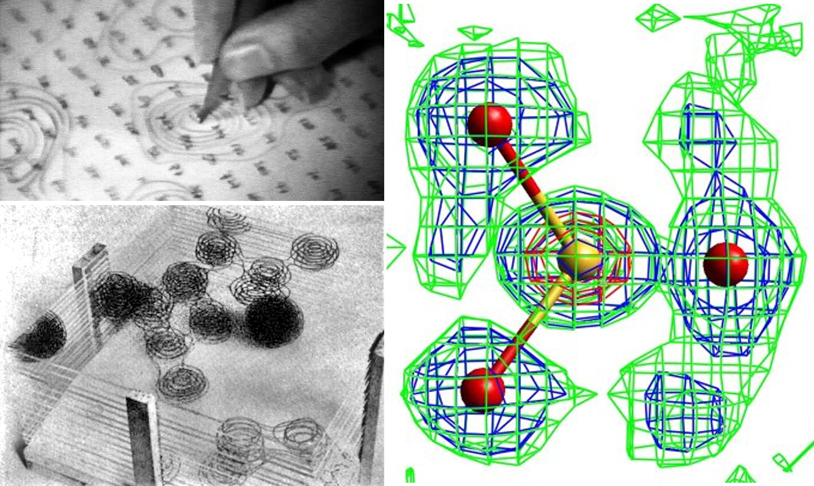

.. toctree::
   :maxdepth: 1
   :caption: Contents:

.. include:: ../macros.bit     

#####################
Electron Density Maps
#####################
.. index:: Fourier routines

****************
Seeing Electrons
****************
X-rays interact with the periodic array of electrons (and hence atoms) in a cystal 
structure - they *see* electron density.  The Bragg reflections have a magnitude 
and a phase angle.  Combining these in a suitable Fourier Synthesis directly yields the 
electron density at any (and hence every) point in the unit cell.
|br|\
The magnitude of the reflections can be measured on a diffractometer, the phase cannot be.
Methods exist (usually **Direct Methods**) for estimating the phases, so that electron 
density maps can be computed. Regions of high density in the maps can be associated with 
atomic nuclei, and hence with an atomic model.  This, in its turn, can be used to compute 
new and better phases and hence a better model, and the process repeated until  there is no 
further improvement.
|br|\
These days it is rare for crystallographers to actually look at density maps.  Instead, 
they are *peak searched* inside the computer and the coordinates of local maxima output.  
However, in difficult cases of disorder, it is very often instructuve to actuially look at 
a contoured map.

.. _contour:

.. index:: 3d-contour

::

  Hand contouring sections and stacking traceings to create a 3D image,
  SO3 group showing clear evidence of disorder either side of the main sites

This section of the manual provides a brief introduction to electron density 
maps in CRYSTALS

::

         Input of the Fourier section limits                  -  \LIST 14
         Compute Fourier limits from the symmetry operators   -  \FLIMIT
         Fourier calculations                                 -  \FOURIER
         Processing of the peaks list                         -   LIST 10
         Elimination of duplicated entries in LISTS 5 and 10  -  \PEAKS
         Slant fourier calculations                           -  \SLANT

 
^^^^^^^^^^^^^^^^^^^^^^^^^^^^^^^^^^^^^^^^^^^^^^^
\\LIST 14 - Input of the Fourier section limits
^^^^^^^^^^^^^^^^^^^^^^^^^^^^^^^^^^^^^^^^^^^^^^^

::

    \LIST 14
    X-AXIS MIN=0.0 STEP=0.0 MAX=0.5 
    Y-AXIS 0.0 0.0 0.9 0.0
    Z-AXIS -2 2 32 60
    ORIENTATION Z X Y
    SCALE VALUE = 10
    END

LIST 14 defines an asymmetric volume of the unit cell with section edges
parallel to any two of the cell axes (a, b or c). The starting and
stopping points must be given for each direction (in crystal fractions).
The user should choose the asymmetric unit to have one
range as small as possible, and the other two approximately equal.
Orientate the computation so that the sections are perpendicular to the
short range direction.
|br|\
The asymmetric unit can also be given for a Patterson synthesis. This may be the same as 
that for a Fourier.
|br|\
If the command \\SPACEGROUP has been used to input the symmetry
information, a LIST 14 will  have been generated automatically.
This will be a valid choice, but may not be computationally optimal.

   
   
   

 
^^^^^^^^^^^^^^^^^^^^^^^^^^^^^^^^^^^^^^^^^^^^^^^^^^^
\\FLIMIT - Compute Fourier limits from the symmetry
^^^^^^^^^^^^^^^^^^^^^^^^^^^^^^^^^^^^^^^^^^^^^^^^^^^

::

    \FLIMIT LAUE=3
    END

This command uses the same algorithms as \\SPACEGROUP to create a LIST 14
from the symmetry operators given in LIST 2

 
^^^^^^^^^^^^^^^^^^^^^^^^^^^^^^^^
\\FOURIER - Fourier calculations
^^^^^^^^^^^^^^^^^^^^^^^^^^^^^^^^

::

    \FOURIER
    MAP TYPE=DIFF
    PEAK HEIGHT = 3
    END

Before a Fourier is computed, a LIST 14 must be stored.
The routine will compute a map in any space group,
the relevant symmetry being found in LIST 2 (space group information,
see section :ref:`LIST02`).
|br|\
The principal types of map to be computed are Fo, DIFF (Fo-Fc) and 2Fo-fc.
The map sections may be output for inspection and contouring, but they are
also scanned for local maxima.
In the ouput listing new peaks are labelled with the following
meanings:

::

         GOOD PEAK -    The peak was ellipsoidal and its centre was 
                        determined by Least-Squares.
         POOR PEAK -    The peak was poorly shaped and its centre was 
                        determined by interpolation.
         DUBIUOS PEAK - The peak centre is an ill-defined local maximum.
         MALFORMED PEAK - The peak centre is extrapolated to be out side
                          of the asymmetric unit - usually due to very 
                          poor phasing.

============================
Difference Map sample output
============================

::

 Results of the peak search and contents of the new list  10

 Map scale factor =     10.000     Minimum peak height =        3.0    
 Maximum number of peaks allowed =    21

 Type   Serial    X         Y         Z           Height(x  10.0)

 C         2.     0.3562    0.8325    0.0967       -2.1   
 H        21.     0.3415    0.9106    0.1251        0.2   
 H        23.     0.5449    0.8072    0.0906        0.2   
 H        22.     0.2614    0.8344    0.0413       -2.9   
 C         3.     0.2362    0.6313    0.1282        1.3   
 
 ...........

 H         1.     0.1685    0.3743    0.2240       -7.8   
 H       103.     0.1687    0.3668    0.2322       -7.5   
 H       104.     0.1685    0.3743    0.2240       -7.8   
 Q         1.     0.2312    0.7453    0.1544       63.2  Good Shape  
 Q         2.     0.8000    0.7428    0.1533       13.9  Good Shape  
 Q         3.     0.4950    0.7500    0.1615        9.7  Poor Shape  
 Q         4.     0.3081    0.3853    0.0608        8.3  Good Shape  
 Q         5.     0.4762    0.3794   -0.0021        8.2  Good Shape  
 Q         6.     0.5281    0.4489    0.2227        7.3  Poor Shape  
 Q         7.     1.0063    0.1086    0.0119        7.2  Poor Shape  
 
 ...........

 Q        16.     0.3887    0.8058    0.2108        5.9  Poor Shape  
 Q        17.     0.6594    0.9389    0.0519        5.7  Good Shape  
 QN       18.     0.0000    0.8889    0.0000      -10.2  Hole        
 The new list  10 contains    38 atoms
 The minimum and maximum map densities are  -1.02      4.35    electrons /A^3
                  The deepest hole is at    0.000   0.889   0.000
 Mean electron density at original atomic sites is    -0.07
                      with an R.M.S. deviation of      0.40

 
^^^^^^^^^^^^^^^^^^^^^^^^^^
\\LIST 10 - The Peaks list
^^^^^^^^^^^^^^^^^^^^^^^^^^

This is the internal output of the Fourier peak search. It must be processed
to eliminate spurious peaks and assign atomic type to others. This is usually achieved by 
the command \\PEAKS
since duplicate peaks related by symmetry, or peaks corresponding to
known atoms  can be eliminated. It is described in the section on Atomic and 
Structural Parameters.

^^^^^^^^^^^^^^^^^^^^^^^^^^^^^^^^^^^^^^^^^^^^^^^^^^^^^^^^^^^^^
\\PEAKS - Elimination of duplicated entries in LISTS 5 and 10
^^^^^^^^^^^^^^^^^^^^^^^^^^^^^^^^^^^^^^^^^^^^^^^^^^^^^^^^^^^^^

::

    \PEAKS
    SELECT REJECT=0.0001
    REFINE DISTANCE=.5
    END

This routine eliminates
atoms or peaks which duplicate other entries in an atomic
parameter list.
When using this routine, a set of distances is calculated about each
atom or peak in turn. Atoms or peaks further down the list than the
current pivot are then eliminated if they have a contact distance less
than a user specified maximum (the  REJECT  parameter).
Thus, when peaks have been added to a
LIST 5, the peaks corresponding to the KNOWN atoms can be eliminated.
|BR|\
It is described in the section on Atomic and 
Structural Parameters.

^^^^^^^^^^^^^^^^^^^^^^^^^^^^^^^^^^^^^^
Slant fourier calculations  -  \\SLANT
^^^^^^^^^^^^^^^^^^^^^^^^^^^^^^^^^^^^^^
A Slant Fourier is one that is calculated through any general plane
of the unit cell (i.e. not parallel to any unit cell face), making it a powerful tool for 
investigating problem structures. See the right hand :ref:`example <contour>` above.

::

       \SLANT
       MAP DIFFERENCE 0.3 0
       CENTROID 0 0 0
       MATRIX 3.4076 10.0498 6.1794
       CONT   5.0606  8.287 -9.5483
       CONT  -6.9181 11.0121 1.546
       DOWN -4 33 0.25
       ACROSS -4 33 0.25
       END

The input for the slant Fourier must include the rotation
matrix  *R,* the centroid  *X,* for the required plane, and the steps and divisions in the
plane. The output from the calculation are figure fields, which can be saved in named 
files (slant.fou by default) for viewing in |blue| MCE |xblue| 
(Marching Cube Electron Density, by Jan Rohlicek & Michal Husak)
|br|\
As an alternative to actually giving a matrix, the CRYSTALS commands for computing
best planes (\\MOLAX), axes of atomic displacement parameters (\\AXES) and TLS analyses
(\\ANISO) can store the relevant matrix for later use by  \\SLANT.
The GUI provides a convenient way for computing and viewing slant Fourier maps, and for
manually placing local peaks (as new atoms) in the structure.

