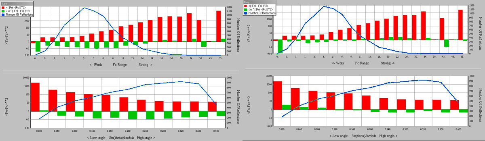

.. toctree::
   :maxdepth: 1
   :caption: Contents:

.. include:: ../macros.bit

###################################
Structure Factors and Least Squares
###################################

**********
Refinement
**********
Determination of parameters in a linear model by linear least squares gives  you the parameter 
values immediately.   
Refinement of a non-linear model (e.g. one containing sines, cosines etc) by non-linear 
least squares is a strange business - it only works properly once you have 
the final answer! The calculation doesn't give the parameters directly, only suggested 
shifts which should improve the model.
However, it will work approximately if you have an approximate starting model, 
and usually it improves that model, so that doing successive least squares calculations
(sometimes called *rounds* or *cycles* of refinement) often converges to the best model
your data can yield.  If all goes well, the shifts get smaller with each successive  
cycle.
You need to be aware that cycles of structure factor-least squares 
(SFLS) may not converge if the starting model is very poor or the data contains gross 
errors.  SFLS only refines the parameters in the current model - it cannot add new 
parameters (such as new atoms), though it can indicate superfluous parameters.  Though 
X-ray structure analysis is data-rich (i.e. there are very many more observations than 
there are parameters), there may still not be enough information in the data to define all 
the parameters you would like to include in the model.  In this case you have to include 
non-X-ray information.  This can be strict relationships between parameters (called |blue|
constraints |xblue| ) or softer information (called |blue|  restraints |xblue| ).

Unlike some other systems, what you *DO* with a parameter is kept separate from the actual
*value* of the parameter.  What you *DO* is held in |blue| LIST 12 |xblue|, the *value* is 
held in LIST 5.  For simple refinements LIST 12 is just a list of the parameters you wish 
to refine:
::

      Example:  Refine the positions and adps of all the atoms.
      \LIST 12 
      FULL X'S U'S
      END

      Example: Refine the anisotropic adps for the heavy atom, the isotropic ones for all 
      other atoms. Fe is the first atom in the list.
      \LIST 12
      FULL FE(1,X'S,U'S)
      CONTINUE C(1,X'S, U[ISO]) UNTIL LAST
      END

The advantage of this strategy is that the refinement definition is kept brief, 
the disadvantage is that if you change an atom name (in LIST 5), you must remember to make 
the corresponding change in LIST 12 and/or LIST 16.
|br|\
To create a LIST 12, see :ref:`setting up a refinement` below.

^^^^^^^^^^^^^^^^^^^^^^^^^^^^^
Time and space for refinement
^^^^^^^^^^^^^^^^^^^^^^^^^^^^^
SFLS is a resource-hungry process.  It involves forming the |blue| Normal Matrix |xblue|,
which contains a row and a column for every refined parameter (i.e. 9 *x* the number of atoms 
for an anisotropic refinement) and updating the values stored in this matrix for every 
reflection used. CRYSTALS contains features designed in the 1970's for minimising the work 
load (when a single cycle of a modest structure might take 24 hours).  Though no longer 
useful for modest structures, these features can be deployed to speed up the development 
of structures containing many hundreds of atoms.  The current (2019) version of CRYSTALS 
will refine over 1000 anisotropic atoms *full matrix* (all of the parameters in one giant 
matrix of 67 million elements).

^^^^^^^^^^^^^^^^^^^^^^^^^^
Refinement using the GUIDE
^^^^^^^^^^^^^^^^^^^^^^^^^^
The GUI will help guide the user through a routine medium size structure analysis by 
automatically creating the refinement directives, |blue| LIST 12 |xblue| .  For 
more complex cases, the refinement instructions created by the GUIDE can be hand-edited to 
handle special cases.  The strategy adopted for GUI is:

* Initially only the overall scale factor (to put the computation on an absolute scale of 
  electrons) is refined using atom coordinates from elsewhere and guesses at the isotropic 
  adps (0.05 for molecular structures).
* The scale and atom positions are then refined, still holding the adps at the initial 
  guesses.  If the adps are introduced before all the atoms are reasonably well placed, the 
  values may increase wildly and some atoms *evaporate*.
* Once the atom positions have stabilised, the isotropic adps are introduced.  In effect, 
  this is constraining the components of an anisotropic adp to define a sphere.
* After the isotropic adps have stabilised, they are permitted to go anisotropic.
* Introduce hydrogen atoms. For a SHELX-type refinement they should be refined as 
  |blue| riding |xblue| atoms, but with modern data they can often be freely refined, or 
  with weak geometric restraints.
* Final tidy up. The user is invited to look  at an Fo/Fc plot to decide if an extinction 
  parameter is needed, and possibly introduce the Flack parameter if the space group is 
  non centrosymmetric.

^^^^^^^^^^^^^^^^^^^^^^^^^^^^^^^^^^^^^^^^^^^^
Large Structures - Blocked Matrix Refinement
^^^^^^^^^^^^^^^^^^^^^^^^^^^^^^^^^^^^^^^^^^^^
Users working with disordered structures can speed up the modelling by first refining the well 
resolved part of the structure and then leaving it out of the refinement 
until the disorder is sorted out. To 
do this, the user must first create a LIST 12 containing only the ordered atoms and refine 
these to stability. Then  they must create a new LIST 12 containing only the 
disordered atoms and apply any 
constraints and restraints needed to stabilise the disorder.  Once this is achieved, 
it should be safe to reintroduce all the atoms. Remember that if there is more than one 
disordered region, they can be worked on one at a time.
|br|\
Users working on large Z'>1 structures can often save time in the early stages by putting
each instance of the structure into its own matrix block.  Once the refinement has become 
reasonably stable, all instances related by pseudo symmetry should be put into the same 
block.

::

  For a Z'=2 structure, atoms C(100) to O(121) and C(200) to O(221) the in itial LIST 12 might be:
  \LIST 12
  BLOCK C(100, X'S, U'S) UNTIL O(121)
  BLOCK C(200, X'S, U'S) UNTIL O(221)
  END

  and after near-convergence
  \LIST 12
  FULL C(100,X'S, U'S) UNTIL O(221)
  END

  
^^^^^^^^^^^^^^^^^^^^^
F or |f2| refinement?
^^^^^^^^^^^^^^^^^^^^^
Both type of refinement have been available in CRYSTALS since the early
70's. For most data sets, there is little difference between the two
correctly weighted refinements. One of the current reasons for choosing
Fsq refinement is *so that -ve observations may be used*. Such a choice
is based on the misapprehension that the moduli in the symbol /Fo/ are the result
of taking the square root of Fsq. In fact, it indicates that the phase
cannot be observed experimentally. The experimental value of Fo takes
the sign of Fsq and the positive square root. With proper weighting,
both refinements converge to the same minima
(Rollett, J.S., McKinlay,T.G. and Haigh, N.P.,  1976, Crystallographic
Computing Techniques, pp 413-415,  ed F.R.
Ahmed,Munksgaard; and Prince,E. 1994, Mathematical Techniques in
Crystallography and Materials Science, pp 124-125.Springer-Verlag).
However, the path to the
minima will be different, and there is some evidence that Fsq refinement
has less false minima. Using all data, including -ve observations,
increases the observation:variable ratio, but it is not evident that a
large number of essentially unobserved data will improve the refinement.
|br|\
If you have data collected under difficult conditions, you may have some observations that 
are wildly incorrect (e.g. partially obscured by hardware). Refinements of these data 
sets often benefit from starting with F refinement and then moving to |f2| once the 
outliers have been uncovered and excluded.
If the difference between F and Fsq refinement is significant, then the
analysis requires care and attention.
|br|\
CRYSTALS currently defaults to |f2| refinement simply to minimise the difficulties in getting 
inexperienced referees to accept manuscripts.

^^^^^^^^^^^^^^^^^^^^^^^^^^^^^^^^^^^^^^^^^^^^^^
R-Factor and minimisation function definitions
^^^^^^^^^^^^^^^^^^^^^^^^^^^^^^^^^^^^^^^^^^^^^^
|blue| **Conventional R-value** |xblue|
::

     This is defined as:
         R = 100*Sum[/Fo-Fc/]/Sum[/Fo/]

where Fo is the signed square root of |F2|. 
This definition is used for both conventional and F-squared refinement. The R-factor
is computed for all except the very bad data and manually omitted reflections, for the
reflections where :math:`I/\sigma(i)` is greater than 2.0, and for all the reflections
accepted by LIST 28 (the reflection filters).  

|blue| **Weighted R-value** |xblue|
::

     The Hamilton weighted  R-value  is defined as :
         100*Sqrt(Sum[ w(i)*D(i)^2 ]/SUM[ w(i)*Fo(i)^2 ])
   
         Fo = Fo for normal refinement, Fo^2 for F-squared refinement.
         Fc = Fc for normal refinement, Fc^2 for F-squared refinement.
         D  = Fo-Fc for normal refinement, Fo^2- Fc^2 for F-squared refinement.

|blue| **Minimisation function** |xblue|
::

     This is defined by :
         MINFUNC = Sum[ w(i)*D(i)*D(i) ]
   
         D, Fo, Fc defined above, w is the weight of the ith reflection.

^^^^^^^^^^^^^^^^^^^^^^^^
Hydrogen Atom Refinement
^^^^^^^^^^^^^^^^^^^^^^^^
Several strategies are available for refining hydrogen atoms.
Which you use is probably a matter of taste.

**Geometric re-placement** 
|br|\
In CRYSTALS, this method requires manual intervention.
|br|\
The command \\HYDROGEN or \\PERHYDRO is used to compute geometrically
suitable positions for the H atoms. These are **not** refined (either
they are left out of LIST 12, or a fixed with the FIX directive). After
a few cycles of refinement of the remaining parameters, they are deleted
(\\EDIT <cr> SELECT TYPE NE H) and new positions computed. This ensures
idealised geometry, but avoids the cost of including the derivatives in the normal matrix.

**Riding hydrogens** 
|br|\
As above, the hydrogens are placed geometrically, but they are included
in the formation of the least squares matrix. Their derivatives are
added to those of the corresponding carbon, and a composite shift
computed for each carbon and its riding hydrogens. This preserves the
C-H vector, but can distort C-C-H angles. A cycle of refinement takes
almost twice as long as the re-placement method.

**Restrained hydrogens** 
|br|\
In this method, starting positions are found for the hydrogen atoms
(either from Fourier maps or geometrically), and the hydrogen positions
are refined along with other atoms. The C-H distances and C-C-H angles
are restrained to conventional values in LIST 16. Though this calculation is even
slower than the riding model, the time in not significant for medium sized structures 
on a modern PC.

**Free refinement** 
|br|\
The hydrogen atom is treated like any other atom. This is now generally quite feasible with 
modern good quality data.  Some may find it unacceptable since it reduces the ratio of 
observations to parameters, and so can upset referees. 
|br|\
Note that the different methods can be mixed in any way, with some
hydrogens placed geometrically, and others refined.
|br|\
Phil Fanwick discusses H refinement in Crystallography for 
Chemists, Cambridge Scholars Publishing, 2019, section 12.5.  

^^^^^^^^^^^^^^^^^
Special positions
^^^^^^^^^^^^^^^^^
Except in P1, the unit cell will contain symmetry operators, and atoms lying on these 
operators need special treatment. 
|br|\
For example, the atom at the Wyckoff site  d  in the space group
P4mm (no. 99) has coordinates  X,X,Z .
In a least squares refinement, the  X  and  Y  coordinates of this atom
must keep the same value , i.e. they become equivalent.  Relationships will also exist 
between the components of the adps, and the crystallographic site occupancy must be 
determined.
|br|\
This is normally taken care of automatically, but the 
user can intervene and do this manually via  the refinement directives, LIST 12.
For a full treatment of atoms on special positions, see
Crystallographic Computing, edited by F. R. Ahmed, page 187,
or Computing Methods in Crystallography, page 51.
|br|\
The relationships between the variable  parameters in a refinement
may also be defined by RESTRAINTS. These are held in LIST 17 (see :ref:`LIST17`),
and are particularly useful if a complex matrix has been defined (e.g.
using RIDE, LINK, EQUIVALENCE, WEIGHT, BLOCK, GROUP or COMBINE).
|br|\
The code treating special positions has to modify the building of the Normal Matrix.
This is usually done by adding constraints to selected parameters.  In 
the normal case that the user (or Guide) has specified a simple matrix this does not
cause a problem. The rules about *implicit* and *explicit* parameters ( 
:ref:`see below <implicit and explicit>` ) have to be 
followed, so that in a more complex cases where the user has already applied constraints 
to an atom on a special position, the code cannot (for mathematical reasons) add an 
additional constraint.  The problem is solved by replacing the special position constraint 
with an equivalent restraint.
|br|\
If you wish to see information about atoms on special positions, you can type
|blue| \\SPECIAL TEST |xblue| on the command line. 

^^^^^^^^^^^^^^^^^^^^^^^^^^^^
Occupation Factor, Occupancy
^^^^^^^^^^^^^^^^^^^^^^^^^^^^
Normally, the user need only be concerned with the *chemical* occupancy of a site. For 
example, if a given site (position in the cell) is 30% occupied by Li and 70% occupied by 
K, LIST 5 will contain a lithium atom at the site and an occupation factor of 0.3, and it 
will also contain a potassium atom at the same coordinates with an occupation of 0.7.  The 
x,y and z coordinates of the two atoms must be kept identical during refinement, and the 
sum of the occupancies must be maintained at unity.  If the atoms are also on a special 
position, CRYSTALS will automatically take care of the effect of site multiplicity.
::

  #LIST     12                                                                    
  BLOCK Li(1,X'S,OCC) K(1,X'S,OCC)       |refine the positions and occupancy
  LINK Li(1,X'S,OCC) AND K(1,X'S,OCC)    |synchronise the shifts in equivalent parameters
  WEIGHT -1 K(1,OCC)                     |shift the occupancy of K1 in the opposite 
                                         |direction to that of Li1
  END  

^^^^^^^^^^^^^^^
Tied parameters
^^^^^^^^^^^^^^^
The example above
(an atom at the special position Wyckoff site  d  in the space group, P4mm, No. 99)
requires the same shift to be applied to the x and the y coordinate of the atom. This is 
generally done automatically by CRYSTALS. For more complex refinements it may be necessary 
or desirable to apply the same shift (or multiple of a shift) to several parameters.  
|br|\
Parameters can be tied individually, on a per atom basis, or for whole groups of atoms.
::

      \LIST 12
      FULL X'S
      EQUIVALENCE C(10,OCC) CL(11,OCC) CL(12,OCC)
      RIDE        C(17,X'S) H(171,X'S) H(172,X'S) H(173,X'S)
      LINK        C(1,X'S,U[ISO])   UNTIL C(13)   AND
      CONTINUE    C(101,X'S,U[ISO]) UNTIL C(113)
      EQUIV       K(1,OCC) NA(1,OCC)
      WEIGHT   -1 NA(1,OCC)

* The first command IMPLIES the positions of all atoms. Subsequent commands
  EXPLICITLY refer to parameters, and over ride the implicit definitions. 
* The second command ties the occupancies of the atoms in dichloromethane.
* The third defines a methyl group with riding hydrogen positions.
* The fourth, which continues onto the next line, ties all the parameters 
  in one group with the corresponding parameters in the second.
* The final equivalence ties the two occupancies, but the weight card negates 
  the shift applied to sodium. The total of their occupancies is therefore constant.

^^^^^^^^^^^^^^^^^^^^^^^
Rigid groups refinement
^^^^^^^^^^^^^^^^^^^^^^^
Initial refinements of large or disordered structures are best done by
defining groups of atoms with well known geometries as rigid groups. The
geometry of the groups should first be idealised with |blue|\\REGULAR |xblue|. Each atom
may not occur in more than one group, though restraints can be applied to
any atoms, in or out of groups.
::

      \LIST 12
      FULL FE(1,X'S) P(1,X'S) CL(1,X'S) CL(2,X'S)
      CONTINUE U'S
      GROUP C(1) UNTIL C(5)
      RIDE  C(1,U'S) UNTIL C(5)
      GROUP C(6) UNTIL C(11)
      RIDE  C(6,U'S) UNTIL C(11)
      GROUP C(12) UNTIL C(17)
      RIDE  C(12,U'S) UNTIL C(17)
      GROUP C(18) UNTIL C(23)
      RIDE  C(18,U'S) UNTIL C(23)
      END

Four atoms (Fe, P, Cl(1 and 2) are refined individually together with
the positions of four groups and all
the anisotropic temperature factors. Each GROUP is given linked
anisotropic temperature shifts. They do not necessarily have the same
starting temperature factor values.

.. _setting up a refinement:

^^^^^^^^^^^^^^^^^^^^^^^^^^^^^^^^^^^
\\LIST 12 - Setting up a Refinement
^^^^^^^^^^^^^^^^^^^^^^^^^^^^^^^^^^^
As seen in the examples above, LIST 12 contains the names of atoms to be refined, and 
how the parameters are to be handled.  At the simplest level, LIST 12 could simply
contain a line for each atom and the parameters to be refined for that atom.
|br|\
However, since in most structures many atoms are likely to be treated in the same way, 
several short cuts are available.  As a rule, a named parameter can only occur on one 
directive.  

.. _implicit and explicit:

================================
IMPLICIT AND EXPLICIT PARAMETERS
================================
Parameters may be referred to either *implicitly,* by just giving the
parameter name (in which case that parameter is referenced for all
atoms), or *explicitly* by specifying the parameter for an atom
or group of atoms. All implicit specifications ignore H atoms.
::

    e.g.
         IMPLICIT: x, u's
         EXPLICIT: C(1,X), O(1,U'S) UNTIL O(14)

A parameter may not be referenced more than once either explicitly or
implicitly. A parameter *may* be referenced both implicitly and
explicitly, in which case the explicit reference takes precedence.
::

    EXAMPLES :
         1  BLOCK x's            (implicit reference)
            FIX Pb(1,y)          (explicit reference)
                     This establishes the refinement of z,y,z for all atoms
                     except Pb(1), for which only x and z are refined.

         2. BLOCK SCALE X
            FIX C(1,X)     ALLOWED

         3. BLOCK SCALE  X
            FIX X          NOT ALLOWED

==============
UNTIL Sequence
==============
The parameters for a continuous group of atoms in LIST 5 may be
specified by an UNTIL sequence.
This type of parameter definition is explicit.  Be careful to check your LIST 12
if you make any changes to the order of atoms in LIST 5.
::

      \LIST 12
      FULL C(1,U'S) UNTIL C(6)
      END

      The adps of all atoms between and including C(1) and C(6) are refined

Parameter definitions of all three types may appear on any directive
in any desired combination provided a named parameter does not occur in  one than one 
explicit directive
::

    EXAMPLE
          LIST 5 contains  FE(1) C(1) C(2) C(3) C(4) C(5) C(6) N(1)
   
          \LIST 12
          BLOCK X'S C(1,U[ISO]) UNTIL C(6) FE(1,U'S)
          END
   
         This refines x,y,z of all atoms, u[11]...u[12] of iron, and
         u[iso] of the carbon (but not the nitrogen) atoms.

============================
Overall parameter refinement
============================
Overall parameters, apart from the layer scale factors and the
element scale factors, are specified  simply by their keys.
Such a specification is considered to be an explicit definition.
The following overall parameter keys may be given :
::

    SCALE       ENANTIO       EXTPARAM
    ENANTIOPOLE was the name given to the absolute structure parameter before
    it widely became known as The Flack parameter. 

############################
The LISTs used in Refinement
############################
Before a stucture factor-least squares calculation is performed, the
following lists must exist in the .DSC file

* LIST  1  Cell parameters (section :ref:`LIST01`)
* LIST  2  Symmetry information (section :ref:`LIST02`)
* LIST  3  Scattering factors (section :ref:`LIST03`)
* LIST  4  Weighting scheme(section :ref:`LIST04`)
* LIST  5  Atomic and other model parameters (section :ref:`LIST05`)
* LIST  6  Reflection data (section :ref:`LIST05`)
* LIST 12  Refinement definitions (section :ref:`LIST12`)
* LIST 16  Restraints (section :ref:`LIST16`)
* LIST 17  Special position restraints (section :ref:`LIST17`)
* LIST 23  Structure factor control list (section :ref:`LIST23`)
* LIST 25  Twin laws, only for twinned refinements (section :ref:`LIST25`)
* LIST 28  Reflection control list (section :ref:`LIST28`)

***************************************************** 
\\LIST 23 - Structure factor calculation control list
***************************************************** 
This LIST controls the structure factor calculation. The
default calculation involves the minimum of computation (atomic
parameters and overall sale factor).  More extensive calculations have
to be indicated by entries in this list. The presence of a parameter in
the parameter list (LIST 5) does not automatically mean that it will be
included in the structure factor calculation.  The GUI and Guide try
to take care of LIST 23 as a refinement proceeds, but a user may need to
intervene in special cases.  (See section :ref:`LIST23`)
::

      \LIST 23
      MODIFY EXTINCTION=YES ANOMALOUS=YES 
      MINIMISE F-SQUARED=YES
      END

 
*********************************
\\LIST 12 - Refinement directives
*********************************
This list defines the parameters to be refined in the least squares calculation, and
specifies relationships between those parameters.   The use of the various directives 
are described in the Reference Manual (section :ref:`LIST12`).
::

    \LIST 12
    FULL         | Starts building a single normal matrix
    BLOCK        | Starts building one of several sub-matrices
    DIAGONAL     | Starts building individual atom-block matrices
    PLUS         | Adds more parameters to the current matrix
    FIX          | Removes specified parameters from the matrix
    EQUIVALENCE  | Sets two or more physical parameters to a single LS parameter
    RIDE         | Causes the parameters of one atom to ride upon those of another
    LINK         | Causes the parameters of a group of atoms to ride upon those of another
    COMBINE      | Redefines parameters in terms of orthogonal coordinates
    GROUP        | Causes the relative positions of a group of atoms to move as a whole
    WEIGHT       | Modifies the computed shift
    SUMFIX       | Keeps the sum of the specified parameters constant
    REM          | A remark
    END

      

*********************************
\\LIST 22 - Processing of LIST 12
*********************************
The refinement directives are read and stored on the disc.
Before the structure factor least squares routines
can use the information in LIST 12 (constraint directives), it is validated against 
LIST 5 (the model parameters) and stored symbolically as a LIST 22.
|br|\
This is done automatically by the SFLS routines (section :ref:`SFLS`), but
the user can force the verification of a complicated LIST 12 by issuing the command
|blue| \\LIST 22 |xblue| .
|br|\
LIST 22 is actually the *Matrix of Constraint* which contains the relationship between the 
physical parameters (e.g. x, y, z) and the Least Squares parameters.  For a simple 
task where all the atomic parameters of atoms are refined, there is a 1-to-1 mapping of 
these two sets of parameters.  For more complex refinements (e.g. with *riding* hydrogen 
atoms) the mapping is more complex.  The command |blue| \\PRINT 22 |xblue| prints out the 
map.
|br|\
For complex refinements it may be necessary or desirable to apply the same shift
(or multiple of a shift) to several parameters.  
::

                      SCALE   DU[ISO]   OU[ISO]  POLARITY   ENANTIO  EXTPARAM  

 Overall parameters    1                                       2                                                                     
                     1.0000                                  1.0000                                                                  

        OCC   (FLAG)     X       Y       Z     U[11]   U[22]   U[33]   U[23]   U[13]   U[12] 
                                               U[ISO]  SIZE     DEC     AZI                  

 O   1.         (0)      3       4       5       6       7       8       9      10      11                             
                       1.0000  1.0000  1.0000  1.0000  1.0000  1.0000  1.0000  1.0000  1.0000                          

 C   2.         (0)     12      13      14      15      16      17      18      19      20                             
                       1.0000  1.0000  1.0000  1.0000  1.0000  1.0000  1.0000  1.0000  1.0000                          

 ........
        
 C  11.         (0)     93      94      95      96      97      98      99     100     101                             
                       1.0000  1.0000  1.0000  1.0000  1.0000  1.0000  1.0000  1.0000  1.0000                          

 H  21.         (1)     12      13      14                                                                             
                       1.0000  1.0000  1.0000                                                                          

 H  22.         (1)     12      13      14                                                                             
                       1.0000  1.0000  1.0000                                                                          

 H  23.         (1)     12      13      14                                                                             
                       1.0000  1.0000  1.0000                                                                          

 ........

 H 111.         (1)     93      94      95                                                                             
                       1.0000  1.0000  1.0000                                                                          

 H 112.         (1)     93      94      95                                                                             
                        1.0000  1.0000  1.0000                                                                          

The 1.0000 indicate that the whole of the physical parameter is related to the least squares 
parameter. The number (0 or 1) in parentheses indicates that the atoms is aniso- or 
isotropic. In each row the integer is the matrix entry for the given parameter - e.g. *2* 
is the Flack enantiopole parameter, *12, 13 and 14* are the x,y,z parameters for C(2). Note 
that for H(21), H(22) and H(23) the least squares parameters are also 12, 13 and 14. 
Remembering that the least squares parameters are |blue| the SHIFTS |xblue| in the real 
parameters, this means that just three least squares parameters represent the shifts in 
12 atomic parameters.

**********************
\\LIST 16 - Restraints
**********************
This list defines the restraint to be used as supplementary observations.
::

    \LIST 16
    DISTANCES  
      Given bond length, difference, mean, asymmetric
    NONBONDED  
    ANGLES     
      Given angle, difference, mean, asymmetric
    VIBRATIONS 
      Same, asymmetric
    U(IJ)'S    
      Same, asymmetric
    UTLS, UEQIV, UVOL, UQISO, UEIG, UALIGN, URIGU, UPERP, UPLANE, ULIJ    
    PLANAR  
    LIMIT   
    ORIGIN  
    SUM     
    AVERAGE 
    SAME    
    DELU    
    SIMU    
    RESTRAIN
    END

    \LIST 16
    DIST  1.39 , .01 =      C(1) to C(2), C(2) to C(3), C(3) to C(4)
    DIST  0.0  , .01 = MEAN C(1) to C(2), C(2) to C(3), C(3) to C(4)
    VIBR  0.0  , .01 =      C(1) to C(2), C(2) to C(3), C(3) to C(4)
    U(IJ) 0.0  , .02 =      C(1) to C(2), C(2) to C(3), C(3) to C(4)
    PLANAR   C(1) until C(6)
    SUM      Li(1,OCC), Na(1,OCC) K(1,OCC)
    SUM      ELEMENT SCALES  
    REM      (twin element scale factors)
    LIMIT    U[11] U[22] U[33]
    SAME 0.01 , 0.1 
    CONT C(17)  C(18)  H(183) H(182) H(181) AND
    CONT C(17)  C(18)  H(182) H(181) H(183)
    REM     (imposes 3-fold symmetry on a single methyl group.)
    DISTANCE 1.5 , 0.03 = C(1) TO S(1) , C(1,5) TO S(1,5)
    CONT                  S(1,7,1,-1) TO C(1,7,1,-1)
    END

The restraints were originally described by J. Waser, Acta Cryst. 1963, 16, 1091.
A good summary of the present facilities and aims is provided
by J.S. Rollett in Crystallographic Computing, p170.
|br|\
In this method of restraints, the user provides  a set of
physical or chemical targets to be applied to the model.
These restraints are usually based upon observations of similar
compounds (for example, bond lengths or bond angles) or upon
known physical laws (for example, the difference in mean square displacement
of two atoms along the bond that joins them).
These restraints are not rigidly applied to the model, but each restraint has
associated with it an e.s.d., which is used to calculate a weight
so that the restraint can then be added into the normal
equations.
(The e.s.d.'s are provided in the natural units, and rescaled by the
program onto the same scale as the X-ray data).
In this way, the significance of the restraints, which are
treated as extra observations, can be varied with respect to the
importance of the X-ray data.
If the structure is required to adhere closely to the proposed
model, the restraints are given high weights (i.e. small e.s.d.'s)
otherwise they can be given smaller weights.
|br|\
If, at the end of a refinement, the restraints are not compatible with
the X-ray data, this is shown by a discrepancy
between the requested value for the restraint, and that computed from
the refined parameters.

*********************************
\\LIST 26 - Processing of LIST 16
*********************************
The restraint directives are read and stored on the disc.
Before the structure factor least squares routines
can use the information in LIST 12 (constraint directives), it is validated against 
LIST 5 (the model parameters) and stored symbolically as a LIST 26.
|br|\
This is done automatically by the SFLS routines (section :ref:`SFLS`), but
the user can force the verification of a complicated LIST 16 by issuing the command
|blue|
\\CHECK HI
|xblue|
This produces a list of the actual and the target values for each restraint. 

*******************************************
\\LIST 17 - The special position restraints
*******************************************
LIST 17 is  generated automatically
by the command \\SPECIAL (section :ref:`SPECIAL`), 
and is intended to take care of floating
origins and atoms on special positions.
The user may create their own LIST 17, but this will be over written by
SPECIAL unless it is deactivated.
   
*****************************
\\CHECK - Checking restraints
*****************************
This command causes the restraints to be calculated,
but not added into the normal equations.
|br|\
The observed and calculated values are output to the listing file,
with a summary on the terminal. If the LEVEL is LOW, only restraints
where the calculated value differs significantly from the target are
printed, otherwise all restraints are printed.
|br|\
Serious discrepancies (more than three e.s.ds) should be explained.

^^^^^^^^^^^^
\\CHECK HIGH
^^^^^^^^^^^^
If a cycle of refinement is done before issuing the command, the leverages 
of all the restraints are calculated and printed on the screen and the lis file.
A leverage of 0 means that the restraint has no influence on the parameter, 
a leverage of 1 means that the restraint completely determine the value of the parameter,
a value between 0 and 1 indicate that both the X-ray data and the restraint contribute to the parameter.

*******************************************
\\LIST 4 - Weighting schemes for refinement
*******************************************
For least squares to work properly, each observation should be *weighted* by the inverse 
of its variance (:math:`(s.u.)^2`), where the *standard uncertainty* is the preferred name 
for the estimated standard deviation. It has the same numerical value. The problem is to
get reliable standard uncertainties, so that 
the weighting of least squares refinement is still somewhat controversial.
|br|\
Instruments output :math:`F^2` and :math:`Sigma(F^2)`.  Simple error analysis assuming Poisson 
statistics produce equal weights for all reflections (:math:`=1/2`, usually replaced by 
unit weights) for refinement against :math:`F`. For :math:`F^2` refinement the simple weight should be
:math:`w=1/Sigma(F^2)`, but experience shows that this over-weights the strong 
reflections and the values of :math:`sigma` are usually augmented by some function of |f2| .
|br|\
The matter is discussed at some length by Schwartzenbach *et* *al* in
Statistical Descriptors (Acta Cryst. (1989). A45, 63-75), 
and further insights may be gleaned from
Numerical Recipes. Weighting the refinement can serve several purposes,
and the weighting may need to be changed as the refinement proceeds. 
|br|\
Initially the analyst
should choose a scheme which will hasten the rate of convergence, and
reduce the risk of the refinement falling
into a false minimum.
Towards the end of the refinement, once all the parameters have been
approximately refined, a different scheme will be necessary to generate
reliable parameter s.u.s (e.s.d.s)
|br|\
Pure 'statistical' weights are
rarely satisfactory. The crucial thing is to look at the analysis of
variance (/ANALYSE). 

.. _anaplot:

::

  The left pair of plots are with the initial simple weighting scheme. 
  In the reweighted right pair, the green bars are now generally close to unity.
  The red bars are the unweighted residuals.

The weighted residual (see definition of Fo' etc above)
:math:`w(Fo'-Fc')^2` should be invariant for any rational
ranking of the data. If there are any trends, then either the model is
wrong or the estimates of w are wrong. If the model is believed to be
full parameterised and substantially correct, the trend in residual can
be used to estimate the weights. CRYSTALS can do this for you, as seen 
in the right hand pair of plots.  
|br|\
The Reference Manual gives details of other weighting schemes to be used for special 
purposes.

^^^^^^^^^^^^^^^^^^^^^^^^^^^^^^^^^^^
Weighting for refinement against Fo
^^^^^^^^^^^^^^^^^^^^^^^^^^^^^^^^^^^
The Guide will initially use unit weights for F refinement. Near convergence
the Guide will suggest you use an empirical Chebychev polynomial
for the final refinement.  You will be shown analyses of residuals for 3, 4 and 5 term
polynomials. CRYSTALS will help you choose the best.

^^^^^^^^^^^^^^^^^^^^^^^^^^^^^^^^^^^^
Weighting for refinement against Fsq
^^^^^^^^^^^^^^^^^^^^^^^^^^^^^^^^^^^^
Initially you should use weights based on the variances of the observations, probably 
slightly modified to down-weight the very strong observations: 
|br|\
:math:`w = 1/(sigma(F^2)^2 + (0.1F^2)^2)`
|br|\
Near convergence a more complex modifier could be appropriate - the modified SHELX scheme. 
CRYSTALS will try to determine the parameters to be used.

^^^^^^^^^^^^^^^^^^^^^^^^^^^^^^
\\LIST 28 - Reflection Filters
^^^^^^^^^^^^^^^^^^^^^^^^^^^^^^
LIST 6 (section :ref:`LIST06`) should contain all the merged observations, 
including negative ones.
LIST 28 can be used to dynamically select which ones are to be
omitted from a calculation. Several conditions may be specified, and
ALL the conditions must be satisfied for a reflection to be used,
i.e. the conditions are ANDed  together.
|br|\
It is also possible to specify individual reflections which
are to be omitted.
|br|\
TAKE CARE WHEN CHANGING LIST 28. If the conditions are relaxed, reflections
may become acceptable for which Fc and phase have not been recomputed
because they were rejected at an earlier stage. It is safest to first
create a null LIST 28 (\\LIST 28 without any directives), recompute the Fc for 
all reflections, and then input the desired LIST 28.
::

    \LIST 28
    MINIMA RATIO=-3
    READ NOMIS=2
    OMIT 2 0 0
    OMIT 0 2 0
    END

The Minimum and maximum values for reflection parameters (e.g. Fo, Fc, weight, ratio) can 
be set If a parameter is not mentioned then nom conditions are applied.  |blue| RATIO 
|xblue| is the ratio of I to sigma(I). Useful values are +3 for F refinement, -3 for |f2| 
refinement (ie all except impossibly negative observations). The reflections are not 
rejected but simply flagged as not to be used. This is different to SHELX, 
which sets very negative reflections to a less-negative value.
|BR|\
Individual reflections can be omitted from calculations if they are believed to have been 
badly measured. |blue| All reflections |xblue| are output to the .fcf file with an IUCr code to 
indicate if they were included in the analysis or not.

^^^^^^^^^^^^^^^^^^^^^^^^^^^^^^^^^^^^^^^^^^^^^^^^^^^^
\\SFLS - Structure Factor Least Squares Calculations
^^^^^^^^^^^^^^^^^^^^^^^^^^^^^^^^^^^^^^^^^^^^^^^^^^^^
Structure Factor calculation and refinement are initialted with the \\SFLS command.
The directive CALCulate causes structure factors to be computed without refinement, REFINE 
causes the structure factor calculation to build the least squares matrix and solve it for 
the new parameter shifts.  The directive |blue|\ SHIFT GENERAL=0 |xblue|\Causes parameter shifts 
to be computed but not applied - useful for generating the variance-covariance matrix (and 
hence parameter esds) for the current model.
::

    \SFLS
    REFINE
    REFINE
    CALC
    END

Good references to the theory and practice of structure factor least squares
are in the chapters by J. S. Rollett and D. W. J.
Cruickshank in Crystallographic Computing, edited by F. R. Ahmed, and
chapters 4, 5 and 6 in Computing Methods in Crystallography, edited by
J. S. Rollett.

^^^^^^^^^^^^^^^^^^^^
Unstable refinements
^^^^^^^^^^^^^^^^^^^^
If a refinement 'blows up', (i.e. R-factor continues to rise, shifts remain large,
adps become very large or very small) , the user should
seek out the physical cause (wrong space group, pseudo symmetry,
incorrect data processing, disorder, twinning etc). If the cause of the
divergence is simply that the model is too inaccurate, the divergence
can by controlled by limiting the shifts applied in the first few
cycles. The modern way to do this is via 'shift limiting restraints'
(Marquardt modifier) in LIST 16.
|br|\
An older method was to use partial
shift factors. These are set up by directives to the \\SFLS command 
(section :ref:`SFLS`) or in the Cycle GUI.
During the solution of the normal equations, the user may specify
that more or less than the whole calculated shift should be
applied.
Alternatively, the program can be instructed to scale the shifts so that
the maximum shift for any parameter group is limited to a given value.
(The  SHIFT ,  MAXIMUM  and  FORCE  directives).

^^^^^^^^^^^^^^^^^^^^^^^^^^^^^^^^^
\\ANALYSE - Analysis of residuals
^^^^^^^^^^^^^^^^^^^^^^^^^^^^^^^^^
::

    \ANALYSE
    LIST HIGH
    END

ANALYSE provides a comparison between Fo and Fc as a
function of the indices, various parity groups, ranges of F and
ranges of :math:`(\sin\theta/\lambda)`. For a well refined structure with suitable
weights, <Fo>/<Fc> should be about unity for all ranges, and <wdeltasq>
should also be about unity for all ranges. A serious imbalance in Fo/Fc
may mean the structure is incomplete, or unsuitable data reduction used.
(section :ref:`DATAREDUC`). 
A systematic trend in <wdeltasw> may mean unsuitable weights are being
used.
|br|\
This function is usually called via the GUI to display the plots - 
:ref:`See figures above <anaplot>` .

