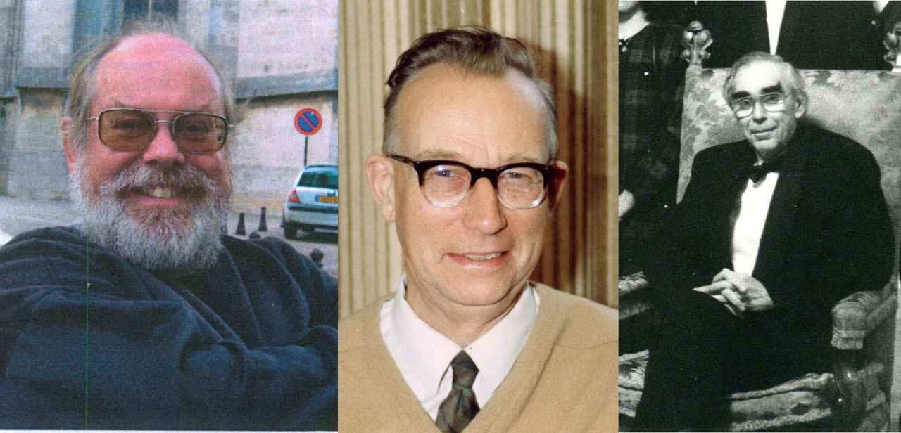

.. toctree::
   :maxdepth: 1
   :caption: Contents:

.. index::About CRYSTALS
   
**************
About CRYSTALS
**************

The CRYSTALS software comprises CRYSTALS and CAMERON and specially recompiled
versions of SIR92, SHELXS, MCE and Superflip. If installed on your computer, CRYSTALS 
can also import and export data from WinGX Mapviewer, SHELXL and SHELXT, Mercury, and Platon.
If the Cambridge Crystallographic Data Base is installed on the users computer, 
structures can be automatically validated using MOGUL.

The suite of software can solve and find the best fit of a crystallographic structural model to 
indexed and integrated single (or twinned) crystal diffraction data (measured with laboratory 
X-rays, synchrotron X-rays or neutron sources).

Features include:

- graphical model of the structure
- powerful atomic and structural parameter editor
- hydrogen atom placement
- sophisticated refinement with constraints and restraints
- various weighting schemes for refinement
- extensive data and structure validation tools
- Fourier maps and contour plots
- Analysis of positional and thermal parameters
- publication tables and cifs
- colour thermal ellipsoid plots
- advanced analysis of absolute structure
- data reduction and absorption corrections

The normal user interface is a standard windowed application, with a view of the structural model and
menus and dialogs for carrying out analysis and refinement. 
Command line instructions can be used in the windowed application where advanced options are required.
A purely command line (batch mode ASCII file in - ASCII file out) version is available.

Several conversion utilities are also provided:

- Shelx2cry an updated conversion tool for SHELX .INS and .RES files, which handles weighting schemes, 
  part numbers, partial occupancies, restraints, constraints and special positions.
- Diffin prepares data for CRYSTALS from a variety of diffractometer sources.
- CSD2CRY converts CSD files to CRYSTALS format input files.
- CIF2CRY converts CIFs to CRYSTALS format input files.
- hklf52cry converts a SHELX hklf5 format twinned reflection data to CRYSTALS format.

The programs are currently available for Windows 7 and 10. An executable for Linux, or compilation 
instructions, can be provided on request.
   

.. index:: History of CRYSTALS

   
*******************
History of CRYSTALS
*******************

   
Version 14 of CRYSTALS is based on a
version (Issue 2) written in FORTRAN by J.R. Carruthers in collaboration with
J.S.Rollett during 1977-78. This was a rewrite of the 1975 CRYSTALS 
system implemented in FORTRAN on the ICL 1900 series of computers. Many of the
crystallographic algorithms had previously been implemented in AUTOCODE on the
English Electric Leo Marconi KDF9 computer during the 1960's, and are described in some 
detail in Computing Methods in Crystallography, Pergamon Press, 1965, edited by 
John Rollett. Keith Prout raised much of the funding for the on-going work.

CRYSTALS continues to be developed, and now contains significant
contributions by  many of the students and visitors to the Chemical
Crystallography Laboratory, Oxford. 

* The SCRIPT processor was devised and implemented by Paul Betteridge in the
  1980's to provide an interactive user interface.

* The graphical user interface (GUI) was devised and written by Richard Cooper 
  in the 1990's as part of a Part II and D
  Phil project (supported by a CCDC studentship) in collaboration with
  Ludwig Macko and Markus Neuburger in Basel, who were working on a
  parallel Macintosh interface.

* The graphics module, CAMERON was devised and written by Lisa Pearce as part of a Part II 
  in 1990-91  and subsequent D Phil project (Supported by a Glaxo studentship). Its 
  functionality was based on a careful analysis of a number of pre-existing graphics 
  programs including SNOOPI, DTMM, CHEM-X, ORTEP, STRUPLOT, MOLDAW, COSMIC, MOLVIEW, PLUTO, 
  SHAKAL and MACMOLECULE.  It has been maintained and developed ever since.

* Extensive modernisation leading to substantial improvements in execution time 
  was undertaken by Pascal Parois during the 2010's, including the inclusion of
  some FORTRAN 95 constructs and the limited use of external libraries.

The whole system is maintained and directed by Richard Cooper.

When publishing structures analysed using CRYSTALS, please select a suitable citation from this list:

* Absolute structure determination with CRYSTALS: Cooper, R. I., Watkin, D. J., and Flack, H. D. (2016) *Acta. Cryst.* **C72**, 261-267
* Use of non-atomic scattering density models: Schroder, L., Watkin, D. J., Cousson, A., Cooper, R. I., and Paulus, W. (2004) *J. Appl. Cryst.* **37**, 545–550
* Use of asymmetric restraint tools: Cooper, R. I., Thorn, A. and Watkin, D. J. (2012) *J. Appl. Cryst.* **45**, 1057–1060
* Use of restraints: Parois, P., Arnold, J., and Cooper, R. I. (2018) *J. Appl. Cryst.* **51**
* Use of resonant scattering correction to Squeeze correction: Cooper, R. I., Flack, H. D., and Watkin, D. J. (2017) *Acta Crystallographica*, **C73**, 845–853.
* Use of tools for large structures. Parois, P., Cooper, R. I. and Thompson, A. L. (2015) *Chemistry Central Journal*, **9**, 30
* An old general citation: Betteridge, P. W.,  Carruthers, J. R.,  Cooper, R. I., Prout, K., Watkin, D. J. (2003). *J. Appl. Cryst.* **36**, 1487.

