.. toctree::
   :maxdepth: 2
   :caption: Contents:

.. _defandconv:

.. |br| raw:: html

    

.. |blue| raw:: html
   
   

.. |xblue|  raw:: html

   

.. |vspace|  raw:: latex

   \vspace{5mm}

.. |F2| replace:: F\ :sup:`2`

.. |2| replace:: \ :sup:`2`

.. _menus: 

#########
The Menus
#########

.. index:: GUI menus

Some of the menu items have detailed help options, which try to explain what
will happen if that menu is chosen.  This menu-specific help option can be turned 
|blue| on |xblue| or |blue| off |xblue| by going to **Tools/Enable TOOLS HELP**.
:ref:`See Tools Help <Tools Help>` for details.

.. index:: Files

*****
Files
*****

::

      New Working Folder
      Open dsc File
      Save dsc File
      Save dsc File as
      Run CRYSTALS Instruction File (USE file)
      Exit Crystals

.. index:: New Working Folder

.. index:: Folders

^^^^^^^^^^^^^^^^^^
New Working Folder
^^^^^^^^^^^^^^^^^^
Choosing this item will display a dialog box allowing you to choose
a new folder to work in. The current dsc file will be closed, and the
working folder will change to the new one. If the new folder contains
an existing crfilev2.dsc, this will be opened.

.. index:: Open dsc File

.. index:: Open a CRYSTALS database

^^^^^^^^^^^^^
Open DSC file
^^^^^^^^^^^^^
Choose this item to open a new CRYSTALS dsc file. The current dsc
file will be closed, and the new one opened. The working directory
will change to the folder containing the new dsc file.
   
   

.. index:: Save the dsc File

^^^^^^^^^^^^^
Save dsc file
^^^^^^^^^^^^^
No action will be taken. The DSC file is constantly updated as operations
are carried out in CRYSTALS, so there is no need to 'save' the current state.
   
   

^^^^^^^^^^^^^^^^
Save dsc file As
^^^^^^^^^^^^^^^^
A dialog box will allow you to choose a filename to save a copy of the
current dsc file. After the copy has been saved, the current dsc file is
closed, and the new copy is opened.
   
   

.. index:: USE files

.. index:: Run a CRYSTALS Instruction File

^^^^^^^^^^^^^^^^^^^^^^^^^^^^^^^^^^^^^^^^
Run CRYSTALS Instruction File (USE file)
^^^^^^^^^^^^^^^^^^^^^^^^^^^^^^^^^^^^^^^^
Cause CRYSTALS to execute (USE) a pre-prepared text file containing 
CRYSTALS commands and/or data lists
   
   

^^^^^^^^^^^^^
Exit Crystals
^^^^^^^^^^^^^
Closes the program.

----   

.. index:: Importing Basic Data

.. index:: Basic Data

****
Data
****

::

      Open FIle
      Open Import Guide
      Import Shelx file (INS or RES)
      Import HKLF4 data
      Import HKLF5 data
      Import "cif" files
      Input Twin Laws
      Input/Edit Cell
      Input/Edit SpaceGroup
      Input/Edit Cell Contents
      File Export
      Filter reflections
      Edit goodies
      View Reflections

      

The Data menu is concerned with the input, export or editing of 
experimental X-ray observations and data.
If you can, choose to read reflections from an HKLF file rather
than a processed *cif* or *fcf* file. The .hkl file contains the original 
unmerged data (unlike an .fcf file which is merged). CRYSTALS will 
perform its own merge and output some useful statistics.

.. index:: Open Files Menu

^^^^^^^^^
Open File
^^^^^^^^^
Shows all crystallographic (and optionally other) files in the
current folder. Selecting a file initiates Import Data guide.
   
   
   

.. index:: Open the File Import Guide Menu

^^^^^^^^^^^^^^^^^
Open Import Guide
^^^^^^^^^^^^^^^^^
Unified script for importing external data to CRYSTALS.

.. index:: Diffractometer cif Files Menu

=====================
Diffractometer *cifs*
=====================
CRYSTALS attempts to identify the instrument type or
origin of a file from its name or extension. 
|br|\ 
**Take care** that the file extension really does reflect the data format
(e.g. fcf format data in an hkl file).
|br|\ 
You can change the choice in the pop-up menu.
   
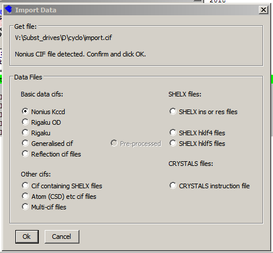

.. index:: shelx cif

.. index:: Shelx cif Files Menu

.. _shelx-cif:

============================
*cif* containing SHELX files
============================
Recent SHELX *cif* files may contain embedded .res and .hkl data.
If you choose this option the .res and .hkl files are extracted
and input into CRYSTALS. If the *cif* contains more than one structure,
they are all extracted and the user prompted to select which one to import
into CRYSTALS.

The program may prompt for 
things it needs but cannot find (e.g. colour, size).  Take care when 
processing H-M space group symbols. Some instruments only output
the Laue group as a space group, others use a syntax which cannot be 
parsed. Also, check that structural formula has been interpreted correctly.
The selection by instrument type is to enable CRYSTALS to enter
the correct details into the final cif.
Try the WinGX option if your instrument is not listed, but remember to 
use |blue| "Edit Cif Goodies" |xblue| in the Results menu
to manually set the instrument type.

.. index:: Data Files Menu

^^^^^^^^^^^^^^^^^^^^
Data Files (Current)
^^^^^^^^^^^^^^^^^^^^

* Import Shelx files (ins, res, hkl, hklf5)
  |br|\
* Short cuts to common data formats
* Import Agilent data (Oxford Diffraction cif_od)
* Import Nonius Kappa data
* Import Rigaku data (not Oxford Diffraction cif_od)
* Import other CIF data
            
.. index:: SHELX ins or ref Files Menu

^^^^^^^^^^^^^^^^^^^^^^^^^^^^^^
Import Shelx file (INS or RES)
^^^^^^^^^^^^^^^^^^^^^^^^^^^^^^
Opens a dialog to help import SHELX .ins or .res files. Choose the
file name. You will need to know the space group symbol.

Remember that CRYSTALS identifies atoms by a symbol which represents 
the element type and a number, e.g.. C(23) Where possible, a SHELX 
atom identifier is converted to a direct CRYSTALS equivalent e.g. 
C23 becomes C(23). If SHELX identifiers contain letters after the 
number e.g. H12b, the numeric part is increased by 100 or 1000, e.g. 
H12b becomes H112.
|br|\ 
See :ref:`Atom ID <Atom ID>` for more details about atom naming syntax.

.. index:: HKLF4 Files Menu

^^^^^^^^^^^^^^^^^
Import HKLF4 data
^^^^^^^^^^^^^^^^^
Opens a dialog which allows the import of reflection data in a variety
of SHELX HKLF4 formats, most commonly (3I4,2F8.2)
   
   

.. index:: HKLF5 Files Menu

.. index:: Twinned Data

^^^^^^^^^^^^^^^^^^^^^^^^^^^^^^^^
Import HKLF5 Data - Twinned Data
^^^^^^^^^^^^^^^^^^^^^^^^^^^^^^^^
Converting SHELX hklf5 files to CRYSTALS format.
|br|\
CRYSTALS need to know the twin law matrices before inputting twinned data, so
the program tries to extract the twin matrices  from the indices of 
groups of overlapping reflections.
|br|\
|blue| **Unmerged data** |xblue| must be passed to CRYSTALS because if the data has been 
merged outside of CRYSTALS, some of the contributors may have had their 
index changed to that of an equivalent. The extraction of the twin law
will then fail.   

.. index:: CSD cif files Menu

.. index:: Cambridge Data Base cif files

^^^^^^^^^^^^^^^^^^^^^^^^^^^^^^^^^^^
Import Structural (CSD) *cif* files
^^^^^^^^^^^^^^^^^^^^^^^^^^^^^^^^^^^
 
Opens a dialog which allows the import of data from "cif"  and "fcf" 
files.

   
If the *cif* file contains more than one structure, the data from 
each may either be put into separate CRYSTALS format files, or into one
single file. If there is only one structure, it can be imported directly into
CRYSTALS, otherwise the user must choose which structure to import.
If the "cif" file contains a Z'=2 structure, the two 
molecules can be 'matched', 
i.e. tested for similarity. See :ref:`Structure Matching <MATCH>`

If the *cif* contains embedded .res and .hkl data, this can be exteacted 
using the "*CIF* containing SHELX" files from the "Open Import GUide" menu.
   

^^^^^^^^^^^^^^^^^^^^^^^^^^^^^
Cell, SG radiation or formula
^^^^^^^^^^^^^^^^^^^^^^^^^^^^^
* Input/Edit Cell
* Input/Edit Space Group
  |br|\
  Displays a dialog box for entering the space group symbol. It may
  either be hand-typed, in which case there must be a space between each
  operator, or it may be selected from a list of the most common settings
  of every space group.
* Input/Edit Formula / Radiation
  |br|\ 
  CRYSTALS usually attempts to compute f' and f" for unusual radiations, but this
  dialogue enables alternative values to be input.

.. index:: Exporting Plain Test files Menu

^^^^^^^^^^^
File Export
^^^^^^^^^^^
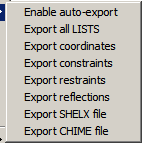

|blue| **Enable auto-export** |xblue| causes plain text (ASCII) versions of the database to
be exported whenever CRYSTALS closes down.

.. index:: View Reflections Menu

^^^^^^^^^^^^^^^^
View Reflections  
^^^^^^^^^^^^^^^^
Displays the internal copy of the reflections in a text editor.

.. index:: Filter Reflections Menu

.. _filtering:

^^^^^^^^^^^^^^^^^^
Filter reflections
^^^^^^^^^^^^^^^^^^
Allows filters to be specified for rejecting certain categories of
reflections. By default, no filters are applied, but you might think
of rejecting reflections where I/sigma(I)< -3.0 (i.e. unreasonably negative).
You might
also want to reject some very low angle reflections of the beam-stop 
is poorly modelled in the diffractometer software.
A high resolution cut off can be set if the data is not as strong as was hoped for.
All reflections are permanently stored, so that the filters can be changed
or removed at any time.  Dont forget that if filters are relaxed/removed, there 
will now be some reflections for which Fc and weight need updating. 

::

  To force an update, on the Command Line manually issue:
      #SFLS
      CALC
      END
      #WEIGHT
      END

.. index:: Edit Scattering Factors Menu

^^^^^^^^^^^^^^^^^^^^^^^
Edit Scattering Factors
^^^^^^^^^^^^^^^^^^^^^^^
CRYSTALS attempts to compute f' and f" for unusual radiations, but this
dialogue enables alternative values to be input.

.. index:: Edit cif Goodies Menu

^^^^^^^^^^^^
Edit goodies
^^^^^^^^^^^^
Allows editing of the 'goodies'- lots of information that is required
for a useful CIF is stored here. This dialog provides a convenient way
to view and edit it.
   

.. index:: Old Diffractometer Files Menu

********************
Diffractometer Files
********************
This option provided access to older programs for processing diffractometer
output.  The only utility without a more modern alternative is for processing
Enraf Nonius CAD4 amd MACH3 files.

.. index:: CAD data Processing Menu

^^^^^^^^^^^^^^^^^^^^
Run RC93 (Cad4 data)
^^^^^^^^^^^^^^^^^^^^
RC93 takes cpd.dat and cpd.psi files, generated by Nonius CAD4 or MACH3
diffractometer software and produces input files suitable for reading
into Crystals.

^^^^^^^^^^^^^^^
Use RC93 output
^^^^^^^^^^^^^^^
Reads in CRYSTALS format data files produced by the RC93 program
   

   
   

.. index:: Structure Solution Menu
   

*****
Solve
*****

::

        SIR92
        Superflip
        SHELXT
        SHELXS
        Sir 97
        Sir 11
        Tangent Recycle
        Fresh Start
        Known Facts

CRYSTALS does not contain any code for structure solution by Direct Methods, 
but the installation package does contain pre-compiled versions of SIR92,
Superflip and SHELXS.  The users may wish to additionally install SHELXT,
SIR97 and SIR11.

CRYSTALS prepares data files for the selected program and executes the program. 
If a trial structure is generated, this can be input to CRYSTALS for futher
development and refinement.
|br|\
See the section :ref:`Structure Menu   <structure menu>` 
for utilities used to modify the initial model.

.. index:: Tangent Recycling Menu

^^^^^^^^^^^^^^^
Tangent Recycle
^^^^^^^^^^^^^^^
A partial structure, structure with missing atoms, poor connectivity or
uncertain atomic type assignments can sometimes be improved by Tangent 
Recycling in SIR92.  

^^^^^^^^^^^
Fresh Start
^^^^^^^^^^^
Fresh Start removes the atomic coordinates, constraints and restraints from
the database.

^^^^^^^^^^^
Known Facts
^^^^^^^^^^^
Provides a brief summary of the degree of completion of an analysis.

----

.. _structure menu:
 

.. index:: Modifying the Structural Model Menus

*********
Structure
*********

::

      Undo/backup Model
      Input
            From Other Programs
            Cameron.L5 file
            SIR92 file
            SIR97 file
            Superflip file
      Edit coordinates
      Invert coordinates
      -----------------------------
      Collect atoms by symmetry
      Centre Molecules
      New Centre Molecules
      Change Atom Types
      Renumber Atoms
      Re-sequence Atoms
      Fix Clashes
      Allocate Residue Numbers
      Remove Residue Numbers
      Allocate Part Numbers
      Remove Part Numbers
      -----------------------------
      Distances
      Add & Remove Bonds
      -----------------------------
      Add Hydrogen + Fourier (Ctrl+H)
      Add Hydrogen Geometrically
      Add Hydrogen Manually
      Renumber Hydrogen
      Remove Hydrogen
      Use H-files
      Create H Restraints
      Create H RIDE Constraints
      -----------------------------
      Remove Q peaks
      Help/Information

.. _revert:

.. index:: Revert: Revert to Earlier Models

.. _UNDO:

.. index:: Undo: Revert to Earlier Models

^^^^
Undo
^^^^
Allows you to step back to any previous model (List 5) stored in the DSC
file. All models are stored unless you PURGE the DSC datafile, or
explicitly delete them using this dialog.
|br|\
Note: If you use the GUIDE an automatic purge occurs after you have
checked for extinction - any models marked explicitly as 'to be retained'
will not be PURGED.  
|br|\ See the section :ref:`Structure Database <structure database>` for more details
   

.. _input-structure:

.. index:: Input Structural Models

^^^^^
Input
^^^^^
Input of structural models.

.. _Input Atoms From Other Programs:

.. index:: Input Atoms From Other Programs:

* From Other Programs
  |br|\
  Open the general input dialogue.  The user must select the desired file.

.. _input an existing Cameron.l5 file:

.. index:: Input a model from CAMERON

* Cameron.l5 file
  |br|\
  This is the file containing any modifications made to the structure using CAMERON. 
  Re-inputting it returns the structure to the situation after the last modifications
  made by CAMERON.

.. _Input from Various Direct Method solutions:

.. index:: Input from Various Direct Method solutions:

* Various Direct Method solutions
  |br|\
  Re-input the result of running the named program.

.. _Edit Coordinates:

.. index:: Edit Coordinates

^^^^^^^^^^^^^^^^
Edit Coordinates
^^^^^^^^^^^^^^^^
Opens the refineable parameter list in a text editor.  The number of atoms in the list
is given at the top of the list as a cross check.  Don't forget to 
change this value if you add or remove atoms.
|br|\
CRYSTALS comes with a simple internal editor but you can change this for another editor
in :ref:`TOOLS\\Preferences <preferences>`

.. _Invert the Structure:

.. index:: Invert the Structure

^^^^^^^^^^^^^^^^^^^^ 
Invert the Structure
^^^^^^^^^^^^^^^^^^^^ 
Use this module if an analysis of the absolute structure shows that the model needs 
inverting.  The module works for all space groups.
|br|\
See `Structure Inversion <../tools/structure/structure-inversion.html>`_ for more 
details

.. _ Collect Atoms by Symmetry:

.. index:: Collect Atoms by Symmetry

^^^^^^^^^^^^^^^^^^^^^^^^^
Collect Atoms by Symmetry
^^^^^^^^^^^^^^^^^^^^^^^^^
Uses the space group symmetry operators to try to assemble the atoms into sensible
molecular fragments.
|br|\ 
See `Atom Collection <../tools/structure/atom-collection.html>`_

.. _Centre Molecules:

.. index:: Centre Molecules in the Unit Cell

^^^^^^^^^^^^^^^^
Centre Molecules
^^^^^^^^^^^^^^^^
An original (1975) algorithm which tries to place the structure near the centre 
of the cell. Changing the order of the atoms in the atom list (List 5) will produce
a different outcome.

.. _New Centre Molecules:

.. index:: Centre Molecules in the Unit Cell (alternative method)

^^^^^^^^^^^^^^^^^^^^
New Centre Molecules
^^^^^^^^^^^^^^^^^^^^
An improved algorithm which uses the Cheshire Groups to see if a change of origin
will move the structure nearer to the centre of the cell.  Note that if there are several 
moieties in the asymmetric unit, it may not be possible to get all of them near the centre.
|br|\ 
See `New Centre <../tools/structure/new-centre.html>`_

.. _Change Atom Types:

.. index:: Change Atom Types

^^^^^^^^^^^^^^^^^
Change Atom Types
^^^^^^^^^^^^^^^^^
Brings up a graphical interface which enables you to delete atoms or change the atomic
type.

.. _Renumber Atoms:

.. index:: Renumber Atoms

^^^^^^^^^^^^^^
Renumber Atoms
^^^^^^^^^^^^^^
Brings up a dialogue box which enables you to select automatic renumbering, or lets
you number atoms via a graphical interface. Automatic will avoid H atom name clashes
later.  If you number the non-H atoms manually, you might like to then choose
:ref:`Renumber Hydrogen <renumber hydrogen>` from lower down this menu to 
ensure that the hydrogen atoms are named after their parent atom.
|br|\
See the ssection on  :ref:`Atom Identifiers <Atom  ID>` for a brief introduction to atom 
naming.

.. _Re-sequence atoms:

.. index:: Re-sequence Atoms

.. index:: Sequence Atoms

^^^^^^^^^^^^^^^^^
Re-sequence Atoms
^^^^^^^^^^^^^^^^^
This routine offers another way of re-ordering the atoms or Fourier peaks so that 
related atoms or peaks form a sequential group in the list, with sequential serial 
numbers and coordinates which put the atoms as close together as possible. 
|br|\
It should be used once the main part (or all the non-hydrogen atoms) have been located.
See  `Resequence Atoms <../tools/structure/resequence.html>`_

.. _`fix clashes`:

.. index:: Fix Atom Name Clashes

.. index:: Atom Name Clashes

^^^^^^^^^^^
Fix Clashes
^^^^^^^^^^^
If there are two atoms with the same ID, any operation involving the name of an atom
will only find the first occurrence of the ID. This menu item changes the second atom
serial number so that it becomes unique.

.. _Allocate Residue Numbers:

.. _Remove Residue Numbers:

.. index:: Residue Numbers 

^^^^^^^^^^^^^^^^^^^^^^^^
Allocate Residue Numbers
^^^^^^^^^^^^^^^^^^^^^^^^

^^^^^^^^^^^^^^^^^^^^^^
Remove Residue Numbers 
^^^^^^^^^^^^^^^^^^^^^^
In CRYSTALS a *RESIDUE* is defined to be a group of atoms connected together by normal
bond lengths, or by additional bonds which the user has defined.  See :ref:`Add and 
Remove Bonds <add and remove bonds>`. 
The RESIDUE number provides a shorthand way of referring to all the atoms in that 
residue:
|br|\
*e.g.* RESIDUE(1)
|br|\
You can allocate a residue number via the graphical window,
or automatically remove or add them via these menu items.  The automatically allocated 
values can be edited if  required. New atoms introduced to a partial structure will be 
added to the same residue as that to which they are bonded.

.. _Allocate Part Numbers:

.. _Remove Part Numbers:

.. index:: Part Numbers

^^^^^^^^^^^^^^^^^^^^^
Allocate Part Numbers
^^^^^^^^^^^^^^^^^^^^^

^^^^^^^^^^^^^^^^^^^
Remove Part Numbers
^^^^^^^^^^^^^^^^^^^
In CRYSTALS, PARTs are used to define groups of atoms which may be subgroups of a 
residue and are to be handled together.
Most commonly this is used for defining alternative groups of atoms in a disordered 
fragment.  The graphics window displays the bonds of different parts in different 
colours.

  .. figure:: images/disordered-so3-b.png
      :align: center
      :figclass: align-center

      **PARTS** can be distinguished in the diagram by their coloured bonds

|br|\
A **PART** has an identifier built up of two components:

* An Assembly.
  |br|\
  All of the atoms in a single disordered region belong to the same Assembly.
* A Group.
  |br|\
  All of the atoms in each of the disorderd moieties is assigned to a single group.
  |br|\
  The PART_ID = 1000 * ASSEMBLY_ID + GROUP_ID
  |br|\
  Thus in the molecule above, all of the atoms could be put into the same RESIDUE.
  |br|\
  The six oxygen are also in a single assembly (1), while those with the blue bonds
  are in one group (1), and those with the green bonds in another (2).
  |br|\
  e.g. the blue bonds are in PART(1001) and the green ones in PART(1002) and all 
  eleven (whole plus partial) atoms are in RESIDUE(1)

  This hierarchy can be used to refer to atoms and atom parameters:
  |br|\
* #EDIT
* RESET OCC 0.6 PART(1001)
* RESET OCC 0.4 PART(1002) These lines together set different occupancies to the
  two different parts

.. _Interatomic Distances:

.. index:: Distance Calculations

^^^^^^^^
Distance
^^^^^^^^
Outputs a list of all interatomic distances, including ones involving a symmetry 
operator.

.. _add and remove bonds:

.. index:: Add and Remove Bonds

.. index:: Bonds (adding and removing)

^^^^^^^^^^^^^^^^^^^^
Add and Remove Bonds
^^^^^^^^^^^^^^^^^^^^
CRYSTALS automatically creates an internal list of the bonds between atoms (LIST
41). This list is formed using the covalent radii stored for each atom type in LIST
29.
|br|\
The user may wish to add to or delete bonds from LIST 41. This can be done via the
graphical editor, or by adding new rules to the user-readable LIST 40
|br|\
The Menu *Add and Remove Bonds* allows the users to edit the rules. The new rules
will be applied to the current and any future atom lists (LIST 5). 
|br|\
If a rule refers to an atom which
has been deleted from the model, a warning is issued and the remaining rules
applied.

  ::

   \DISK
   DELETE 40
   DELETE 41
   END

removes all manually set bonding information and restores the default rules.

  ::

    \BONDING   ACTION
           Possible Actions are:
           REPLACE (default, replaces all previous information)
           EXTEND (Adds new information to existing)
    DEFAULTS   TOLTYPE= TOLERANCE= MAXBONDS= NOSYMMETRY= SIGCHANGE=
    ELEMENT    TYPE= RADIUS= MAXBONDS=
    PAIR       TYPE1= TYPE2= MIN= MAX= BONDTYPE=
            Possible bond types are:
            0 - type undefined
            1,2,3 - single, double or triple bond
    MAKE       atom-specification TO atom-specification bondtype
    BREAK      atom-specification TO atom-specification
    END  

  *Example*

  ::

    #BONDING
    BREAK FE(12) TO O(16) 
    MAKE O(16) TO C(17) 1 
    END

  See `The Help file  <../tools/structure/ed40.html>`_

----   

.. _Hydrogen Placement by Fourier and geomery:

.. index:: Hydrogen Atoms

^^^^^^^^^^^^^^^^^^^^^
Add Hydrogens+Fourier
^^^^^^^^^^^^^^^^^^^^^
Computes a difference Fourier map based on the current model and superpose on it
hydrogen atoms at positions computed from the molecular geometry. New peaks found in the 
map are named "Q" atoms.  The user can then delete Q or H atoms, manually convert 
Q atoms to H, or delete all remaining Q atoms.
|br|\
If selected, CRYSTALS will compute a few cycles refining just the hydrogen atoms,
subject to mild geometry related restraints. 

  .. figure:: images/difference.png

      The H atoms are quite well placed geometrically on C11. There is an arbitary ambiguity 
      placing one of the H atoms on C1 trans to the O or the N atoms. 
      The computed atoms (white) fall midway between the Q (pink) - i.e. CRYSTALS made the 
      wrong choice.  
      |br|\
      During the automatic H atom optimisation by restrained refinement, the white atoms 
      on C1 will rotate to approximately where the Q peaks were located.

.. _Add Hydrogen Geometrically:

^^^^^^^^^^^^^^^^^^^^^^^^^^
Add Hydrogen Geometrically
^^^^^^^^^^^^^^^^^^^^^^^^^^
Idealised positions are computed for carbon atoms with unsatisfied valency requirements.
These are based on the interatomic distances and local geometry. The hydrogen atoms on
terminal methyl groups are positioned so that one of the H is *trans* to the heaviest 
second neighbour to the carbon.

.. _Add Hydrogen Manually:

^^^^^^^^^^^^^^^^^^^^^
Add Hydrogen Manually
^^^^^^^^^^^^^^^^^^^^^
A pop-up window permits  the user to select from a number of common situations.  The 
user has to select (using the graphical window) 1, 2 or 3 atoms adjacent to the pivot
atom.  The user can select pivot atoms which are not carbon and
input a non-standard distance. This 
enables the user to place a  non-hydrogen atom into a structure, by first pretending it
is hydrogen, and then re-naming it.
|br|\
The pop-up doesn't support the use of atoms related to the atoms in LIST 5 by symmetry
operators. If you need to refer to an atom involving symmetry, you will need to use the
CRYSTALS command :ref:`#HYDROGEN <hydrogen-placement>`.
  

..  _renumber hydrogen:

^^^^^^^^^^^^^^^^^
Renumber Hydrogen
^^^^^^^^^^^^^^^^^
This routine ensures that the hydrogen atoms are named after their parent atom.
To work properly
this module assumes that all non-hydrogen serial numbers are unique.
|br|\
See :ref:`Atom Identifiers <Atom ID>`

.. _Refine Hydrogen:

^^^^^^^^^^^^^^^
Refine Hydrogen
^^^^^^^^^^^^^^^
Refine only the hydrogen atoms subject to mild geometrical restraints. U[iso] may
also be restrained to be similar to that of the bonded heavier atom. 
|br|\
Deuterium is treated in the same way as hydrogen. 
|br|\
A useful refinement strategy is to use this utility to optimise just the hydrogen 
atoms with respect to both the data and normal geometry, and then refine them
as *RIDING* on their parent atoms.
See `Refining Hydrogen atoms  <../tools/refinement/refine-h.html>`_ for more
details

.. _Remove Hydrogen:

^^^^^^^^^^^^^^^
Remove Hydrogen
^^^^^^^^^^^^^^^
This utility deletes all hydrogen atoms from the structure.  
Note that deuterium is not removed.

.. _Use H-file:

^^^^^^^^^^^
Use H-files
^^^^^^^^^^^
When hydrogen atoms are automatically placed, two files are created which can be
re-used later providing no atoms are removed or renamed.

  #. PERH.DAT
     |br|\
     This file contains instructions for regenerating all the hydrogen atoms originally
     placed during perhydrogenation.

  #. DELH.DAT
     |br|\
     This file contains instructions for deleting all the hydrogen atoms  originally
     placed during perhydrogenation.

   DELH and PERH can thus be used to repeatedly remove and re-idealise hydrogen atoms if
   there is appreciable movement of the parent atoms during refinement with constrained
   (RIDING) hydrogen.  

::

      #USE DELH.DAT
      #USE PERH.DAT

.. _Hydrogen Restraints:

.. index:: Hydrogen Restraints

^^^^^^^^^^^^^^^^^^^^^^^^^^
Create Hydrogen Restraints
^^^^^^^^^^^^^^^^^^^^^^^^^^
This utility scans the structure for H-O, H-N and H-C bonds and sets up idealised
geometrical and thermal restraints.  The target values are similar to those used in 
SHELXL.
|br|\
See `Refining Hydrogen atoms  <../tools/refinement/refine-h.html>`_ for more
details

.. _Hydrogen Constraints:

.. index:: Hydrogen Constraints:
.. Index:: RIDING Hydrogen Constraints:

^^^^^^^^^^^^^^^^^^^^^^^^^^^
Create Hydrogen Constraints
^^^^^^^^^^^^^^^^^^^^^^^^^^^
Constrains hydrogen atoms to RIDE upon their parent atom. 

----

.. _Remove Peaks:

.. index:: "Q" Peaks

^^^^^^^^^^^^^^
Remove Q-peaks
^^^^^^^^^^^^^^
Simply deletes all Q, QN, QC and other non-atomic entries from the atom list (LIST 5)

   
----

*******
Fourier
*******

::

      Difference
      F-obs
      2Fo-Fc
      Others
            F-calc
            Optimal
            Fo-Patterson
            Fc-Patterson
      ------------------
      Remove Q-peaks
      ------------------
      Set Map Ranges

.. _Fourier maps:

.. index:: Fourier Maps

This script implements the CRYSTALS command #FOURIER, and may be used to        
compute a variety of real and vector space Fourier syntheses.                  
In this script you are only offered a limited selection of syntheses           
together with a peak search. The underlying COMMAND includes options           
for formatting and printing the map, various weighting schemes, and            
special treatment of reflections.                                              
After computing the map, this script enables you to process the peak           
search into an atoms list. 
|br|\

For non-centrosymmetric space groups, Fourier maps are computed from a list of reflections (LIST 7)
in which Friedel pairs are merged, created from the unmerged ones in LIST 6.
In addition, if the structure is twinned, the Fo values need to be de-twinned using the 
refined values of the twin fractions (TWIN ELEMENTS).
|br|\
These transformations are done automatically when maps are computed via the gui.  If you 
choose to do maps from the COMMAND LINE (#FOURIER) you will need to organise these 
transformations yourself  using the SCRIPT *COPY67*. 
:ref:`The section FOURIERS gives more details <fouandpat>`
|br|\
CRYSTALS stores negative Fo values for use during least squares refinement. These cannot 
be used in maps because they would create a phase inversion so are automatically excluded.
|br|\
The Menu offers you the opportunity to recompute the overall scale factor or recalculate
the phases (with the current scale factor).
The reflections can be given equal weights, SIM weights or the same weights as were 
used during the refinement. SIM weighting (see, for example, Fundamentals of 
Crystallography, ED C. Giacovazzo, IUCr , Oxford University Press, 1992, page 393) uses 
the partial structure to improve the estimates of the phases for the computation of a 
difference map. 
|br|\
The maps are scanned for local maxima and the electron density at known atomic sites. This
information is stored in  LIST 10, the *peaks list*.  The number of peaks to be saved can 
either be given by the user or estimated from the cell volume. 
|br|\
The SCRIPT can use the COMMAND #PEAKS to reject peaks close to known atoms or use the peak 
position to refine the know approximate position (Fourier refinement).
The peaks list is passed to the graphics window where the user can change peaks into atoms
or delete them

The computed map can be saved as figure-fields in the listing file (BFILEnn.LIS) or can be 
passed to graphical plotting programs.

^^^^^^^^^^
Difference
^^^^^^^^^^
A difference map uses \|Fo-Fc\| as the argument together with the computed phases. It is 
useful for locating atoms not present in the current model.

^^^^^^
2Fo-Fc
^^^^^^
This is a hybrid between a normal Fo map (which usually clearly shows the known atoms and 
ghosts of the unknown atoms) and a Difference map (which shows the unknown atoms). It 
gives peaks on approximately the same scale for the known and unknown atoms.

^^^^^^^
Optimal
^^^^^^^
This is a version of the 2Fo-Fc map devised by Peter Main 
to treat centrosymmetric and non-centrosymmetric reflections differently. 

^^^^^^^^^^^^^^
Remove Q Peaks
^^^^^^^^^^^^^^
Simply deletes all Q, QN, QC and other non-atomic entries from the atom list (LIST 5)

.. (see _remove peaks, above)

.. index Map Ranges::

^^^^^^^^^^^^^^
Set Map Ranges
^^^^^^^^^^^^^^
CRYSTALS still uses the Beevers-Lipson factorisation for Fourier maps because it works 
correctly, and there is no advantage in changing to the FFT for non-macromolecular 
materials. Only a unique part of the unit cell is normally computed.  CRYSTALS derives a 
unique volume from the symmetry elements, but for many space groups there are alternative 
unique volumes.  These may be entered by the user.  The unique volume for a Patterson map 
may be different from that for a Fourier - CRYSTALS also derives a unique volume for this.

----

**********
Refinement
**********

.. index:: Refinement Menu

::

      The Guide
      Setup Directives and Constraints
      Setup and Refine
      Refine
      Refine H
      --------------------------------
      Remove all Directives and Restraints
      Edit Directives and Restraints
      F or Fsq and Advanced Options
      Choose Weights
      Rescale Weights
      Filter Reflections
      --------------------------------
      Delete all Restraints
      Edit Restraints
      Add Shift Limiting Restraints
      Add 1-2 and 1,3 Vibration Restraints
      Add 1-2 and 1,3 Thermal Similarity Restraints
      --------------------------------
      Calculate Scale Factor
      Recalculate Fc and Phases
      --------------------------------
      PLATON Squeeze
      Anomalous Modified Squeeze
      Information

Crystals has an extensive set of tools for the
:ref:`refinement of structures <sfandls>` by the method of Least Squares 
(See :ref:`FOURIER <fourier>` for details about Fourier refinement).
|br|\
The usual method uses a *full matrix* in which correlations between all the refined 
parameters are included in the calculation.  In unfavourable cases the mathematics may be 
unstable - the program uses code implemented by Pascal Parois to try to overcome this. If 
the user gets warning messages about this problem, they should verify that they have not 
made a mistake in the specification of the refinement.
|br|\
In CRYSTALS it is not necessary to refine all the parameters all the time.  If, in a
disordered structure, a substantial part of the model is well behaved, the partially 
refined atoms may be kept fixed until the disorder is sorted out, after 
which they can be included again for the final refinement.
|br|\
For well behaved structures, the normal procedure is full matrix on everything. The GUIDE 
will often cope well with such structures - small problems may be overcome using tools from 
this menu.
|br|\
For a good read, go to `J Appl Cryst, Volume 41, Part 3, June 2008, Pages 491-522
<https://doi.org/10.1107/S0021889808007279>`_

^^^^^^^^^
The Guide
^^^^^^^^^

This opens :ref:`The Guide <THE GUIDE>`, which leads the user through a routine structure analysis

.. index:: Refinement Directives and Constraints

^^^^^^^^^^^^^^^^^^^^^^^^^^^^^^^^
Setup Directives and Constraints
^^^^^^^^^^^^^^^^^^^^^^^^^^^^^^^^

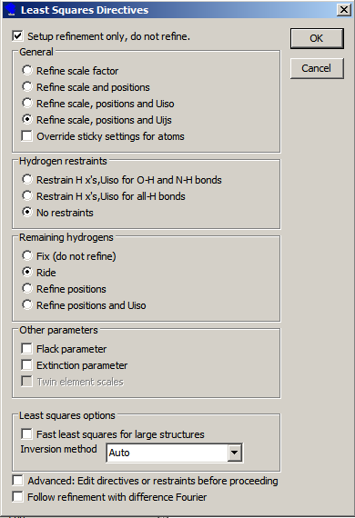

This item sets up the conditions for refinement.  |blue|\ **Sticky** |xblue|\
settings are special conditions 
which the user wishes to impose an an individual atom.  They are set via the model window.

* General
  |br|\
  The options are listed in order of increasing complexity.  The code tries to make an 
  optimal choice, but you can move backwards/forwards in the list if you have a better 
  idea. See the general `refinement HELP <../tools/refinement/refinement.html>`_ 
  for more details.
  |br|\

* Hydrogen Restraints
  |br|\
  Hydrogen atoms can be refined freely, with constraints or with restraints.
  See the `hydrogen atom HELP <../tools/refinement/refine-h.html>`_ for more details
  |br|\

* Other Parameters
  |br|\
  The Flack parameter is a measure of absolute structure, and should be evaluated for all 
  non-centrosymmetric space groups.
  See the absolute `structure HELP <../tools/analyse/absolute.html>`_ file for more details

  Extinction may affect the stronger reflections for crystals which diffract very well.
  See the analysis of `results HELP <../tools/analyse/analysis.html>`_ file for more details
  |br|\
    

* Least Squares Options
  |br|\
  The defaults suit most structures. The different inversion methods can be explored if
  there are convergence problems. 

^^^^^^^^^^^^^^^^
Setup and Refine
^^^^^^^^^^^^^^^^
Sets up refinement (as above) and then launches cycles of refinement.

^^^^^^^^^^^^^^^^^
Refinement Cycles
^^^^^^^^^^^^^^^^^
Brings up a pop-up enabling the user to specify the number of cycles of refinement 
required.  Note that this choice is stored in the system, and the same value will 
continue to be used  for refinements **in all structures** until changed by the user.

.. _partial shift factors:

.. index:: Partial Shift Factor

The partial shift factor is reset to unity for every new job. Setting it to some 
fractional value, say 0.5, may help convergence of a parameter whose value is jumping back 
and forth between two local minima. Note that partial shift factors are not the same as 
:ref:`shift limiting restraints, <Add Shift Limiting Restraints>`
though they often have similar effects. 
See `J Appl Cryst, Volume 41, Part 3, June 2008, Pages 491-522
<https://doi.org/10.1107/S0021889808007279>`_ for details.

*Minimise Disk Useage* inhibits adding data to the database during intermediate cycles.

^^^^^^^^^^^^^^^
Refine Hydrogen
^^^^^^^^^^^^^^^
This sets up default  restraints for all hydrogen atoms and performs several cycles of 
refinement.  It preserves your existing restraints and constraints (list 16 and 12) and 
restores them before closing.

----

^^^^^^^^^^^^^^^^^^^^^^^^^^^^^^^^^^^^^
Remove all Directives and Constraints
^^^^^^^^^^^^^^^^^^^^^^^^^^^^^^^^^^^^^
Creates a null LIST 12

^^^^^^^^^^^^^^^^^^^^^^^^^^^^^^^
Edit Directives and Constraints
^^^^^^^^^^^^^^^^^^^^^^^^^^^^^^^
This enables LIST 12 to be edited by a text editor

.. index:: F or Fsq refinement

^^^^^^^^^^^^^^^^^^^^^^^^^^^^^
F or Fsq and Advanced Options
^^^^^^^^^^^^^^^^^^^^^^^^^^^^^
CRYSTALS can refine against both F and |F2| . Usually there is little to choose 
between the two procedures, though the older F refinement is less sensitive to data with 
serious outliers.  The user can switch back and forth between the two methods at will.  
For poor data a possible strategy is to start with F refinement and then switch to |F2| 
one the outliers have been eliminated. **It is important to remember that 
different weighting schemes are required for F and |F2| refinements**.

.. index:: Special Positions, snapping to

.. index:: Snapping to special positions

The radius specified in *Snap onto positions* option causes atoms lying within that 
distance of a special position to snapped onto it.  The occupation number is taken care of 
automatically. If a disordered atom is near a special position and you need to prevent 
this operation, set the radius to zero.  This value is remembered for the current 
structure.

.. index:: Choosing reflection weights

.. index:: Weighting schemes

^^^^^^^^^^^^^^
Choose weights
^^^^^^^^^^^^^^

::

      Quasi-Unit
      Simple Statistical
      Robust Statistical
      Modified SHELX
      Optimal Chebychev
      Chebychev(F)
      Chebychev(Fsq)

During refinement reflections must be weighted in a way that reflects your confidence in 
the measured values *and* the ability of the model to represent the data.
|br|\
|blue| Simple Statistical. |xblue| With modern diffractometer data the standard uncertainties
provide good starting values for an |F2| refinement. They can be switched
to the |blue| Modified SHELX |xblue| scheme once the structure is complete and refinement is 
progressing well.
|br|\
|blue| Quasi-Unit. |xblue| 
For F refinement unit weights provide a good starting point, switching to a Chebychev 
polynomial for the final convergence. If this option is chosen for an |F2| refinement, 
the appropriate quasi-unit weights are 1/2F.
|br|\
The empirical SHELX and the Chebychev schemes aim to provide a uniform distribution of 
residuals and are appropriate once the model is fully parameterised and well-converged.
Using these schemes to early on in a refinement can seriously hinder convergence.
See the `analysis of results HELP <../tools/analyse/analysis.html>`_ 
`and weights HELP <../tools/analyse/weights.html>`_ files for more details.
|br|\

^^^^^^^^^^^^^^^
Rescale Weights
^^^^^^^^^^^^^^^
This option tries to scale the *Goodness of Fit* to unity, and  was introduced at the 
request of a user group. Its effect is just cosmetic.

.. index:: Filter Reflections

.. _Filter Reflections:

^^^^^^^^^^^^^^^^^^
Filter Reflections
^^^^^^^^^^^^^^^^^^
The systematic absences are the only reflections rejected by CRYSTALS. However, it is 
possible to filter out reflections on the fly according to preset conditions. These 
conditions can be removed or altered at any time.
|br|\
The user is recommended to experiment with filtering in order to obtain optimal results.
|br|\
See also :ref:`Filtering Reflections <filtering>`

----

^^^^^^^^^^^^^^^^^^^^^
Delete all Restraints
^^^^^^^^^^^^^^^^^^^^^
Creates a null LIST 16

^^^^^^^^^^^^^^^
Edit Restraints
^^^^^^^^^^^^^^^
Opens List 16 in a text editor.

.. _Add Shift Limiting Restraints:

.. index:: Add Shift Limiting Restraints

^^^^^^^^^^^^^^^^^^^^^^^^^^^^^
Add Shift Limiting Restraints
^^^^^^^^^^^^^^^^^^^^^^^^^^^^^
Shift limiting restraints provide a mechanism for controlling an unstable refinement,
that is, a refinement in which unacceptably large shifts are generated during the
least squares or a refinement where the shifts on a parameter remain quite large but
oscillate in sign between one cycle and the next. They are mathematically different from 
:ref:`partial shift factors. <Partial Shift Factors>`
|br|\
The default values are set in the pop-up, and applied to all atomic parameters. You might 
want to reduce the *esd* of the adp cross-terms if one of the U[ij] is unstable because 
two of the U[ii] are almost identical.
|br|\
::

      EXAMPLE:

        LIMIT 0.005 C(27,U[12])

::

                Default Value         Suggested Change  Units
      LIMIT      0.01 U[ISO]            0.01 U[ISO]     A^2
      LIMIT      0.01 X                 0.01 X          A
      LIMIT      0.01 Y                 0.01 Y          A
      LIMIT      0.01 Z                 0.01 Z          A
      LIMIT      0.01 U[11]             0.01 U[11]      A^2
      LIMIT      0.01 U[22]             0.01 U[22]      A^2 
      LIMIT      0.01 U[33]             0.01 U[33]      A^2 
      LIMIT      0.01 U[12]             0.005 U[12]     A^2 
      LIMIT      0.01 U[13]             0.005 U[13]     A^2 
      LIMIT      0.01 U[23]             0.005 U[23]     A^2 
      LIMIT      0.01 OCC               0.01 OCC 
    

.. _Add Vibration Restraints:

.. index:: Add Vibration Restraints

^^^^^^^^^^^^^^^^^^^^^^^^^^^^^^^^^
Add 1-2, 1-3 Vibration Restraints
^^^^^^^^^^^^^^^^^^^^^^^^^^^^^^^^^
In general, the amplitudes of vibration of pairs atoms in the direction of a 
bond linking them are approximately the same 
(F.L. Hirshfeld, Acta Cryst., A32 (1976) 239-244).  If the inter-bond angles are also
reasonably rigid, the amplitudes along the line between next nearest neighbours (1-3)
directions will also be similar. These conditions can be set as restraints during the 
initial refinement of large structures as guides to the optimisation.
|br|\
These restrainte should usually be removed near the end of a refinement, or only
applied selectively to a few specific atoms.

.. _Add 1-2, 1-3 Thermal Similarity Restraints:

.. index:: Add 1-2, 1-3 Thermal Similarity Restraints 

^^^^^^^^^^^^^^^^^^^^^^^^^^^^^^^^^^^^^^^^^^
Add 1-2, 1-3 Thermal Similarity Restraints
^^^^^^^^^^^^^^^^^^^^^^^^^^^^^^^^^^^^^^^^^^
In general, the overall shape and size of the adps of first and second neighbouring
atoms shold be similar. These conditions can be set as restraints during the 
initial refinement of large structures as guides to the optimisation.
|br|\
These restrainte should usually be removed near the end of a refinement, or only
applied selectively to a few specific atoms.

....

.. _Calculate Scale Factor:

.. index:: Calculate Scale Factor

^^^^^^^^^^^^^^^^^^^^^^
Calculate Scale Factor
^^^^^^^^^^^^^^^^^^^^^^
Refine the overall scale factor for the current model without refining any other 
parameters. Note the CRYSTALS also estimates the scale factor by other methods, and
displays these in the text window. Substantial disagreements between the methods
should be investigated.

.. _Recalculate Phases:

.. index:: Recalculate Phases

^^^^^^^^^^^^^^^^^^
Recalculate Phases
^^^^^^^^^^^^^^^^^^
Calculate Fc and the phases for the current model without recomputing the scale factor.

....

.. _PLATON Squeeze:

.. index:: PLATON Squeeze

^^^^^^^^^^^^^^
PLATON Squeeze
^^^^^^^^^^^^^^
The Squeeze utility in PLATON is used to detect voids large enough to hold 
a molecule of solvent or a counter ion in a structure.  
The discrete Fourier transform of the difference 
electron density in the void is added to structure factors computed from the rest of the 
structure.  This procedure is used when no reasonable atomic model can by assigned 
to the electron density in the void. 
|br|\
See PLATON SQUEEZE: a tool for the calculation of the disordered solvent contribution 
to the calculated structure factors. 
`A. L. Spek,  Acta Cryst. (2015). C71, 9-18 <https://doi.org/10.1107/S2053229614024929>`_

.. _Anomalous Modified Squeeze:

..index:: Anomalous Modified Squeeze

^^^^^^^^^^^^^^^^^^^^^^^^^^
Anomalous Modified Squeeze
^^^^^^^^^^^^^^^^^^^^^^^^^^
If the main structure contains no strong anomalously  scattering atoms, 
and the void region is suspected of containing atoms with reasonablly large anomalous 
(resonant) scattering, this can be used to compute approximate anomalous differences, and 
so estimate the absolute structure of the material. 
|br|\
See HUG and SQUEEZE: using CRYSTALS to incorporate resonant scattering in the SQUEEZE 
structure-factor contributions to determine absolute structure.
`R. I. Cooper, H. D. Flack and D. J. Watkin,
Acta Cryst. (2017). C73, 845-853, <https://doi.org/10.1107/S2053229617013304>`_

----

.. index:: Analyse

.. _analyse:

*******
Analyse
*******

::

      Agreement Analysis
      Fo vs Fc Graph
      Normal Probability Plot      
      Difabs Analysis
      Wilson Plot
      -----------------------
      Variance of Reflections
      Wt vs Sigma Plot
      Multiplicity of Observation
      Tabbed Initial Analysis
      -----------------------
      Absolute Configuration
      ROTAX analysis/twins
      Likely H-bonds
      -----------------------
      Publication Checks
      Mogul Geometry Check

See `Structure Evaluation <../tools/analyse/analysis.html>`_ for details and examples

^^^^^^^^^^^^^^^^^^
Agreement analysis
^^^^^^^^^^^^^^^^^^
Displays graphs of four different analyses of variance. The red bars are the unweighted 
residuals (Fo-Fc) |2| in the specified intervals, the green bars are the weighted residuals, 
w(Fo-Fc) |2|.  The green bars should all be small if the weights are appropriate.
   
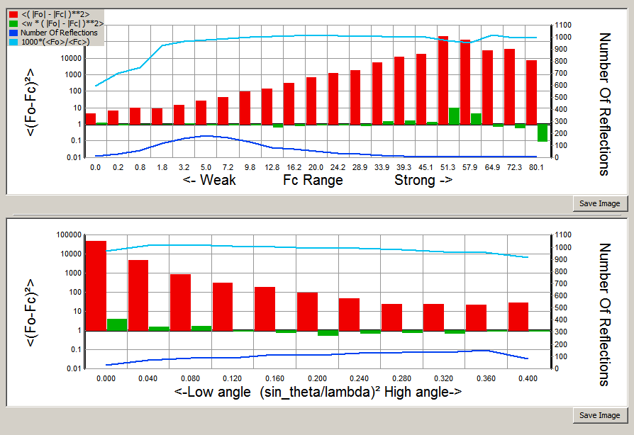

.. _Fo vs Fc Graph:

.. index:: Fo vs Fc Graph 

^^^^^^^^^^^^^^
Fo vs Fc Graph 
^^^^^^^^^^^^^^
Displays a plot of Fo vs Fc.  The reflections should lie around the unit gradient 
line with a small scatter. Outliers can be omitted from the refinement by right-clicking 
them.  They are added to LIST 28, and can be re-introduced to the refinement by using the 
:ref:`Filter Reflections` item on the |blue| Refinement |xblue| menu.  
|br|\
If the strong reflections tend to droop below the unit gradient line, this is often 
indicative of the need to include an extinction parameter into the refinement.

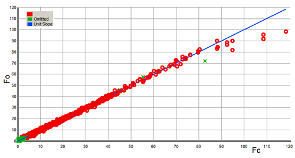

.. _Difabs Analysis:

.. index:: Difabs Analysis 

^^^^^^^^^^^^^^^
Difabs analysis
^^^^^^^^^^^^^^^
Creates a bit map or contour plot of the ratio of Fo to Fc as a function of diffraction 
geometry. For serial difftactometers with single observations of each reflection, 
the geometrical parameters are the 
azimuth and declination of the incident and emergent beams.
|br|\
With area detector instruments every reflection is generally measured several times at 
quite different geometrical settings (for example, a pair of equivalent reflections may 
occur, at different locations, on a single image). The only geometrical features in common 
for a batch of equivalent reflections (and hence for the merged refelction) are the 
azimuth and declination of the scattering vector.
In the original paper the average ratio Fo/Fc was used as the basis for an absorption
correction.
(An Empirical Method for Correcting Diffractometer Data for Absorption Effects,
Nigel Walker and David Stuart, Acta Cryst. (1983). A39, 158-166)
With modern data deviations from unity of this ratio as a function of geometry can be used 
to reveal that there my be a problem with the model or (more likely) a problem with the 
data collection or processing.
   
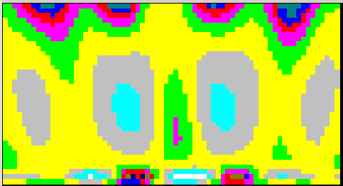
   

.. _Wilson Plot:

.. index::  Wilson Plot

^^^^^^^^^^^
Wilson Plot
^^^^^^^^^^^
The Wilson Plot shows the average normalised reflection intensity versus resolution, and 
has a characteristic shape for molecular materials.  (see, for example, Fundamentals of 
Crystallography, Edited by Carmelo Giacovazzo, page 322)  This plot can be used for an 
initial estimation of the overall scale factor and temperature factor (adp). Significant 
deviations from the characteristic shape may indicate repeated motifs in the molecule or 
the structure, or problems with the data collection. Once a structure has been solved, 
CRYSTALS also plots the curve for the calculated structure factors.  Differences between 
the two curves suggest that there are features in the data which are not represented by 
the model.

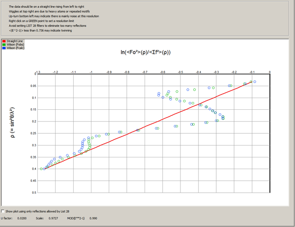

----

.. _Variance of Reflections:

.. index:: Variance of Reflections

^^^^^^^^^^^^^^^^^^^^^^^
Variance of Reflections
^^^^^^^^^^^^^^^^^^^^^^^
This plots the Internal Variance (rms dispersion) of equivalent reflections versus the 
External Variance (average of the reported individual variances). For modern machines the 
plot is scattered around the unit gradient.  
|br|\
There is also a histogram of the number of merged reflections in different multipllicity 
of observations (MoO) ranges.

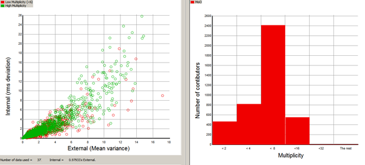

.. _Weight vs Sigma:

.. index:: Weight vs Sigma

^^^^^^^^^^^^^^^^
Weight vs Sigma
^^^^^^^^^^^^^^^^
The weight given to a reflection during the refinement should reflect both the standard 
uncertainty (sigma) of the observations *and the ability of the model to match the data*.
A reflection whose magnitude is likely to be uncertain should be down-weighted, as should 
a reflection for which the current model cannot provide a reliable estimate. |blue| 
Remember the least squares cannot increase the complexity of a model |xblue|, but simply 
optimises the current parameters. 

.. _Multiplicity of Observation:

.. index:: Multiplicity of Observation

^^^^^^^^^^^^^^^^^^^^^^^^^^^
Multiplicity of Observation
^^^^^^^^^^^^^^^^^^^^^^^^^^^
It is comforting when the Multiplicity of Observation is roughly constant across the whole 
resolution range. If it isn't, dont worry too much unless there are other symptoms of 
something having gone wrong during data collection.

.. _Tabbed Initial Analysis:

.. index:: Tabbed Initial Analysis

^^^^^^^^^^^^^^^^^^^^^^^
Tabbed Initial Analysis
^^^^^^^^^^^^^^^^^^^^^^^
A whole series of graphs based on the initial input of the raw data and not requiring a 
model.  These give you a rough idea about the quantity and quality of the data. Especially 
important are the Completeness graph and the plot of the systematic absences.
|br|\
See `Tabbed Initial <../tools/analyse/tabbed-initial.html>`_ for more 
details
 

----

.. _Absolute Configuration:

.. index:: Absolute Configuration

^^^^^^^^^^^^^^^^^^^^^^
Absolute Configuration
^^^^^^^^^^^^^^^^^^^^^^
Compute the Flack, Hooft and other parameters for non-centrosymmetric structures.
|br|\
See `absolute structure HELP <../tools/analyse/absolute.html>`_ for details on 
how to interpret the output

   
.. _Likely H-bonds:

.. index:: Likely H-bonds

^^^^^^^^^^^^^^
Likely H-bonds
^^^^^^^^^^^^^^
Finds all X--H distances (X-O or N) where the bond distance falls between
1.5 and 2.2 Angstroms. Also lists the X-H--X angles so that you can decide
if the X--H is an acceptable hydrogen bond.
   
   

.. _rotax:

 
^^^^^^^^^^^^^^^^^^^^
Rotax analysis/twins
^^^^^^^^^^^^^^^^^^^^

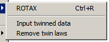

=====
Rotax 
=====
Runs the Rotax procedure for looking for twin-laws. Output consists
of a selection of possible twin laws with associated figures-of-merit.
Figures closer to zero are best, but beware figures of exactly zero
(corresponding to exact lattice overlap), since they are probably just
part of the point group symmetry of your structure.
|br|\
Choose a twin law to be applied and set the starting values for the twin
components.
   
   

=======================
Input twinned structure
=======================
Allows you to give a known twin-law. The ROTAX option above is probably
easier to use, even if you already know the twin law.
   
   

================
Remove twin laws
================
Removes the twin laws (List 25), removes the twin scales from the model
(List 5) and reverts to the original reflection listing. (Saved during
the application of the twin-law).
   

----

.. index:: Publication Checks

.. _Publication Checks:

^^^^^^^^^^^^^^^^^^
Publication Checks
^^^^^^^^^^^^^^^^^^

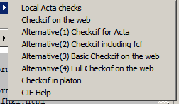

=================
Local Acta Checks
=================
Minimal check against Acta requirements for use when Web access is not available.

========
Checkcif
========
|blue| Checkcif on the Web |xblue| should take you to the current web site.  
The alternatives may disappear in the future. 
|br|\
See |blue| Results |xblue| below and the `HELP file <../tools/analyse/cifcheck.html>`_ for more details

If you have **PLATON** installed, |blue| Checkcif in Platon |xblue| writes files for 
Platon and checks your cif without using the web.  ,If you haven't run PLATON before, you
will be asked to browse for the PLATON.EXE file on your hard disk.

^^^^^^^^^^^^^^^^^^^^
Mogul Geometry Check
^^^^^^^^^^^^^^^^^^^^
Checks the local geometry of every atom. See :ref:`Graphic Window sections <mogul check>` 
for more details

----

.. _Results:

*******
Results
*******

::

      Output CIF file 
      CIF file no esds 
      Output HTML summary 
      Output Summary file 
      Output other tables 
      Export archive LISTS 

      Edit CIF goodies 

      Local Acta checks
      Checkcif on the web  http://checkcif.iucr.org                                              
      Alternative(1) Checkcif for Acta  http://journals.iucr.org/services/cif/checking/checkform.html
      Alternative(2) Checkcif including fcf http://journals.iucr.org/services/cif/checking/checkcifhkl.html
      Alternative(3) Basic Checkcif on the web  http://journals.iucr.org/services/cif/checking/checkbasic.html
      Alternative(4) Full Checkcif on the web   http://journals.iucr.org/services/cif/checking/checkfull.html 
      Checkcif in platon 
      PLATON Help 
      CIF Help                                                         
      
      Printcif on the web  http://publcif.iucr.org/services/tools/printcif.php 

      Results menu help                                        
      Analyse menu help                                        

^^^^^^^^^^
Output ...
^^^^^^^^^^
Allows you to output data in a variety of ways. 
|br|\
Note that the standard uncertainties output
in CIF files follow the 'Rule of 19', as requested by *Acta Cryst*:
|br|\
The Rules are:
   
::

      SU values are quoted to two digits precision if they are < 19.
      E.g.
      rule of 9:    5.548(1)   1.453(2)    3.921(3)    1.2287(8)
      rule of 19:   5.5483(9)  1.4532(16)  3.921(3)    1.2287(8)
      rule of 29:   5.5483(9)  1.4532(16)  3.9214(29)  1.2287(9)
   
   
The object of this approach is to provide a more consistent distribution
of precision across all values. 
   

===============
Output CIF file
===============
CIF format files are used for submitting data to journals and exchanging results with other people.

=======================
Output CIF file no esds
=======================
Used for exchanging data in cif format prior to publication. The absence of esds means 
that the file cannot accidentally be published because it will generate copious errors in 
Checkcif.

===================
Output HTML Summary
===================
Output coordinates, adps, bondlengths and angles in HTML format. Useful for reports, 
theses etc with a little editing.

===================
Output Summary File
===================
A summary of all the information in the binary data base (dsc file).

===================
Output Other tables
===================
Various tables in A4 format.

.. _Export archive files:

.. index:: Export archive files

====================
Export archive files
====================
Copies all the LISTS to EXCHANGE.DAT in CRYSTALS format. Useful for saving a *snap shot* of the 
current state of an analysis, or exchanging data with other CRYSTALS users.

----

.. _Edit cif Goodies:

================
Edit CIF goodies
================

Allows you to view and edit some of the values that will be put in the final CIF. These 
are generally things not systematically stored, including for example crystal shape and 
colour. This information is held in LIST 30, which can also be displayed by typing:

::

      #SUM LIST 30

   
----   
 
==================
Publication Checks
==================

:ref:`See Publication Checks <Publication Checks>` above.

----

===================
Printcif on the web
===================
An IUCr utility for printing out cif files in a pretty format

----

.. index:: Graphics 
 
.. _Graphics Menu:

********
Graphics
********

::

      Cameron Graphics
      Cameron (view existing input files)

      Import last Cameron output 
      Import last Cameron input
      Mapviewer

There are two quite distinct graphical modules built into CRYSTALS.  The Model pane of the 
normal screen offers a view of the current structure and provides graphical access to 
various atom-based operations.  It has limited interaction with symmetry operators.
|br|\
|blue| **CAMERON** |xblue|  is a fully-functial graphical module designed by Lisa Pearce 
as a Part II project in 1990-91, and completed (along with other software projects) during her 
DPhil.  

^^^^^^^^^^^^^^^^
Cameron Graphics
^^^^^^^^^^^^^^^^

Starts Cameron. This program enables you to both visualise crystal structures and to 
graphically edit them.  Common operations can be selected from a menu; more complex operations 
can be performed via the command line interface.
|br|\
The extensive range of packing operations are useful for undersanding the relationship between
entities, and for prepraring meaningful diagrams. 
See here for an `example of optimising the position <../tools/structure/cam-centre.html>`_ 
in the cell of structures composed of multiple entities.
|br|\
Modifications made to the structure can be
re-input to CRYSTALS. Output can be as high resolution postscript or
or as an enhanced metafile (suitable for direct inclusion in MS WORD documents).

^^^^^^^^^^^^^^^^^^^^^^^^^^^^^^^^^^^
Cameron (view existing input files) 
^^^^^^^^^^^^^^^^^^^^^^^^^^^^^^^^^^^
Enables you to view again existing CAMERON input files

----

^^^^^^^^^^^^^^^^^^^^^^^^^^
Import last Cameron output
^^^^^^^^^^^^^^^^^^^^^^^^^^
Reads the model which CAMERON wrote at the end of its last run back into CRYSTALS.
Could be useful if you've trashed the model since then (although, see also:
Structure -> Undo, section :ref:`undo <undo>`).
   

^^^^^^^^^^^^^^^^^^^^^^^^^
Import last Cameron input
^^^^^^^^^^^^^^^^^^^^^^^^^
Reads the model which CRYSTALS last wrote to CAMERON back into CRYSALS.
Could be useful if you trashed the model in CAMERON and then accidentally
brought it back into CRYSTALS. (Although, see also:
Structure -> Undo, section :ref:`undo <undo>`).
   

^^^^^^^^^
Mapviewer
^^^^^^^^^
Enables you to re-display maps created by a previous Slant or Voids calculation.
   

.. _appearance:

**********
Appearance
**********

::

      Screen Layout
      Atoms
      Model
      Auto Scale (Zoom off)

      Set Text Font
      Set Input Font

^^^^^^^^^^^^^
Screen Layout
^^^^^^^^^^^^^
Displays an image of a typical screen with explanatory text.

.. image:: images/layout.png
   :target: ../_images/layout.png

.. _atoms:

^^^^^
Atoms
^^^^^

========
Covalent
========
Sets radius of atoms displayed in the main model window to be 1/4 of
their covalent radius.
   

=============
Van der Waals
=============
Sets the radius of atoms displayed in the main model window to be
the VDW radius.
   

=======
Thermal
=======
Displays atoms as either ellipse representation of ADPs, or sphere
representing U[iso].

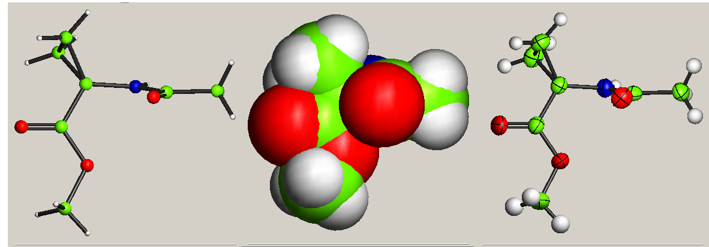

----
   

============
Quarter size
============
Set radius to 1/4 of given value (either covalent, vdw or thermal).
   

=========
Half size
=========
Set radius to 1/2 of given value (either covalent, vdw or thermal).
   

=========
Full size
=========
Set radius to given value (either covalent, vdw or thermal).
   
   

.. _model:

 
^^^^^
Model
^^^^^

============
Update model
============
If automatic update is disabled, this command updates the model

----   

================
Auto Display OFF
================
Disables the model display. Useful for big structures where the drawing is
significantly slowing the program.
   

===============
Auto Display ON
===============
Enables display of the model.
 

^^^^^^^^^^^^^^^^^^^^^
Auto scale (zoom off)
^^^^^^^^^^^^^^^^^^^^^
Restores the model to its original view, if it has been zoomed.
   
   
.. _set font:

^^^^^^^^^^^^^
Set Text Font
^^^^^^^^^^^^^
Allows you to choose a font for the text output window. I recommend
Lucida Console, or Courier - in any case use a fixed/monospaced font,
otherwise the output of tables will not make much sense.
   

^^^^^^^^^^^^^^
Set Input Font
^^^^^^^^^^^^^^
Lets you choose a font for the input editbox. Might be useful if
you are demonstrating command line features on a high-res screen.
   
   
   

.. _tools:

*****
Tools
*****

::

      Preferences
      Enable Tip of the Day
      Enable TOOLS help

      Notepad
      Benchmark
      Delete Bfiles
      PLATON

      Systematic Naming
      Probe Minima
      Delred

      Spacegroup Quiz
      Who Wants to be ..

      New Things

      Obsolete
      Information

.. _preferences:

^^^^^^^^^^^
Preferences
^^^^^^^^^^^

.. image:: images/preferences.png

The Preferences menu sets items which will apply whenever CRYSTALS is started, whatever 
the folder holding the data.

=============================
Default minimisation Function
=============================
CRYSTALS can refine structures using either *Fobs* and *Fcalc*, or  |F2| obs and  |F2| 
calc. 

=================
Platon Executable
=================
PLATON must be downloaded by the user from the WINGX website.  It is usually installed in 
the *pwt* folder.

=================
SHELXT Executable
=================
SHELXT is a structure solution program which must be downloaded by the user.

===============
External Editor
===============
Some menus enable you to change data values using a plain text editor. CRYSTALS contains a 
built-in editor, but you can substitute this with an editor of your choice. Clearing this
field reverts to the built-in editor.

^^^^^^^^^^^^^^^^^^^^^
Enable Tip of the Day
^^^^^^^^^^^^^^^^^^^^^
A Tip of the Day is displayed on startup.  This can be enabled/disabled here.

.. _Tools Help:

.. index::  Tools Help

^^^^^^^^^^^^^^^^^
Enable TOOLS HELP
^^^^^^^^^^^^^^^^^
Some menu items offer you a brief Help File before you choose whether to continue or 
quit. Disabling this feature removes the HELP button from the current menu.

----

^^^^^^^
Notepad
^^^^^^^
Opens the MS plain text editor. Dont' forget to save the edits in a file in the current folder.

^^^^^^^^^^^^^^^
Delete 'bfiles'
^^^^^^^^^^^^^^^
CRYSTALS creates a number of files with *bfile##* as the root in the *logs* subfolder,
with an extension indicating the kind of data it contains.  You can browse to this
folder and delete the files manually or use this option to delete all except the current
version.  
See :ref:`Files and Folders <Files and Folders>` for information about the file 
contents.

^^^^^^^^^^^^^^^^^
Systematic Naming
^^^^^^^^^^^^^^^^^
The numbering of molecules in Z'>1 structures such that equivalent atoms have related
serial numbers can usually be carried out using a drop down in the graphical interface.
The method can fail if the structures have internal topographically identical atoms
because this leads to an ambiguity in assigning equivalences.
|br|\
This option allows the user to manually pair up a minimum of 4 non-coplanar atoms in order 
to resolve the ambiguity. 

^^^^^^^^^^^^
Probe Minima
^^^^^^^^^^^^
This tool checks the stability of the minimisation function for the current model.
|br|\
It takes the current model and applies random perturbations to the positions of the 
atoms and then refines them.  The terminal R-factor is recorded and the starting model 
reinstated. The procedure is repeated a specified number of times and you are invited 
either to keep the original model or take the one with the lowest R-factor.
|br|\
The built-in refinement instruction is  **BLOCK FIRST(X'S) UNTIL LAST** so
it is recommended that either all hydrogen atoms are removed from  the structure or
they are all refined with restraints.

----

^^^^^^^^^^^^^^^^
Space Group Quiz
^^^^^^^^^^^^^^^^
A little diversion to test your basic understanding of Space Groups

^^^^^^^^^^^^^^^
Who Wants to be
^^^^^^^^^^^^^^^
Another diversion testing general knowledge of crystallography.  It is easy to add
more questions by editing the files \SCRIPT\WWTB#.DAT where # is 1 for easy questions, 2 
and 3 for increasingly difficult.

----

^^^^^^^^
Obsolete
^^^^^^^^
These facilities are no longer supported but are retained for reference purposes.

======
DELRED
======
DELRED is a free standing program due to several authors for performing a Delauny 
Reduction on unit cell parameters.  Most diffractometers perform this analysis 
automatically.

=======
Reindex
=======
Reindex in a free standing program for reindexing a reflection file.  The only file 
formats supported are CRYSTALS HKLI, PUNCH6C and SHELX and SIR92.  Reflections generating 
fractional indices are rejected.

.. _benchmark:

=========
Benchmark
=========
This largely obsolete feature runs a simulation of a refinement cycle to estimate the 
speed of the computer.  In 1988 the benchmark took 1899 seconds (32 minutes!). In 2019
it is taking less than one second.

======
PRIMER
======
The old web-based Primer. 

==========
User Guide
==========
The old User Guide

****
Help
****
This menu is under re-development.
|br|\
Current items are:

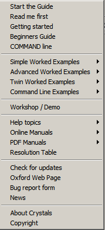

