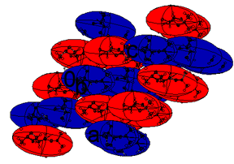

.. toctree::
   :maxdepth: 3
   :caption: Contents:

################
The Model Window
################

.. _defandconv:

.. |br| raw:: html

    

.. |blue| raw:: html
   
   

.. |xblue|  raw:: html

   

.. |vspace|  raw:: latex

   \vspace{5mm}

.. _The Model Window:

.. index:: The Model Window

**********************
Using the Model Window
**********************
The model window shows the current structure.  The image is updated automatically whenever 
there is a significant change in the model. For very large structure (or slow computers) 
model display can be inhibited through the menu |blue| Appearance/Model/Auto Display OFF |xblue|.
|br|\
This window has its own little menu.  This provides tools for selecting atoms in a 
rectangle (or polygon), for zooming, for swapping between a Ball & Stick representation or 
an adp representation, and for displaying/hiding the hydrogen atoms.

The image is sensitive to the mouse pointer:

* Hovering over an atom displayes its name, and occupation number if that is not unity.
* Hovering over a `bond`_ displays the names of the atoms involved and the bond length. If an 
  atom should be bonded to the main fragment but is in a symmetry equivalent position, the 
  partial bonds from the atoms concerned are drawn in grey and hovering over the bod to 
  detatched atom also shows the symmetry operators involved. Clicking on the *ghost* bond
  in the main fragment enable you to move the disconnected atom to a bonding position.
* Left-clicking an atom *selects* the atom. Left-clicking again deselects it.
* Right-clicking in the background. Brings up a menu of operations.  If no atoms have been 
  selected, some operations are greyed out.
* Right-clicking an unselected atom brings up a menu applicable to that atom or the 
  fragment containing that atom.
* Right-clicking one of a pair of selected atoms brings up a menu of possible single or
  pairwise operations.
* Right-clicking one of a group of more than 2 atoms brings up a menu of possible
  operation operations on single atoms or the whole selected group.

----

.. _Right Click in Background:

.. index:: GUI Right Click in Background

.. index:: Right Click in Background

^^^^^^^^^^^^^^^^^^^^^^^^^
Right Click in Background
^^^^^^^^^^^^^^^^^^^^^^^^^

.. image:: images/rc-background.png

============
Add Hydrogen
============
Adds missing hyrogen to carbon atoms assuming normal geometry.

====================
Remove Fourier Peaks
====================
Removes any **Q** peaks left over from a peak search or other operation which generates
psudo atoms.

========
Geometry
========
Brings up an ancient question and answer dialogue. 

.. _mogul check:

====================
Mogul Geometry Check
====================
Passes your structure to the Cambridge Crystalloraphic Data  Centre **Mogul** program
(if it is installed). This program compares the local geometry at each atom with standard
geometries for a similar environment obtained from the CSD.  Differences are ranked in
order of decreasing significance.  Any serious differences might be important.

In this example it is the carbon at the apex of the cyclopropyl group which is flagged as 
anomalous.

.. _Right Click Atom:

..index:: Right Click Atom

..index:: GUI Right Click Atom

^^^^^^^^^^^^^^^^
Right Click Atom
^^^^^^^^^^^^^^^^

::

      Change Type of ...
      Set Residue Number of ...
      Set Part Number of ...
      Set Occupancy of ...
      Change ... to Uequiv
      Set U[iso] of ...

      Edit ...
      Add Hydrogens to ...
      Split Atom ...
      Environment of ...
      Refine mode ...

      Select Fragment containing ...
      Delete Fragment containing ...
      Centroid of Fragment containing ...
      Map Fragment containing ... onto another
      Zoom Fragment containing ...

      Delete ...

Right clicking an atom brings up a major menu with three submenus.

==================
Change Type of ...
==================
The element type of the selected atom can be changed to another from a drop down list, or 
from a periodic table.

=========================
Set Residue Number of ...
=========================
Set the residue number of the selected atom. |blue| Allocate residues |xblue| from the 
:ref:`Structure menu <Allocate Residue Numbers>` does this automatically.

======================
Set Part Number of ...
======================
Sets the part number of the selected atom. 
:ref:`See also <Allocate Part Numbers>` from the Structure Menu.

====================
Set Occupancy of ...
====================
Set the occupation number of the selected atom. |blue| Care |xblue| - the default is zero. 
This can be useful to remove an atom from the structure factor calculation but retain its 
name and location as a place-holder.

================
Change to Uequiv
================
Makes an anisotropic atom isotropic with U[iso] set to U[equiv].

==========
Set U[iso]
==========
Changes the value of U[iso]

========
Edit ...
========
Pops up an edit box for the parameters of the selected atom. **Dont forget** to |blue| Apply 
|xblue| your changes.

====================
Add Hydrogens to ...
====================
Brings up a menu to enable you to geometrically places any missing hydrogen atoms.

Since you can specify any value for the bond length, you can trick this utility into placing any kind of 
atoms - all you have to do is rename the H atom once it has been placed!

==============
Split Atom ...
==============
Puts a half occupancy isotropic atom towards each end of the longest axis of the adp of the 
selected atom.  The new atoms have serial numbers 10*(the original serial number) plus 0 
and 1, *i.e.* C(10) splits into C(100) and C(101).  If you are splitting several atoms in 
a disordered group, you may have to interchange the names or coordinates of some pairs to get a 
consistent naming for the whole group.  :ref:`See <swap labels>` for doing this.

==================
Environment of ...
==================
Print out, in the text window, the distances and angles around the selected atom.

===========
Refine Mode
===========
This sets the *sticky* refinement directive for the chosen atom. These sticky conditions 
over ride any general conditions sset by other menus.

----

==============================
Select Fragment Containing ...
==============================

===============================
Zoom to Fragment Containing ...
===============================

==============================
Delete Fragment Containing ...
==============================

===================================
Centroid of Fragment Containing ...
===================================
Computes the inertial tensor of the atoms in the selected fragment. This appears in the 
atom list as an atom of type **QC**.  The scaled components of the tensor are stored as 
the adp of the atom QC, and can be rendered as an ellipsoid in CRYSTALS and CAMERON. Since 
the tensor more-or-less contains all the atoms, it can be used to represent a simplified 
version of  the whole fragment in a packing diagram.

Packing diagram from CAMERON for a Z'=2 structure. The ellipsoids enclosing the two 
molecules have been coloured red and blue to faclitate interpreting the packing. Take care 
to rename one of the QC pseudo-atoms from QC(1) to QC(2).

========================================
Map Fragment containing ... onto another
========================================
For Z'>1 structures it is possible to (try) to map one molecule onto another.

The output 
shows the deviations of the positional and adp parameters, the deviations in the 
geometries and the relationship between the positions and orientations of the fragments. 
If there is pseudo symmetry, the symmetry elements are listed.
|br|\
When there is a fair match, it is possible to renumber the atoms in the second fragment so 
that they are related to the numbers in the first.
|br|\
The residues must have the same number of atoms and not be disordered. It is sometimes 
useful to remove hydrogen atoms. If the mapping fails because of high internal symmetry, 
this can sometimes be resolve by renaming some of the equivalent atoms in both residues to Q

**SAME** restraints can be generated to relate geometrical features of the two fragments.

.. _Right Click Pair:

.. index:: Right Click Pair

.. index:: GUI Right Click Pair

^^^^^^^^^^^^^^^^
Right Click Pair
^^^^^^^^^^^^^^^^

.. image:: images/select-pair.png

Many of the operations are as for right clicking on a single atom.
|br|\
Additional operations are:

::

      Swap Labels
      Swap Coordinates
      Break Bond
      Add Bond
      Restrain Selection

.. _swap labels:

===========
Swap Labels
===========
The atom labels are interchanged but the coordinates are untouched.
The order of the atom parameters  in LIST 5 is not altered,
so that if C(2) and C(3) are swapped, the 
list C(1) C(2) C(3) C(4) would become  C(1) C(3) C(2) C(4)

.. _swap coordinates:

================
Swap Coordinates
================
When an atom is split, the two new atoms are numbered 10n and 10n+1, where n is the serial 
of the original atom.  The numbering of the new atoms does is not based on the 
connectivity, so that if a multi-atom disordered section is being split, some of the 10n 
and 10n+1 labels or coordinates for a pair might need interchanging to create naming 
consistency, *i.e.* all the 10n atoms are in one residue, and the 10n+1 in the other.
The order of the atom IDs in LIST 5 is not altered, but the coordinates are interchanged.

==========
Break Bond
==========

========
Add Bond
========
Bonds are created by rules and the values of the covalent radii.  This means that 
sometimes unwanted 'bonds' are formed (often from a metal to an adjacent ligand), and some 
bonds are missing (for example if the atoms are too far apart).
|br|\
:ref:`See the section Add and Remove Bonds <add and remove bonds>` for more details.

==================
Restrain Selection
==================
Set up restraints between the pair of atoms:

* Distances
* Vibration along the bond (Hirshfeld restriants)
* Thermal Similarity

.. _Right Click Selection:

.. index:: Right Click Selection

.. index:: GUI Right Click Selection

^^^^^^^^^^^^^^^^^^^^^
Right Click Selection
^^^^^^^^^^^^^^^^^^^^^

.. image:: images/rc-selection.png

Many of the operations are as for Right Clicking on a Pair. 
|br|\
Additional operations are:

::

      Slant Fourier Map
      Voids Map

=================
Slant Fourier Map
=================
This computes the best plane through the selected atoms, and then computes a series of
Fourier sections parallel to this plane.  The sections can be output as figure fields in 
the listing file, or visualised as contour maps (Rohlicek J., Husak M. (2007) J. Appl. Cryst. 40, 600).

=========
Voids Map
=========
Creates a figure field of distances outside of and within the Van der Walls surface of the 
known atoms. Plotting can be done with the built in Marching Cubes program
(Rohlicek J., Husak M. (2007) J. Appl. Cryst. 40, 600).
Negative values (green in this example) are within the surface, red are 
ouside. The contour levels can be adjusted with the sliders.

.. _bond:  ../_images/rc-bond-1.png

