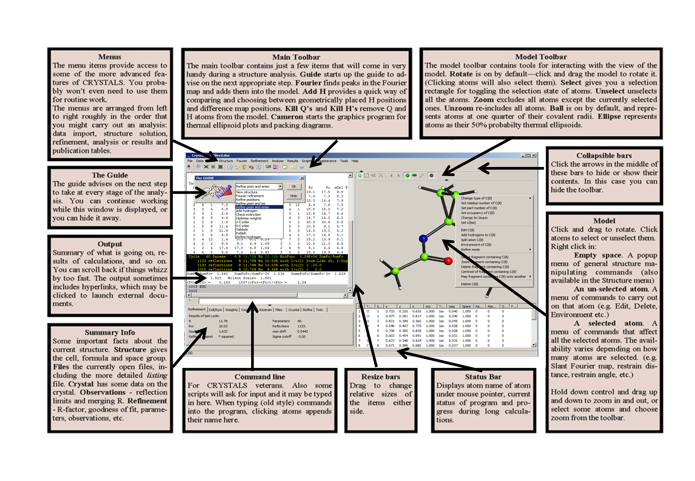
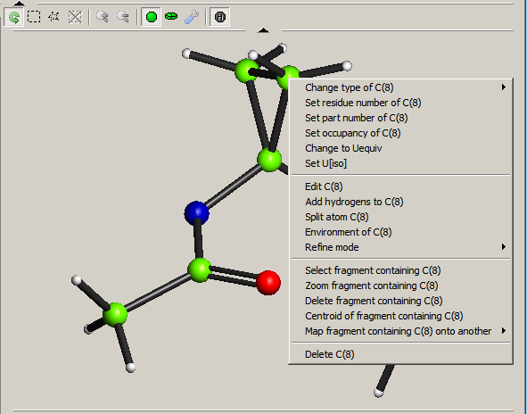
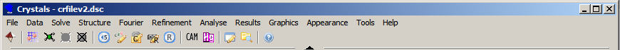

.. toctree::
   :maxdepth: 3
   :caption: Contents:

#######################
Understanding  CRYSTALS
#######################

.. _defandconv:

.. |br| raw:: html

    

.. |blue| raw:: html
   
   

.. |xblue|  raw:: html

   

.. |vspace|  raw:: latex

   \vspace{5mm}

.. index:: Need to Know

*****************
You Need to Know:
*****************

::

 There are a few things you need to keep in the back of your mind when using CRYSTALS.

       Structure database
       Lists
       Atoms
       Reflections
       Commands and Scripts

.. _database:

.. index:: Database, Structure

^^^^^^^^^^^^^^^^^^^
Structure database:
^^^^^^^^^^^^^^^^^^^
The program accumulates information as it works, which means that if you stop working on a structure,
you can restart the task from where you left off - a bit like creating a big WORD document. The accumulated data
is stored in a binary database *something.dsc*.  By default, the something is  *crfilev2.dsc*. 

.. index:: LISTs, Data

^^^^^^
Lists:
^^^^^^
Sets of related crystallographic data are collected together into *LISTs*.  Some of the 
LISTS have names, but they are generally referred to by a number
|br|\
You will most frequently see references to *LIST 5*, the refinable parameters 
(mostly atoms) and *LIST 6*, the reflections.
|br|\ See, for example, LIST 1, :ref:`LIST01` and :ref:`Lists` for a list of all LISTs.
|br|\

.. _`Atom ID`:

.. index:: Atom Name Syntax

^^^^^^
Atoms:
^^^^^^
Atoms are held in LIST 5, and are identified by a two-part symbol, the atom ID:

   * The Name. A four character identifier also used to identify the atomic scattering 
     factor.  This is **not** case sensitive.

   * A four digit *serial number* enclosed in parentheses.  

   The combination e.g. C(12), should be unique for every atom.  While symbols like C(12) 
   and O(12) refer to different atoms and are permitted, they are not recommended and it 
   is advised that all serial numbers are unique because automatic hydrogen naming computes the 
   serial number of each hydrogen from that of its parent atom, e.g. H(11), H(12) and 
   H(13) attached to C(1). 
   |br|\ 
   If two atoms have the same ID, references to the atom will only find the first 
   occurrence. See :ref:`Fixing clashes <fix clashes>`
   |br|\
   Atom names can also include symmetry information.
   See the section :ref:`atomparams` .

.. see crystals/initial.rst
.. see crystals/parameters.rst

.. index:: Reflections

^^^^^^^^^^^^
Reflections:
^^^^^^^^^^^^
Reflections are held in LIST 6. Usually unmerged data including  the systematic absences
are input to CRYSTALS. The systematic absences are excluded and the 
indices transformed to the unique part of the reciprocal lattice and equivalent 
reflections merged during data input.  The systematic absences and the equivalent
reflections are examined and information about them exported to tables and graphs to help
resolve problems should they occur.
|br|
Friedel pairs are generally conserved for non-centrosymmetric space groups.  If 
necessary, a merged copy will be created for special purposes, e.g. computing a 
Fourier Synthesis.

^^^^^^^^^^^^^^^^^^^^^
Commands and Scripts:
^^^^^^^^^^^^^^^^^^^^^
CRYSTALS works by performing operations given in the form of *COMMANDS*.  For 
convenience in day-to-day use, COMMANDS and suitable parameters have been packaged up
into *SCRIPTS*.  These SCRIPTs are usually accessed via the *GUI* Menus, Tool Bar or 
Model window.  The experienced user can access many SCRIPTS directly via the *Command 
Line*.
|br|\ See the section :ref:`Syntax of Commands`.
|br|\

.. index:: Help

^^^^^^^^^^
Help Files
^^^^^^^^^^
There are a variety of help files, which are slowly being rationalised. Many menus have
a brief help text as the bottom item on the menu.
|br|\
Some menus also have hyperlinks to illustrated texts
|br|\
Some menu items having a basic choice between *Continue* or *Cancel* also have an 
optional help button.  This button only shows if you have |blue| Tools-Help |xblue|
enabled. 
:ref:`See the section Tools Help <Tools Help>`. These little help files explain what will
happen if you choose to continue.

*********************
Organising your data:
*********************
Keep track of what you are doing by creating a new folder for each new structure and 
placing you basic data, such as diffractometer output, into it.  CRYSTALS will create a 
binary data base of information about your structure and add to it as he analysis 
proceeds.
|br|\
**DO NOT** try to edit this file in any way. You will corrupt it and make its contents 
inacessible.
|br|\ For details see the section :ref:`Files and Folders`.
|br|\

.. index:: Organisisng Your Data
.. index:: Screen Layout
.. index:: GUI Overview
.. index:: Main Toolbar

********************* 
Layout of the Screen:
*********************

Please see `layout`_ for a high resolution image

.. _layout: ../_images/layout.png

::

       Main Toolbar
       Top Menu
       The Guide
       Text Window
       Summary Tabs
       Command Line
       Model Window

^^^^^^^^^^^^^
Main Toolbar:
^^^^^^^^^^^^^
   The Main Toolbar contains just the few items that are most commonly used during an 
   analysis.  They ar a subset of items available via the Menu bar.

   * |guide| *Guide* starts up the Guide to advise on the next appropriate step.

   .. |guide| image:: images/tool_guid.bmp

   * |four| *Fourier* links to most commonly required Fourier maps.

   .. |four|  image:: images/toolfour.bmp

   * |perh| *Perhydrogenation*  uses geometrical and Fourier methods to locate hydrogen 
     atoms.

   .. |perh|  image:: images/tl_perh.bmp

   * |delq|  *Delete* **Q** peaks.

   .. |delq|  image:: images/tl_delq.bmp

   * |delh|  *Delete* all hydrogen atoms.

   .. |delh|  image:: images/tl_delh.bmp

   * |undo|  *Undo* enables you to revert to an earlier version of the model.

   .. |undo|  image:: images/undo.bmp

   * |ed5|  *Edit Atoms* enables you to edit the atomic parameters with a normal text editor.

   .. |ed5|  image:: images/ed5.bmp

   * |ed12|  *Edit Constraints* enables you to set up the the refinement details with a normal text editor.

   .. |ed12|  image:: images/ed12.bmp

   * |ed16|  *Edit Restraints* enables you to set up the the refinement restraints with a normal text editor.

   .. |ed16|  image:: images/ed16.bmp

   * |refine|  *Refine* initiates a user-defined number of cycles of refinement

   .. |refine|  image:: images/refine.bmp

   * |cam|  *CAMERON* Graphical structure viewer, printer and manipulator.

   .. |cam|  image:: images/toolcam.bmp

   * |hg|  *Mercury* A link to the CCDC Mercury structure viewer.

   .. |hg|  image:: images/mercury.bmp

   * |note|  *Text Editor* Usually Notepad on Windows machines.

   .. |note|  image:: images/notepad.bmp

   * |expl|  *Explorer* opens Windows explorer in the current working directory.

   .. |expl|  image:: images/tool_norm.bmp

^^^^^^^^^
Top Menu:
^^^^^^^^^
The top Menu provides access to SCRIPTS which automate common tasks (including all
those on the Tool Bar).  If *Tool Help* is turned on 
(see  :ref:`Tools Help <tools help>` ), some of 
the menu items provide information about what will happen if you choose that menu.
|br|\
The menus are arranged from left to right in roughly the order required for a routine
structure determination:
|br|\
See :ref:`menus` for details.
|br|\

   * File: Selection of file manipulation commands

   * Data Import:  Compatible with many diffractometer data sets and SHELX .res, .ins, 
     .hkl and .hklf5 formats.

   * Structure Solution:  SIR92, SHELXS and Superflip are packaged with CRYSTALS. Users are 
     recommended to install SHELXT from the SHELX website.

   * Structure:  Manipulation of the structure, including naming and numbering of atoms, setting Parts 
     and Residues, making and/or breaking bonds, things concerned with hydrogen atoms and
     Q peaks.

   * Fourier:  Various Fourier syntheses.
 
   * Refinement:  Setting up refinement details, constraints and restraints. Choosing 
     refinement weights and *SQUEEZing* the structure (see :ref:`squeeze <squeeze>` )

   * Analyse: Many analytical and graphical tools to help validate an analysis, or to 
     trouble-shoot problem structures/data sets.  

   * Results:  Output results in various formats, including cif files with embedded 
     refinement details and un-merged reflections.  Links to IUCr Checkcif or *PLATON*
     if it is installed.

   * Graphics: View the current (or re-display previous) structure in *CAMERON*. View
     previously created maps.

   * Appearance: Set screen font and some aspects of the model window, including 
     auto-updating.

   * Tools: Set various options, bits and pieces.

   * Help:  Access to the guides and manuals.

^^^^^^^^^^
The Guide:
^^^^^^^^^^
Tries to suggest what to do next at each stage in an analysis.
The drop-down contains alternative suggestions.
The Guide can be turned off at any time and turned back on from the Top Menu.
|br|\
|g-ref|

.. |g-ref|  image:: images/guide-ref.png

^^^^^^^^^^^^
Text Window: 
^^^^^^^^^^^^
A summary of what CRYSTALS is doing (the full details are in 
*bfile##.lis*).  The window can be widened by dragging the right hand edge, and
can be scrolled back with the side scroll bar.
|br|\
Hyper-links to other output and files appear in blue.

^^^^^^^^^^^^^
Summary Tabs: 
^^^^^^^^^^^^^
Display information from the data base (.dsc file). 
  
   * The *Refinement*   tab only updates after a cycle of refinement.
   * The *Constraint* tab enables the refinement directives to be edited.
   * The *Restraint* tab enables the restraints to be edited.
   * The *Files* tab enables you to look at the output listing (.lis) and punch
     (.pch) files without exiting CRYSTALS.
  

^^^^^^^^^^^^^
Command Line:  
^^^^^^^^^^^^^
The start of a command is indicated by the COMMAND name preceded immediately by
a special character. The end is indicated by the word END.
|br|\
The permitted special characters are: "#", "\" and "&".
|br|\ See the section :ref:`Syntax of Commands` for more details.
|br|\  
This is where you would enter CRYSTALS commands directly.  See :ref:`command-line` for 
more details. Most 
complicated sets of commands are now generally created via the SCRIPTS, but some useful 
commands are:  

   * *#SUMMARY LIST 5* followed by the optional low/medium/high displays less or more of 
     the contents of LIST 5, the atom parameter list.
   * *#DISK* enables you to see and manage the LISTS in the data base.
   * *#USE* followed by a file name to cause CRYSTALS to read input from the named file.
   * *#EDIT* starts the powerful atomic parameter editor. See  :ref:`Editing Atoms`

^^^^^^^^^^^^^^^^
Graphics Window:  
^^^^^^^^^^^^^^^^
The model window both displays the structure and enables you to perform 
some atom-based operations, such as computing Fourier sections, selecting or deleting 
atoms or groups of atoms, setting atom parameters, computing geometrical parameters.
See :ref:`Using the Model Window <the model window>` for operations which can be performed on 
the  model
|br|\
|gui|

.. index:: Customising CRYSTALS

********************
Customising Crystals
********************
The download kit installs CRYSTALS in a default mode. Small changes can be made to the 
appearance of the screen and to actions taken when the program is started.
|br|\
If a file |blue| CRYSINIT.DAT |xblue| exists in the current folder it is executed before 
control passes to the user interface. This file may contain any CRYSTALS commands, but 
most commonly it contains :ref:`Immediate Commands <Immediate Commands>` 

:ref:`See Startup <customise>` and :ref:`Menus/Appearance <appearance>`

.. see also Immediate Commands

.. index:: Using the Guide

***************
Using The Guide
***************

To be done!

.. index:: Using Menus

***********
Using Menus
***********

The menus provide short cuts for many common tasks.

 
:ref:`These are described in detail in the Menus section <menus>` 

.. see userguide/userinterface.rst

----

.. index:: Inputting Data
.. index:: Atom Names in SHELX
.. index:: Site Occupancy

.. _`Inputting Data`:

**************
Inputting Data
**************

Select *Data* and then *Open File* from the GUI Menu.  
This should open a window showing all files with
suitable extensions. Use the drop-down at the bottom right to 
show *All Files* if your file has an unusual extension.  If you click on 
your data file, CRYSTALS will try to identify the type of data based
on the file extension.  Check and change the automatic selection if necessary.

* From Shelx:

  *.ins* and *.res* files will be pre-processed by the module *shelx2cry*,
  written by Pascal Parois. This will extract any useful information it can
  and save it in CRYSTALS format. Rather than look for the space group symbol
  on the **TITL** card, it tries to determine the space group from the symmetry
  elements.

  * Atom Names in SHELX
    |br|\
    Remember that SHELX has a quite different atom naming syntax from CRYSTALS. 
    The automatic conversion from SHELX to CRYSTALS may lead to ambiguity.  If you 
    resolve this either manually or automatically by  CRYSTALS, there is a real
    risk that :ref:`restraints <list 16>` copied over from SHELX will no longer be valid.
    |br|\
    See the section :ref:`Atom Identifiers <Atom ID>` for a brief explanation of naming in CRYSTALS,
    and :ref:`atomparams` for the full syntax in CRYSTALS.

  * Site Occupancy
    |br|\
    The atomic site occupancy used in CRYSTALS is the 'chemical' occupancy, *i.e.* the 
    fraction of an atom expected at that site without reference to the crystallographic
    symmetry. Any modification required because the atom lies on a Special Position is
    applied internally by CRYSTALS. This feature can be turned off by setting a flag in
    :ref:`List 13` .

  If there is a reflection file (.hkl) with the same name as the *ins* or *res* file,
  this is automatically processed.
  |br|\
  |br|\
  If a SHELX *cif* file contains embedded *res* and *hkl* files, these can be extracted
  with *shelx2cry* and then processed.
  |br|\

* From Diffractometers
  |br|\
  Utilities exist for processing SHELX *hklf4* and *hklf5* format files, and for 
  extracting reflections from *cif*, *fcf* and *cif_od* files.  If your *cif* file
  has the extension *hkl* take care to re-select the correct option from the menu.

  * Twinned Data
    |br|\
    Twinned data in the SHELX hklf5 format can be processed with Bruce Foxman's *hklf52cry*
    program.  Since CRYSTALS needs to know the twin laws, Bruce's program attempts
    to derive these from the hklf5 file.  Note that the hklf5 file should be
    **unmerged** data, which conserves the original reflection indices. If an *hklf5*
    file simply has the extension *.hkl* take care to reselect the correct option from
    the menu.

* From  *CIF* files
  |br|\
  CRYSTALS can extract both structural and reflection data from *cif* or *fcf* files.

----

.. _cameron:

*************
Using CAMERON
*************

to be rewritten

:ref:`See the old Cameron reference manual <cameron-manual>`

