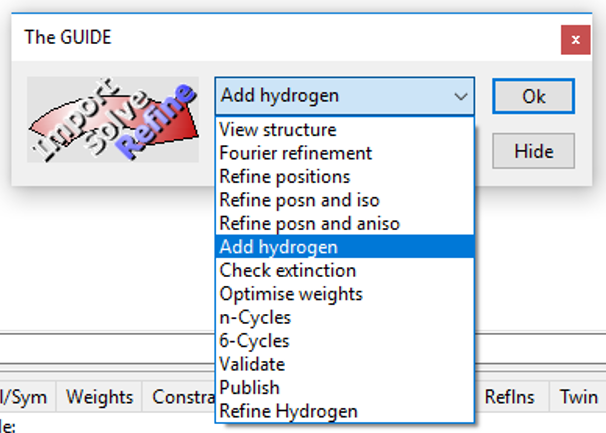
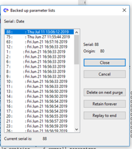

.. toctree::
   :maxdepth: 1
   :caption: Contents:

.. _defandconv:

.. |br| raw:: html

    

.. |blue| raw:: html
   
   

.. |xblue|  raw:: html

   

.. |vspace|  raw:: latex

   \vspace{5mm}

.. |F2| replace:: F\ :sup:`2`

#################
Crystals Workflow
#################

********************************
Background to structure analysis
********************************

No two crystal structure analyses follow exactly the same path, so
that it is impossible to give a definitive step-by-step procedure for
the general case. The principal causes for deviation from a linear
process are:

- Direct Methods fails to yield a recognisable structure. (Rare)
- Direct Methods yield only a partial structure. (Rare)
- Fourier refinement fails to complete the structure. (Rare)
- There is disorder in the structure. (Common)
- There is unexpected solvent (possibly disordered).(Common)
- Difference maps fail to locate all the H atoms, and their positions
  cannot be simply predicted. (Rare)

Most of these situations can readily be recognised by a chemist with
some crystallographic experience, and so for the moment it is necessary
for some one to remain in control of each structure analysis

^^^^^^^^^^^^^^^^^^^^^^^^^^^^
Principal Stages of analysis
^^^^^^^^^^^^^^^^^^^^^^^^^^^^

The principal steps in structure analysis are:

- Data collection.
- Data pre-processing. This is diffractometer-specific and performed
  with a dedicated program.
- Data reduction. This is the Lp and possibly absorption corrections,
  and is usually included in the pre-processing.
- Transfer of data from diffractometer to user's computer.
- Start CRYSTALS and import the data.
- Structure Solution. Usually done by direct methods,
  even for heavy atom structures.
- E-map evaluation, usually done by inspection with the CRYSTALS graphics window.
- Structure development. Atoms not revealed by direct methods may be
  revealed by Fourier refinement in CRYSTALS
- Structure refinement, by least squares. First isotropic and then
  anisotropic temperature factors for the non-hydrogen atoms.
- Hydrogen atom location, from a difference Fourier, by geometric
  prediction, or a combination.
- Final weighted refinement, possibly including extinction, final difference
  synthesis, production of tables and diagrams.

^^^^^^^^^^^^^^^^^^^^^^^^^^^^^
Preparations for the analysis
^^^^^^^^^^^^^^^^^^^^^^^^^^^^^

Before you start using CRYSTALS, you will need to know (or have in a
suitable file) the following:

- Unit cell parameters and standard deviations.
- Chemical formula.
- Space group symbol or operators
- The name of the file containig the reflection data.

Additional optional information useful for creating a complete cif file are:

- Number of formula units in the unit cell
- Crystal colour and approximate size and shape.
- Temperature of data collection
- Minimum/maximum index ranges during data collection and cell determination.
- Minimum/maximum theta ranges during data collection and cell determination.
- If the data has been preprocessed by some other system, you will also
  need to know the merging 'R' factor (Rint)

----

.. _The Guide:

********************************
Routine Analysis using the Guide
********************************

The Guide guides you through the stages on importing you basic data, solving the
structure, refining the structure, validataing it and creating the final *cif* files.
The Guide monitors the progress of an analysis mainly through the value of the *R-factor*,
and so depends upon the users intervention for the atypical cases listed above. |br|\
The dropdown menu enables you to over-ride  the guides choice, though it doesn't enable
you to revert to an earlier model. To do that you need to select 
*Undo/Backup Model* on the Structure menu of the main tool bar.

----

***************
Reflection Data
***************

Ideally, the reflections should be data-reduced with equivalent reflections kept 
separate and including the systematic absences. 
This enable CRYSTALS to compute useful statistics about the data quality.
As an introduction to the system, it is assumed that the reflections
have been pre-processed and are in  standard SHELX  'HKLF 4' format, ie each line
of the file contains h,k,l, Fsq and sigma(Fsq) in fixed columns. 
If the data is not in the standard format, you will need
to specify the FORMAT of the data in the FORTRAN convention. If the pre-processor
documentation specifies the output format use it, otherwise study the
following example. |br|\
If there are decimal points in the numbers, they count as a column but
over-ride the position given in the format statement. 

::

 e.g.
      1234567890123456789012345678 (column number)
         1  -2  13  186135   465.4 (reflection 1 -2 13, Fsq=186135, sigma=465.4)
        10   3   0     145      17 (reflection 10 3 0, Fsq=145, sigma=17)

The FORTRAN format for this data is:

::

        (3F4.0,2F8.0)

